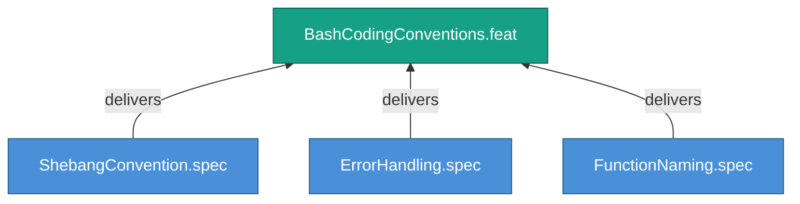

<!-- (c) 2026-* Frederick Bloom -- 20260826-144956-555723-7f72-88ef-6d2f40241d41-BashCodingConventions.feat-0.0.1.md -- Hanaden AI -->
---
filename-id:   20260826-144956-555723-7f72-88ef-6d2f40241d41-BashCodingConventions.feat-0.0.1
node-type:     FEAT
layer:         2
version:       0.0.1
status:        Draft
priority:      1
author:        Frederick Bloom
copyright:     "(c) 2026-* Frederick Bloom"
description: >
  Shebang convention, error handling mandate, and function
  naming standards for all bash scripts.
parent:        20260826-144956-547061-7425-a42f-3a1b7cdd5bb3-BashCodingStandards.moti-0.0.1
tdd:
  state:         NOT_STARTED
  test-file:     null
  last-run:      null
  iterations:    0
  coverage-lines: all
---

# BashCodingConventions: Bash Coding Convention Standards

## Goal

Every bash script in the project MUST follow the shebang convention, error
handling mandate, and naming standards.

## Requirements

| ID | Requirement | Constraint |
|----|-------------|------------|
| R1 | Shebang MUST be #!/usr/bin/env bash | Portable invocation |
| R2 | set -euo pipefail MUST be present | Fail-fast error handling |
| R3 | snake_case for functions, UPPER_CASE for exports | Naming consistency |

## Feature Tree

## Test Suite

> **Suite ID:** PENDING
> **Suite name:** BashCodingConventions Feature Suite
> **Test file:** `null` (NOT_STARTED)

### ⚙️ Functional Tests

| ID | Description | Method | Pass Criteria | TDD |
|----|-------------|--------|---------------|-----|

## References

- SdlcEngineSpec.system-0.0.1

## Changelog

| Version | Date | Author | Changes |
|---------|------|--------|---------|
| 0.0.1 | 2026-08-26 | Frederick Bloom + AI | Initial feature |
