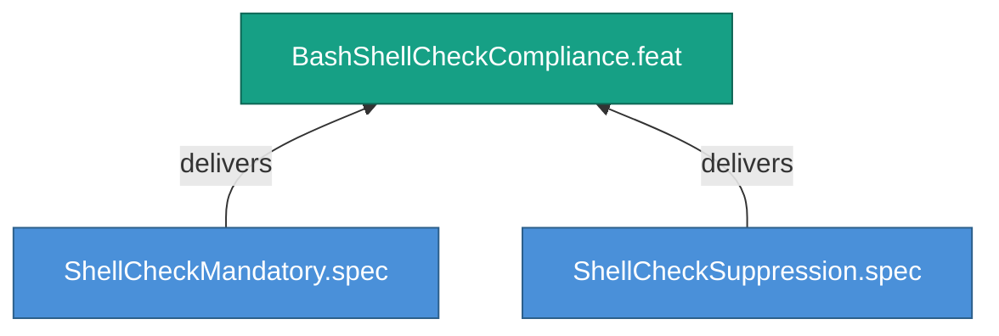

<!-- (c) 2026-* Frederick Bloom -- 20260826-144956-591918-7e4c-824a-fdae600e5918-BashShellCheckCompliance.feat-0.0.1.md -- Hanaden AI -->
---
filename-id:   20260826-144956-591918-7e4c-824a-fdae600e5918-BashShellCheckCompliance.feat-0.0.1
node-type:     FEAT
layer:         2
version:       0.0.1
status:        Draft
priority:      2
author:        Frederick Bloom
copyright:     "(c) 2026-* Frederick Bloom"
description: >
  ShellCheck MUST pass clean on all .sh files.
  Suppressions require inline justification.
parent:        20260826-144956-547061-7425-a42f-3a1b7cdd5bb3-BashCodingStandards.moti-0.0.1
tdd:
  state:         NOT_STARTED
  test-file:     null
  last-run:      null
  iterations:    0
  coverage-lines: all
---

# BashShellCheckCompliance: Mandatory ShellCheck Compliance

## Goal

Every .sh file in the project MUST pass ShellCheck clean. Suppressions are
allowed only with documented justification.

## Requirements

| ID | Requirement | Constraint |
|----|-------------|------------|
| R1 | shellcheck *.sh MUST return exit 0 | Zero warnings or errors |
| R2 | Suppressed checks MUST have inline justification comments | Documented rationale |

## Feature Tree

## Test Suite

> **Suite ID:** PENDING
> **Suite name:** BashShellCheckCompliance Feature Suite
> **Test file:** `null` (NOT_STARTED)

### ⚙️ Functional Tests

| ID | Description | Method | Pass Criteria | TDD |
|----|-------------|--------|---------------|-----|

## References

- SdlcEngineSpec.system-0.0.1

## Changelog

| Version | Date | Author | Changes |
|---------|------|--------|---------|
| 0.0.1 | 2026-08-26 | Frederick Bloom + AI | Initial feature |
