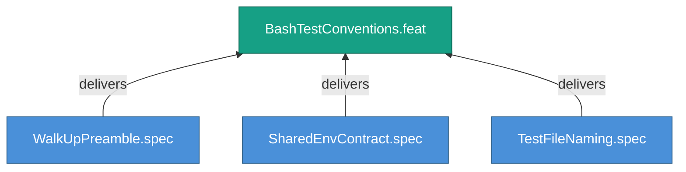

<!-- (c) 2026-* Frederick Bloom -- 20260826-144956-462937-7dfe-be9d-3948507505fc-BashTestConventions.feat-0.0.1.md -- Hanaden AI -->
---
filename-id:   20260826-144956-462937-7dfe-be9d-3948507505fc-BashTestConventions.feat-0.0.1
node-type:     FEAT
layer:         2
version:       0.0.1
status:        Draft
priority:      1
author:        Frederick Bloom
copyright:     "(c) 2026-* Frederick Bloom"
description: >
  Walk-up preamble, shared/env.sh contract, and test_*.sh
  naming convention.
parent:        20260826-144956-454073-7be6-a8cd-127e0ed221a1-BashTestStandards.moti-0.0.1
tdd:
  state:         NOT_STARTED
  test-file:     null
  last-run:      null
  iterations:    0
  coverage-lines: all
---

# BashTestConventions: Bash Test File Conventions

## Goal

Every bash test file MUST follow the walk-up preamble, shared environment
contract, and naming conventions.

## Requirements

| ID | Requirement | Constraint |
|----|-------------|------------|
| R1 | Walk-up preamble MUST be first executable block | Before any test logic |
| R2 | shared/env.sh MUST be sourced via walk-up | Consistent environment |
| R3 | Test files MUST be named test_*.sh | Discoverable by convention |

## Feature Tree

## Test Suite

> **Suite ID:** PENDING
> **Suite name:** BashTestConventions Feature Suite
> **Test file:** `null` (NOT_STARTED)

### ⚙️ Functional Tests

| ID | Description | Method | Pass Criteria | TDD |
|----|-------------|--------|---------------|-----|

## References

- SdlcEngineSpec.system-0.0.1

## Changelog

| Version | Date | Author | Changes |
|---------|------|--------|---------|
| 0.0.1 | 2026-08-26 | Frederick Bloom + AI | Initial feature |
