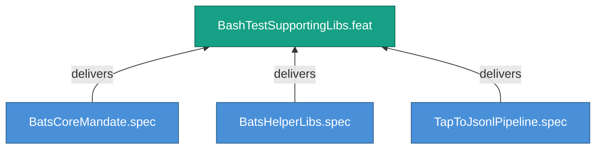

<!-- (c) 2026-* Frederick Bloom -- 20260826-144956-500916-7371-9306-e2fb18cf92af-BashTestSupportingLibs.feat-0.0.1.md -- Hanaden AI -->
---
filename-id:   20260826-144956-500916-7371-9306-e2fb18cf92af-BashTestSupportingLibs.feat-0.0.1
node-type:     FEAT
layer:         2
version:       0.0.1
status:        Draft
priority:      2
author:        Frederick Bloom
copyright:     "(c) 2026-* Frederick Bloom"
description: >
  bats-core mandate, helper libraries, and TAP → JSONL
  conversion pipeline.
parent:        20260826-144956-454073-7be6-a8cd-127e0ed221a1-BashTestStandards.moti-0.0.1
tdd:
  state:         NOT_STARTED
  test-file:     null
  last-run:      null
  iterations:    0
  coverage-lines: all
---

# BashTestSupportingLibs: Bash Test Supporting Libraries and Pipeline

## Goal

The bash test infrastructure requires bats-core as the runner, standard
helper libraries, and a TAP-to-JSONL conversion pipeline.

## Requirements

| ID | Requirement | Constraint |
|----|-------------|------------|
| R1 | bats-core ≥ 1.10 MUST be the test runner | Version gate |
| R2 | bats-support, bats-assert, bats-file MUST be in test_helper/ | Local installation |
| R3 | TAP output MUST be convertible to JSONL | Pipeline required |

## Feature Tree

## Test Suite

> **Suite ID:** PENDING
> **Suite name:** BashTestSupportingLibs Feature Suite
> **Test file:** `null` (NOT_STARTED)

### ⚙️ Functional Tests

| ID | Description | Method | Pass Criteria | TDD |
|----|-------------|--------|---------------|-----|

## References

- SdlcEngineSpec.system-0.0.1

## Changelog

| Version | Date | Author | Changes |
|---------|------|--------|---------|
| 0.0.1 | 2026-08-26 | Frederick Bloom + AI | Initial feature |
