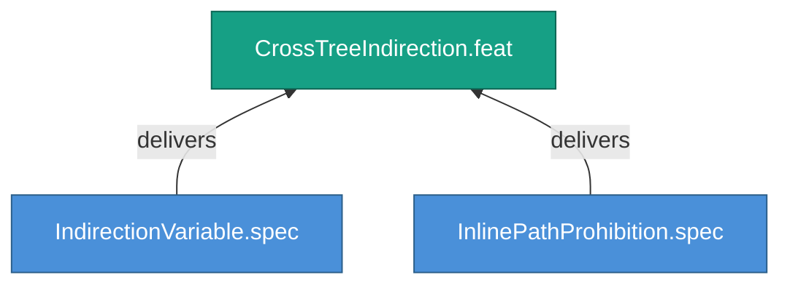

<!-- (c) 2026-* Frederick Bloom -- 20260826-144956-231464-7df2-a91f-0365aae6d7db-CrossTreeIndirection.feat-0.0.1.md -- Hanaden AI -->
---
filename-id:   20260826-144956-231464-7df2-a91f-0365aae6d7db-CrossTreeIndirection.feat-0.0.1
node-type:     FEAT
layer:         2
version:       0.0.1
status:        Draft
priority:      3
author:        Frederick Bloom
copyright:     "(c) 2026-* Frederick Bloom"
description: >
  Cross-tree references (src/test → src/main) MUST use
  indirection variables, never inline paths.
parent:        20260826-144956-169396-7286-94bf-13e738429e09-FileReferencePortability.moti-0.0.1
tdd:
  state:         NOT_STARTED
  test-file:     null
  last-run:      null
  iterations:    0
  coverage-lines: all
---

# CrossTreeIndirection: Cross-Tree References Use Indirection Variables

## Goal

When code in one tree (e.g., src/test/) needs to reference an artifact in
another tree (e.g., src/main/), it MUST use an indirection variable set by
shared/env.sh, never an inline path literal.

## Requirements

| ID | Requirement | Constraint |
|----|-------------|------------|
| R1 | Cross-tree refs MUST use $VARIABLE indirection | No inline paths |
| R2 | Variables defined in shared/env.sh | Single source of truth |

## Feature Tree

## Test Suite

> **Suite ID:** PENDING
> **Suite name:** CrossTreeIndirection Feature Suite
> **Test file:** `null` (NOT_STARTED)

### ⚙️ Functional Tests

| ID | Description | Method | Pass Criteria | TDD |
|----|-------------|--------|---------------|-----|

## References

- SdlcEngineSpec.system-0.0.1

## Changelog

| Version | Date | Author | Changes |
|---------|------|--------|---------|
| 0.0.1 | 2026-08-26 | Frederick Bloom + AI | Initial feature |
