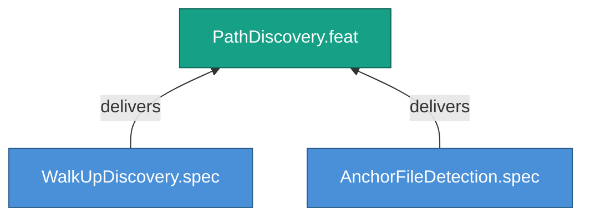

<!-- (c) 2026-* Frederick Bloom -- 20260826-144956-178335-749a-ab86-87180362b851-PathDiscovery.feat-0.0.1.md -- Hanaden AI -->
---
filename-id:   20260826-144956-178335-749a-ab86-87180362b851-PathDiscovery.feat-0.0.1
node-type:     FEAT
layer:         2
version:       0.0.1
status:        Draft
priority:      1
author:        Frederick Bloom
copyright:     "(c) 2026-* Frederick Bloom"
description: >
  Scripts discover their environment via BASH_SOURCE walk-up
  and anchor file detection.
parent:        20260826-144956-169396-7286-94bf-13e738429e09-FileReferencePortability.moti-0.0.1
tdd:
  state:         NOT_STARTED
  test-file:     null
  last-run:      null
  iterations:    0
  coverage-lines: all
---

# PathDiscovery: Runtime Path Discovery Via Walk-Up Pattern

## Goal

Every executable script MUST discover its environment at runtime using the
BASH_SOURCE walk-up pattern to find anchor files, rather than hardcoding paths.

## Requirements

| ID | Requirement | Constraint |
|----|-------------|------------|
| R1 | MUST use BASH_SOURCE[0] for self-location | No hardcoded __FILE__ |
| R2 | MUST walk up to find shared/env.sh anchor | Found-or-abort |

## Feature Tree

## Test Suite

> **Suite ID:** PENDING
> **Suite name:** PathDiscovery Feature Suite
> **Test file:** `null` (NOT_STARTED)

### ⚙️ Functional Tests

| ID | Description | Method | Pass Criteria | TDD |
|----|-------------|--------|---------------|-----|

## References

- SdlcEngineSpec.system-0.0.1

## Changelog

| Version | Date | Author | Changes |
|---------|------|--------|---------|
| 0.0.1 | 2026-08-26 | Frederick Bloom + AI | Initial feature |
