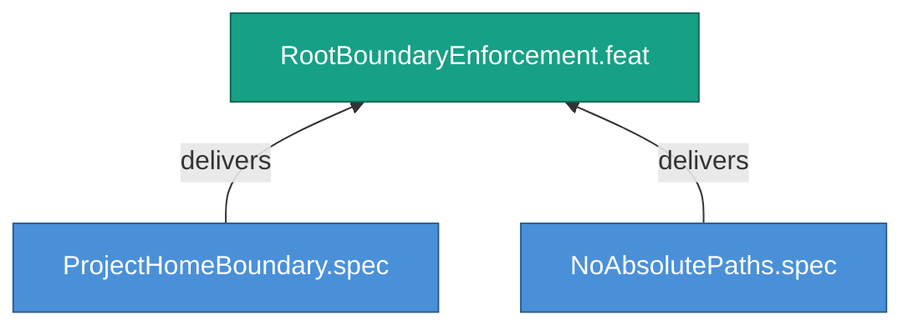

<!-- (c) 2026-* Frederick Bloom -- 20260826-144956-205268-77af-ad36-531d0e7bc321-RootBoundaryEnforcement.feat-0.0.1.md -- Hanaden AI -->
---
filename-id:   20260826-144956-205268-77af-ad36-531d0e7bc321-RootBoundaryEnforcement.feat-0.0.1
node-type:     FEAT
layer:         2
version:       0.0.1
status:        Draft
priority:      2
author:        Frederick Bloom
copyright:     "(c) 2026-* Frederick Bloom"
description: >
  Walk-up discovery MUST NOT traverse above PROJECT_HOME,
  and source files MUST NOT contain absolute paths.
parent:        20260826-144956-169396-7286-94bf-13e738429e09-FileReferencePortability.moti-0.0.1
tdd:
  state:         NOT_STARTED
  test-file:     null
  last-run:      null
  iterations:    0
  coverage-lines: all
---

# RootBoundaryEnforcement: PROJECT_HOME Boundary and Absolute Path Prohibition

## Goal

The walk-up discovery pattern MUST respect the PROJECT_HOME boundary and
never traverse above it. All source files MUST be free of hardcoded absolute
paths to host-specific locations.

## Requirements

| ID | Requirement | Constraint |
|----|-------------|------------|
| R1 | Walk-up MUST NOT traverse above PROJECT_HOME | Stop at boundary |
| R2 | No /homes, /etc, /usr absolute paths in source files | Zero tolerance |

## Feature Tree

## Test Suite

> **Suite ID:** PENDING
> **Suite name:** RootBoundaryEnforcement Feature Suite
> **Test file:** `null` (NOT_STARTED)

### ⚙️ Functional Tests

| ID | Description | Method | Pass Criteria | TDD |
|----|-------------|--------|---------------|-----|

## References

- SdlcEngineSpec.system-0.0.1

## Changelog

| Version | Date | Author | Changes |
|---------|------|--------|---------|
| 0.0.1 | 2026-08-26 | Frederick Bloom + AI | Initial feature |
