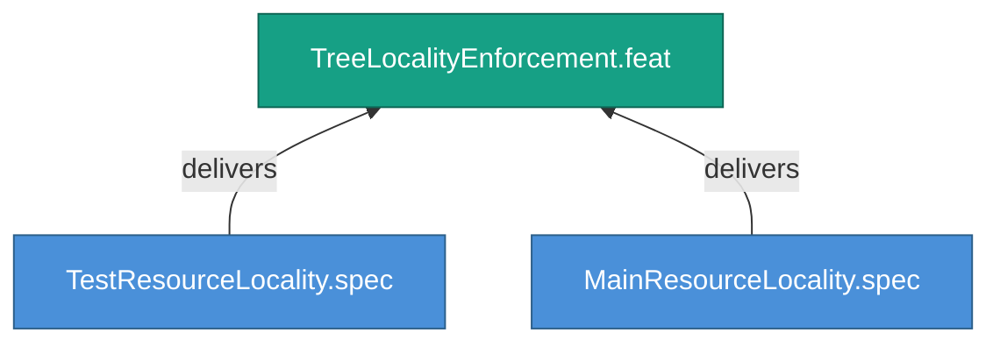

<!-- (c) 2026-* Frederick Bloom -- 20260826-144956-257822-74c7-b9b4-831ab45f7c65-TreeLocalityEnforcement.feat-0.0.1.md -- Hanaden AI -->
---
filename-id:   20260826-144956-257822-74c7-b9b4-831ab45f7c65-TreeLocalityEnforcement.feat-0.0.1
node-type:     FEAT
layer:         2
version:       0.0.1
status:        Draft
priority:      4
author:        Frederick Bloom
copyright:     "(c) 2026-* Frederick Bloom"
description: >
  Resources (shared libs, fixtures) MUST live in the tree
  that uses them, not cross-tree.
parent:        20260826-144956-169396-7286-94bf-13e738429e09-FileReferencePortability.moti-0.0.1
tdd:
  state:         NOT_STARTED
  test-file:     null
  last-run:      null
  iterations:    0
  coverage-lines: all
---

# TreeLocalityEnforcement: Resources Local To Their Consuming Tree

## Goal

Shared resources (libraries, fixtures, helper scripts) MUST reside in the
tree that consumes them. Test resources live in src/test/shared/, main
resources live in src/main/shared/.

## Requirements

| ID | Requirement | Constraint |
|----|-------------|------------|
| R1 | Test shared resources MUST be in src/test/ subtree | No cross-tree resources |
| R2 | Main shared resources MUST be in src/main/ subtree | No cross-tree resources |

## Feature Tree

## Test Suite

> **Suite ID:** PENDING
> **Suite name:** TreeLocalityEnforcement Feature Suite
> **Test file:** `null` (NOT_STARTED)

### ⚙️ Functional Tests

| ID | Description | Method | Pass Criteria | TDD |
|----|-------------|--------|---------------|-----|

## References

- SdlcEngineSpec.system-0.0.1

## Changelog

| Version | Date | Author | Changes |
|---------|------|--------|---------|
| 0.0.1 | 2026-08-26 | Frederick Bloom + AI | Initial feature |
