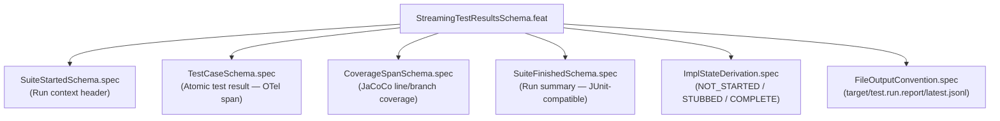

<!-- (c) 2026-* Frederick Bloom -- 20260827-091223-StreamingTestResultsSchema.feat-0.0.1.md -- Hanaden AI Loader -->
---
filename-id:   20260827-091223-512840-7e3a-bc40-f1d249c07a8b-StreamingTestResultsSchema.feat-0.0.1
node-type:     FEAT
layer:         2
version:       0.0.1
status:        Active
author:        Frederick Bloom
copyright:     "(c) 2026-* Frederick Bloom"
description: >
  Defines a canonical JSONL streaming test result record schema stored under
  target/test.run.report/ (ephemeral, not committed). The schema is designed
  for bidirectional mapping to OpenTelemetry Spans, xUnit/JUnit XML, and
  JaCoCo coverage XML. Records are emitted in real-time as each test case
  completes — not batched at the end. The schema covers four record types:
  suite_started, test_case, coverage_span, and suite_finished. Test
  implementation state (NOT_STARTED / STUBBED / COMPLETE) is derived
  dynamically by inspecting the test file at the conventional path — it is
  never stored as a static field in the spec document.
parent:        20260826-144956-364216-7c46-8b78-046d80de4a3f-StructuredTestAutomation.moti-0.0.1
tdd:
  test-file:   "src/test/generic-sdlc/test_streaming_test_results_schema.sh"
---

# StreamingTestResultsSchema: Real-Time JSONL Test Run Event Stream

## 1. Goals & Design Constraints

Every test run MUST stream structured results in real-time to a well-defined
output location. The schema is designed around three invariants:

1. **Streaming-first, not batch.** Each `test_case` record is emitted
   immediately when the test completes — not accumulated and written at the
   end. This allows CI gates, dashboard feeds, and alerting to react to
   failures as they happen.

2. **Ephemeral storage, deterministic path.** Results are written to
   `target/test.run.report/` relative to project root. This directory is
   ephemeral (not committed, in `.gitignore`). It is overwritten on each run.
   The _latest_ run file is always at a canonical path; timestamped archives
   may coexist alongside it.

3. **Bidirectional schema compatibility.** Every field in the JSONL schema
   maps to a named field in at least one of: OTel Span, JUnit XML, or JaCoCo
   XML. The mapping is lossless for the intersection and documented for the
   extensions.

---

## 2. Output File Convention

```
target/
└── test.run.report/              ← ephemeral, .gitignore'd
    ├── latest.jsonl              ← always the most recent run (overwritten)
    ├── latest.summary.json       ← final suite_finished record only
    ├── YYYYMMDD-HHMMSS.jsonl     ← timestamped archive (optional, kept N runs)
    └── junit-compat.xml          ← JUnit XML export (generated post-run from JSONL)
```

Each `latest.jsonl` file contains a sequence of newline-delimited JSON objects
in strict chronological emission order:

```
[suite_started]
[test_case] × N    ← emitted immediately on each test completion
[coverage_span] × M ← emitted per spec-node coverage hit (optional)
[suite_finished]
```

---

## 3. Record Type Definitions

### 3.1 `suite_started` — Run Context Header

Emitted exactly once, before any test case runs.

```jsonl
{
  "type":         "suite_started",
  "schema_ver":   "1.0.0",
  "suite_id":     "<spec-filename-id>-SUITE",
  "suite_name":   "HomesShadow.spec — Isolation Verification Suite",
  "trace_id":     "4bf92f3577b34da6a3ce929d0e0e4736",
  "started_at":   "2026-08-27T09:12:23.441Z",
  "spec_file":    "PROJECT_HOME/docs/.../HomesShadow.spec/...-HomesShadow.spec-0.0.1.md",
  "test_file":    "src/test/.../HomesShadow.spec/test_homes_shadow.sh",
  "host":         "workstation-hostname",
  "runner":       "bats-core/1.11.0",
  "total_planned": 60,
  "tags":         ["security", "vfs", "isolation"]
}
```

| Field | OTel Mapping | JUnit XML Mapping | JaCoCo Mapping |
|:---|:---|:---|:---|
| `trace_id` | `Span.trace_id` | `testsuite/@id` (hex prefix) | — |
| `suite_id` | `Span.name` (root span) | `testsuite/@name` | `report/@name` |
| `started_at` | `Span.start_time` | `testsuite/@timestamp` | — |
| `total_planned` | `Span.attributes["test.planned"]` | `testsuite/@tests` | — |
| `runner` | `Span.attributes["test.framework"]` | — | — |
| `host` | `Span.resource["host.name"]` | `testsuite/@hostname` | — |

---

### 3.2 `test_case` — Atomic Test Result

Emitted immediately when each test case finishes. One record per vector row.

```jsonl
{
  "type":             "test_case",
  "suite_id":         "<spec-filename-id>-SUITE",
  "trace_id":         "4bf92f3577b34da6a3ce929d0e0e4736",
  "span_id":          "00f067aa0ba902b7",
  "vector_id":        "HS-UC1-01",
  "use_case":         "UC-1: Standard Execution",
  "description":      "List root of shadowed /homes returns empty",
  "spec_constraint":  "HomesShadow.spec §UC-1: tmpfs overlay on /homes",
  "cmd":              "bwrap-enhanced.sh /bin/ls /homes",
  "input":            {"args": ["/bin/ls", "/homes"], "env_overrides": {}},
  "expected_exit":    0,
  "actual_exit":      0,
  "expected_output":  "",
  "actual_output":    "",
  "expect_result":    "PASS",
  "status":           "PASS",
  "started_at":       "2026-08-27T09:12:23.501Z",
  "finished_at":      "2026-08-27T09:12:23.612Z",
  "duration_ms":      111,
  "error":            null,
  "host_mutated":     false,
  "tags":             ["happy-path", "vfs"]
}
```

**Key field semantics:**

| Field | Meaning |
|:---|:---|
| `vector_id` | Matches the ID in the spec doc's test vector table (e.g. `HS-UC1-01`) |
| `expect_result` | `"PASS"` = this test is expected to succeed; `"FAIL"` = intentional negative test (expected to demonstrate a failure mode) |
| `status` | Actual outcome: `PASS`, `FAIL`, `SKIP`, `ERROR` |
| `host_mutated` | Boolean — true if any host-side file changed during this test (always false for sandbox tests) |
| `error` | `null` on PASS; error string on FAIL/ERROR |
| `input` | Structured representation of CLI args, env overrides, preconditions |
| `expected_output` | Exact string or regex pattern the output must match |
| `actual_output` | What the command actually produced (truncated at 4096 chars) |

**OTel / JUnit / JaCoCo mapping:**

| Field | OTel Mapping | JUnit XML Mapping | JaCoCo Mapping |
|:---|:---|:---|:---|
| `span_id` | `Span.span_id` | — | — |
| `trace_id` | `Span.trace_id` | — | — |
| `vector_id` | `Span.name` | `testcase/@name` | — |
| `spec_constraint` | `Span.attributes["test.constraint_id"]` | `testcase/@classname` | — |
| `duration_ms` | `Span.duration` | `testcase/@time` (÷1000) | — |
| `status=PASS` | `Span.status.code=OK` | `<testcase>` (no child = pass) | — |
| `status=FAIL` | `Span.status.code=ERROR` | `<testcase><failure>` | — |
| `status=SKIP` | `Span.status.code=UNSET` | `<testcase><skipped/>` | — |
| `started_at` | `Span.start_time` | — | — |
| `error` | `Span.events["exception"]` | `<failure message=...>` | — |

---

### 3.3 `coverage_span` — Per-Spec-Node Coverage Hit (Optional)

Emitted when a test case exercises a named spec constraint or source line range.
Enables JaCoCo-style line and branch coverage tracking at the spec-node level.

```jsonl
{
  "type":           "coverage_span",
  "suite_id":       "<spec-filename-id>-SUITE",
  "trace_id":       "4bf92f3577b34da6a3ce929d0e0e4736",
  "span_id":        "00f067aa0ba902b7",
  "vector_id":      "HS-UC1-01",
  "spec_node":      "HomesShadow.spec",
  "source_file":    "boot/bwrap-enhanced.sh",
  "lines_hit":      [42, 43, 44, 87, 88],
  "branches_hit":   ["L42:true", "L42:false", "L87:true"],
  "branches_total": 4,
  "branch_coverage_pct": 75.0,
  "timestamp":      "2026-08-27T09:12:23.615Z"
}
```

| Field | JaCoCo XML Mapping | OTel Mapping |
|:---|:---|:---|
| `source_file` | `sourcefile/@name` | `Span.attributes["code.filepath"]` |
| `lines_hit` | `line/@nr` where `line/@ci > 0` | — |
| `branches_hit` | `line/@cb` (covered branches) | — |
| `branch_coverage_pct` | Derived from `cb/mb` | `Span.attributes["test.branch_coverage"]` |

---

### 3.4 `suite_finished` — Run Summary Trailer

Emitted exactly once, after all test cases complete.

```jsonl
{
  "type":              "suite_finished",
  "schema_ver":        "1.0.0",
  "suite_id":          "<spec-filename-id>-SUITE",
  "trace_id":          "4bf92f3577b34da6a3ce929d0e0e4736",
  "finished_at":       "2026-08-27T09:12:24.210Z",
  "duration_ms":       769,
  "total":             60,
  "passed":            58,
  "failed":            1,
  "skipped":           1,
  "errored":           0,
  "expected_failures": 12,
  "overall_status":    "FAIL",
  "coverage": {
    "lines_hit":       142,
    "lines_total":     180,
    "line_pct":        78.9,
    "branches_hit":    44,
    "branches_total":  56,
    "branch_pct":      78.6
  },
  "output_file":       "target/test.run.report/latest.jsonl"
}
```

**Key field semantics:**

| Field | Meaning |
|:---|:---|
| `expected_failures` | Count of `test_case` records where `expect_result=FAIL` and `status=FAIL` — these are **correct** negative test outcomes, not regressions |
| `overall_status` | `"PASS"` iff `failed == 0`; expected_failures do NOT count as failures |
| `coverage` | Aggregated from all `coverage_span` records in this run |

---

## 4. Implementation State Convention (Dynamic — Never Stored in Spec Docs)

Test implementation state is derived at read-time by inspecting the test file at the
conventional path defined in `tdd.test-file`. It is **never stored as a static field**
in the spec document or the test table.

```
CONVENTIONAL INSPECTION ALGORITHM:
  path = PROJECT_HOME / tdd.test-file

  if ! file_exists(path):           → NOT_STARTED
  elif file_has_only_stubs(path):   → STUBBED
  else:                             → COMPLETE

STUB DETECTION:
  A test file is STUBBED if every @test block:
    - Has body containing only: skip / TODO / echo / # placeholder
    - Has zero assert* or run / [ $status... ] / grep assertions
```

The three states:

| State | Symbol | Derived from |
|:---|:---|:---|
| `NOT_STARTED` | `○` | `tdd.test-file` does not exist on disk |
| `STUBBED` | `◑` | File exists; all `@test` bodies are skeletons (no real assertions) |
| `COMPLETE` | `●` | File exists; at least one `@test` body contains a real assertion |

Tooling that renders spec documents (dashboards, AI agents) MUST compute this state
dynamically at display time, not read it from the spec file.

---

## 5. Bats-Core Emission Contract

Every `test_*.sh` script that produces this format MUST source a shared
emitter helper:

```bash
#!/usr/bin/env bats
# shellcheck source=src/lib/test-emit.sh
source "${PROJECT_HOME}/src/lib/test-emit.sh"

setup_suite() { emit_suite_started "$BATS_SUITE_TEST_NUMBER"; }
teardown_suite() { emit_suite_finished; }

@test "HS-UC1-01: List root of shadowed /homes returns empty" {
  local input_args=("/bin/ls" "/homes")
  run bwrap-enhanced.sh "${input_args[@]}"
  emit_test_case "HS-UC1-01" "UC-1" "$status" "$output" 0 "" "PASS"
  assert_success
  assert_output ""
}
```

The `emit_test_case` call writes one `test_case` JSONL record to `latest.jsonl`
before the assertion, so partial results are preserved even if a test crashes.

---

## 6. Feature Tree



---

## 7. OTel ↔ JUnit ↔ JaCoCo Bidirectional Mapping Summary

```
┌─────────────────────────────────────────────────────────────────────────────┐
│ JSONL Record    │ OTel Concept      │ JUnit XML Element  │ JaCoCo XML       │
├─────────────────┼───────────────────┼────────────────────┼──────────────────┤
│ suite_started   │ Root Span (start) │ <testsuite>        │ <report>         │
│ test_case       │ Child Span        │ <testcase>         │ —                │
│ coverage_span   │ Span Event        │ —                  │ <sourcefile>     │
│ suite_finished  │ Root Span (end)   │ </testsuite>       │ </report>        │
├─────────────────┼───────────────────┼────────────────────┼──────────────────┤
│ trace_id        │ trace_id          │ @id (hex prefix)   │ —                │
│ span_id         │ span_id           │ —                  │ —                │
│ duration_ms     │ Span.duration     │ @time (÷1000)      │ —                │
│ status=PASS     │ StatusCode.OK     │ (no child elem)    │ —                │
│ status=FAIL     │ StatusCode.ERROR  │ <failure>          │ —                │
│ status=SKIP     │ StatusCode.UNSET  │ <skipped/>         │ —                │
│ lines_hit       │ —                 │ —                  │ line/@ci > 0     │
│ branch_pct      │ attr[branch_cov]  │ —                  │ line/@cb / @mb   │
└─────────────────┴───────────────────┴────────────────────┴──────────────────┘
```

## Changelog

| Version | Date | Author | Changes |
|:---|:---|:---|:---|
| 0.0.1 | 2026-08-27 | Frederick Bloom + AI | Initial: 4 record types, OTel/JUnit/JaCoCo mapping tables, impl-state derivation algorithm, Bats-core emission contract, output file convention |
