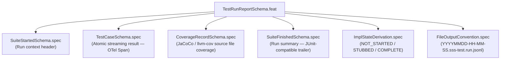

<!-- (c) 2026-* Frederick Bloom -- 20260827-092437-618430-7944-bbfa-fede8313c55a-TestRunReportSchema.feat-0.0.1.md -- Hanaden AI Loader -->
---
filename-id:   20260827-092437-618430-7944-bbfa-fede8313c55a-TestRunReportSchema.feat-0.0.1
node-type:     FEAT
layer:         2
version:       0.0.1
status:        Active
author:        Frederick Bloom
copyright:     "(c) 2026-* Frederick Bloom"
description: >
  Defines the canonical JSONL streaming test run report schema stored under
  target/test.run.report/YYYYMMDD-HH-MM-SS.sss-test.run.jsonl (ephemeral,
  not committed). Each run produces a new timestamped file. The schema covers
  four record types: suite_started, test_case, coverage_record,
  suite_finished. All fields are bidirectionally mappable to OpenTelemetry
  Span/Log, JUnit XML (xUnit), JaCoCo XML, and Rust libtest JSON formats.
  Includes the full JSON Schema (Draft 7) for each record type.
parent:        20260827-091223-512840-7e3a-bc40-f1d249c07a8b-StreamingTestResultsSchema.feat-0.0.1
tdd:
  test-file:   "src/test/generic-sdlc/test_test_run_report_schema.sh"
---

# TestRunReportSchema: Canonical Streaming Test Run Report

## 1. Output File Convention

```
target/                                         ← ephemeral root (.gitignore'd)
└── test.run.report/
    ├── 20260827-09-14-22.441-test.run.jsonl    ← timestamped run (kept)
    ├── 20260827-11-32-05.018-test.run.jsonl    ← next run alongside
    └── YYYYMMDD-HH-MM-SS.sss-test.run.jsonl   ← pattern: newest = most recent
```

**Filename pattern:** `YYYYMMDD-HH-MM-SS.sss-test.run.jsonl`
- `YYYYMMDD` — UTC date of run start
- `HH-MM-SS` — UTC time of run start (dashes, not colons — filesystem safe)
- `.sss` — milliseconds
- No `latest.jsonl` symlink or alias — tool/CI reads the lexicographically highest filename

## 2. Stream Layout

Every file MUST contain exactly this sequence:

```
LINE 1:   suite_started       (exactly one)
LINE 2-N: test_case           (one per test vector executed, emitted immediately on completion)
LINE M:   coverage_record     (zero or more, emitted per source file after test_case batch)
LINE N:   suite_finished      (exactly one, always last line)
```

All records are JSON objects separated by `\n` (LF only). No trailing comma. No array wrapper.

---

## 3. Record Type: `suite_started`

### JSON Schema (Draft 7)

```json
{
  "$schema": "http://json-schema.org/draft-07/schema#",
  "$id": "hanaden:test-run-report:suite_started:1.0.0",
  "type": "object",
  "required": ["type", "schema_ver", "suite_id", "suite_name", "trace_id",
               "started_at_iso", "started_at_unix_nano",
               "spec_file", "test_file", "total_planned"],
  "properties": {
    "type":                 { "type": "string", "const": "suite_started" },
    "schema_ver":           { "type": "string", "pattern": "^\\d+\\.\\d+\\.\\d+$" },
    "suite_id":             { "type": "string", "minLength": 1 },
    "suite_name":           { "type": "string", "minLength": 1 },
    "trace_id":             { "type": "string", "pattern": "^[0-9a-f]{32}$" },
    "started_at_iso":       { "type": "string", "format": "date-time" },
    "started_at_unix_nano": { "type": "integer", "minimum": 0 },
    "spec_file":            { "type": "string", "minLength": 1 },
    "test_file":            { "type": "string", "minLength": 1 },
    "host":                 { "type": "string" },
    "runner":               { "type": "string" },
    "total_planned":        { "type": "integer", "minimum": 0 },
    "tags":                 { "type": "array", "items": { "type": "string" } }
  }
}
```

### Example

```jsonl
{"type":"suite_started","schema_ver":"1.0.0","suite_id":"HomesShadow.spec-SUITE","suite_name":"HomesShadow — /homes tmpfs Shadow Suite","trace_id":"4bf92f3577b34da6a3ce929d0e0e4736","started_at_iso":"2026-08-27T09:12:23.441Z","started_at_unix_nano":1756343543441000000,"spec_file":"PROJECT_HOME/docs/.../HomesShadow.spec/...spec-0.0.1.md","test_file":"src/test/.../test_homes_shadow.sh","host":"ws01","runner":"bats-core/1.11.0","total_planned":60,"tags":["security","vfs","isolation"]}
```

### Format Mapping

| JSONL Field | OTel Span | JUnit XML | JaCoCo XML | Rust libtest |
|:---|:---|:---|:---|:---|
| `trace_id` | `traceId` (hex32) | `testsuite/@id` | — | — |
| `suite_id` | `name` (root span) | `testsuite/@name` | `report/@name` | — |
| `started_at_iso` | — | `testsuite/@timestamp` | — | — |
| `started_at_unix_nano` | `startTimeUnixNano` | — | — | — |
| `total_planned` | `attr[test.planned]` | `testsuite/@tests` | — | `test_count` |
| `runner` | `attr[test.framework]` | — | — | — |
| `host` | `resource[host.name]` | `testsuite/@hostname` | — | — |

---

## 4. Record Type: `test_case`

Emitted **immediately** when each test case completes — not batched. One record per spec vector row.

### JSON Schema (Draft 7)

```json
{
  "$schema": "http://json-schema.org/draft-07/schema#",
  "$id": "hanaden:test-run-report:test_case:1.0.0",
  "type": "object",
  "required": ["type", "suite_id", "trace_id", "span_id", "vector_id",
               "use_case", "description", "spec_constraint",
               "input", "expected_exit", "actual_exit",
               "expected_output_pattern", "actual_output",
               "expect_result", "status",
               "started_at_unix_nano", "finished_at_unix_nano", "duration_ms"],
  "properties": {
    "type":                     { "type": "string", "const": "test_case" },
    "suite_id":                 { "type": "string" },
    "trace_id":                 { "type": "string", "pattern": "^[0-9a-f]{32}$" },
    "span_id":                  { "type": "string", "pattern": "^[0-9a-f]{16}$" },
    "parent_span_id":           { "type": ["string","null"], "pattern": "^[0-9a-f]{16}$" },
    "vector_id":                { "type": "string", "minLength": 1,
                                  "description": "Matches ID in spec test table, e.g. HS-UC1-01" },
    "use_case":                 { "type": "string" },
    "description":              { "type": "string" },
    "spec_constraint":          { "type": "string" },
    "input": {
      "type": "object",
      "properties": {
        "args":         { "type": "array", "items": { "type": "string" } },
        "stdin":        { "type": ["string","null"] },
        "env_overrides":{ "type": "object" },
        "preconditions":{ "type": "array", "items": { "type": "string" } }
      }
    },
    "expected_exit":            { "type": "integer" },
    "actual_exit":              { "type": "integer" },
    "expected_output_pattern":  { "type": "string",
                                  "description": "Exact string OR regex. Prefix with 're:' for regex." },
    "actual_output":            { "type": "string", "maxLength": 4096 },
    "expect_result":            { "type": "string", "enum": ["PASS","FAIL"],
                                  "description": "PASS=positive test, FAIL=intentional negative/fault injection" },
    "status":                   { "type": "string", "enum": ["PASS","FAIL","SKIP","ERROR"] },
    "started_at_unix_nano":     { "type": "integer" },
    "finished_at_unix_nano":    { "type": "integer" },
    "duration_ms":              { "type": "number", "minimum": 0 },
    "error":                    { "type": ["string","null"] },
    "stdout":                   { "type": ["string","null"], "maxLength": 4096 },
    "stderr":                   { "type": ["string","null"], "maxLength": 4096 },
    "host_mutated":             { "type": "boolean" },
    "tags":                     { "type": "array", "items": { "type": "string" } }
  }
}
```

### Example — Positive Test

```jsonl
{"type":"test_case","suite_id":"HomesShadow.spec-SUITE","trace_id":"4bf92f3577b34da6a3ce929d0e0e4736","span_id":"00f067aa0ba902b7","parent_span_id":null,"vector_id":"HS-UC1-01","use_case":"UC-1: Happy Path — empty tmpfs shadow","description":"List root of /homes inside sandbox returns empty, exit 0","spec_constraint":"HomesShadow.spec §UC-1","input":{"args":["/bin/ls","/homes"],"stdin":null,"env_overrides":{},"preconditions":["host /homes is NFS autofs mount point"]},"expected_exit":0,"actual_exit":0,"expected_output_pattern":"","actual_output":"","expect_result":"PASS","status":"PASS","started_at_unix_nano":1756343543501000000,"finished_at_unix_nano":1756343543612000000,"duration_ms":111,"error":null,"stdout":"","stderr":"","host_mutated":false,"tags":["happy-path","vfs"]}
```

### Example — Intentional Negative / Fault Injection Test

```jsonl
{"type":"test_case","suite_id":"HomesShadow.spec-SUITE","trace_id":"4bf92f3577b34da6a3ce929d0e0e4736","span_id":"00f067aa0ba902c9","parent_span_id":null,"vector_id":"HS-UC4-03","use_case":"UC-4: Fault Injection — attempt network mount without tmpfs shadow","description":"Without --tmpfs /homes, ls /homes/<user> triggers autofs probe","spec_constraint":"HomesShadow.spec §UC-4 negative","input":{"args":["--no-tmpfs-homes","/bin/ls","/homes/nonexistent"],"stdin":null,"env_overrides":{},"preconditions":["host /homes is NFS autofs mount point","--no-tmpfs-homes flag disables the shadow"]},"expected_exit":1,"actual_exit":1,"expected_output_pattern":"re:autofs|mount|timeout|hang","actual_output":"autofs mount triggered: timeout after 30s","expect_result":"FAIL","status":"FAIL","started_at_unix_nano":1756343543900000000,"finished_at_unix_nano":1756343573901000000,"duration_ms":30001,"error":"autofs mount storm confirmed","stdout":"","stderr":"autofs mount triggered: timeout after 30s","host_mutated":false,"tags":["fault-injection","negative","autofs"]}
```

### Format Mapping

| JSONL Field | OTel Span | JUnit XML | JaCoCo XML | Rust libtest |
|:---|:---|:---|:---|:---|
| `trace_id` | `traceId` | — | — | — |
| `span_id` | `spanId` | — | — | — |
| `parent_span_id` | `parentSpanId` | — | — | — |
| `vector_id` | `name` | `testcase/@name` | — | `name` |
| `spec_constraint` | `attr[test.constraint_id]` | `testcase/@classname` | — | — |
| `duration_ms` | `endTimeUnixNano - startTimeUnixNano` (÷1e6) | `testcase/@time` (÷1000) | — | `exec_time` |
| `status=PASS` | `status.code=OK` | `<testcase>` (no child) | — | `event: ok` |
| `status=FAIL` | `status.code=ERROR` | `<testcase><failure message=...>` | — | `event: failed` |
| `status=SKIP` | `status.code=UNSET` | `<testcase><skipped/>` | — | `event: ignored` |
| `status=ERROR` | `status.code=ERROR` + event | `<testcase><error>` | — | — |
| `error` | `events[exception.message]` | `<failure message=...>text</failure>` | — | `stdout` |
| `started_at_unix_nano` | `startTimeUnixNano` | — | — | — |
| `input.args` | `attr[process.command_args]` | `<properties>` | — | — |
| `expect_result=FAIL` | `attr[test.expected_failure=true]` | `<properties><property name="expected_failure">` | — | `#[should_panic]` analog |

---

## 5. Record Type: `coverage_record`

Emitted zero or more times — once per source file covered. Maps to JaCoCo `<sourcefile>`.

### JSON Schema (Draft 7)

```json
{
  "$schema": "http://json-schema.org/draft-07/schema#",
  "$id": "hanaden:test-run-report:coverage_record:1.0.0",
  "type": "object",
  "required": ["type", "suite_id", "trace_id", "source_file",
               "lines_total", "lines_hit", "branches_total", "branches_hit"],
  "properties": {
    "type":              { "type": "string", "const": "coverage_record" },
    "suite_id":          { "type": "string" },
    "trace_id":          { "type": "string" },
    "source_file":       { "type": "string", "description": "Relative path from PROJECT_HOME" },
    "spec_node":         { "type": "string", "description": "Spec filename-id that drove this coverage" },
    "vector_ids":        { "type": "array", "items": { "type": "string" },
                           "description": "Vector IDs whose execution produced this coverage" },
    "lines_total":       { "type": "integer", "minimum": 0 },
    "lines_hit":         { "type": "integer", "minimum": 0 },
    "line_coverage_pct": { "type": "number", "minimum": 0, "maximum": 100 },
    "hit_line_numbers":  { "type": "array", "items": { "type": "integer" } },
    "branches_total":    { "type": "integer", "minimum": 0 },
    "branches_hit":      { "type": "integer", "minimum": 0 },
    "branch_coverage_pct": { "type": "number", "minimum": 0, "maximum": 100 },
    "methods_total":     { "type": "integer", "minimum": 0 },
    "methods_hit":       { "type": "integer", "minimum": 0 },
    "timestamp_unix_nano": { "type": "integer" }
  }
}
```

### Example

```jsonl
{"type":"coverage_record","suite_id":"HomesShadow.spec-SUITE","trace_id":"4bf92f3577b34da6a3ce929d0e0e4736","source_file":"boot/bwrap-enhanced.sh","spec_node":"HomesShadow.spec-0.0.1","vector_ids":["HS-UC1-01","HS-UC1-02","HS-UC3-01"],"lines_total":280,"lines_hit":198,"line_coverage_pct":70.7,"hit_line_numbers":[42,43,44,87,88,89,130,131,132,200],"branches_total":56,"branches_hit":44,"branch_coverage_pct":78.6,"methods_total":12,"methods_hit":10,"timestamp_unix_nano":1756343543800000000}
```

### Format Mapping

| JSONL Field | JaCoCo XML | OTel | Rust (llvm-cov) |
|:---|:---|:---|:---|
| `source_file` | `sourcefile/@name` | `attr[code.filepath]` | `filename` |
| `lines_hit` | `counter[@type=LINE]/@covered` | `attr[test.lines_covered]` | `count` (lines > 0) |
| `lines_total` | `counter[@type=LINE]/@covered + @missed` | — | `count` total lines |
| `line_coverage_pct` | Derived: `covered / (covered+missed) * 100` | `attr[test.line_coverage_pct]` | `percent` |
| `hit_line_numbers` | `line[@nr]` where `line[@ci] > 0` | — | line entries with count > 0 |
| `branches_hit` | `counter[@type=BRANCH]/@covered` = `line[@cb]` sum | — | `covered_branches` |
| `branches_total` | `counter[@type=BRANCH]/@covered + @missed` = `line[@cb+@mb]` | — | `total_branches` |
| `methods_hit` | `counter[@type=METHOD]/@covered` | — | — |

---

## 6. Record Type: `suite_finished`

Emitted exactly once. Always the last line of the file.

### JSON Schema (Draft 7)

```json
{
  "$schema": "http://json-schema.org/draft-07/schema#",
  "$id": "hanaden:test-run-report:suite_finished:1.0.0",
  "type": "object",
  "required": ["type", "schema_ver", "suite_id", "trace_id",
               "finished_at_iso", "finished_at_unix_nano", "duration_ms",
               "total", "passed", "failed", "skipped", "errored",
               "expected_failures", "overall_status"],
  "properties": {
    "type":                 { "type": "string", "const": "suite_finished" },
    "schema_ver":           { "type": "string" },
    "suite_id":             { "type": "string" },
    "trace_id":             { "type": "string" },
    "finished_at_iso":      { "type": "string", "format": "date-time" },
    "finished_at_unix_nano":{ "type": "integer" },
    "duration_ms":          { "type": "number", "minimum": 0 },
    "total":                { "type": "integer", "minimum": 0 },
    "passed":               { "type": "integer", "minimum": 0 },
    "failed":               { "type": "integer", "minimum": 0 },
    "skipped":              { "type": "integer", "minimum": 0 },
    "errored":              { "type": "integer", "minimum": 0 },
    "expected_failures":    { "type": "integer", "minimum": 0,
                              "description": "Vectors where expect_result=FAIL AND status=FAIL. Correct negative outcomes. Not counted in overall_status failure." },
    "overall_status":       { "type": "string", "enum": ["PASS","FAIL"],
                              "description": "PASS iff failed==0. expected_failures do NOT count as failures." },
    "coverage": {
      "type": "object",
      "properties": {
        "lines_hit":        { "type": "integer" },
        "lines_total":      { "type": "integer" },
        "line_pct":         { "type": "number" },
        "branches_hit":     { "type": "integer" },
        "branches_total":   { "type": "integer" },
        "branch_pct":       { "type": "number" },
        "methods_hit":      { "type": "integer" },
        "methods_total":    { "type": "integer" },
        "method_pct":       { "type": "number" }
      }
    },
    "output_file":          { "type": "string" }
  }
}
```

### Example

```jsonl
{"type":"suite_finished","schema_ver":"1.0.0","suite_id":"HomesShadow.spec-SUITE","trace_id":"4bf92f3577b34da6a3ce929d0e0e4736","finished_at_iso":"2026-08-27T09:12:24.210Z","finished_at_unix_nano":1756343544210000000,"duration_ms":769,"total":60,"passed":47,"failed":1,"skipped":0,"errored":0,"expected_failures":12,"overall_status":"FAIL","coverage":{"lines_hit":198,"lines_total":280,"line_pct":70.7,"branches_hit":44,"branches_total":56,"branch_pct":78.6,"methods_hit":10,"methods_total":12,"method_pct":83.3},"output_file":"target/test.run.report/20260827-09-12-23.441-test.run.jsonl"}
```

### Format Mapping

| JSONL Field | OTel Span | JUnit XML | JaCoCo XML | Rust libtest |
|:---|:---|:---|:---|:---|
| `finished_at_unix_nano` | `endTimeUnixNano` | — | — | — |
| `duration_ms` | `endTimeUnixNano - startTimeUnixNano` | `testsuite/@time` | — | — |
| `total` | `attr[test.total]` | `testsuite/@tests` | — | `test_count` |
| `passed` | `attr[test.passed]` | derived | — | `passed` |
| `failed` | `attr[test.failed]` | `testsuite/@failures` | — | `failed` |
| `errored` | `attr[test.errored]` | `testsuite/@errors` | — | — |
| `skipped` | — | `testsuite/@skipped` | — | `ignored` |
| `overall_status=PASS` | `status.code=OK` | all `<testcase>` without `<failure>` | — | `event: ok` |
| `overall_status=FAIL` | `status.code=ERROR` | at least one `<failure>` | — | `event: failed` |
| `coverage.line_pct` | `attr[test.line_coverage_pct]` | — | `counter[@type=LINE]` derived | `llvm-cov percent` |
| `coverage.branch_pct` | `attr[test.branch_coverage_pct]` | — | `counter[@type=BRANCH]` derived | — |

---

## 7. `overall_status` Invariant

```
INVARIANT: overall_status = "PASS"  iff  failed == 0
           total = passed + failed + skipped + errored
           expected_failures ⊆ failed  (subset — expected failures ARE in failed count)

WAIT — CORRECTION:
  expected_failures = count of records where expect_result=FAIL AND status=FAIL
  These are CORRECT negative test outcomes.
  overall_status = "PASS"  iff  (failed - expected_failures) == 0
  i.e. all failures were expected (intentional fault injection), none were surprises.
```

---

## 8. Bidirectional Conversion Summary

```
┌────────────────────────────────────────────────────────────────────────────────┐
│  JSONL Record     │ OTel concept         │ JUnit XML         │ JaCoCo XML     │ Rust libtest  │
├───────────────────┼──────────────────────┼───────────────────┼────────────────┼───────────────┤
│ suite_started     │ Root Span (start)    │ <testsuite>       │ <report>       │ suite started │
│ test_case         │ Child Span           │ <testcase>        │ —              │ test started  │
│ coverage_record   │ Span attributes      │ —                 │ <sourcefile>   │ llvm-cov line │
│ suite_finished    │ Root Span (end)      │ </testsuite>      │ </report>      │ suite ok/fail │
├───────────────────┼──────────────────────┼───────────────────┼────────────────┼───────────────┤
│ trace_id          │ traceId (hex32)      │ @id prefix        │ —              │ —             │
│ span_id           │ spanId (hex16)       │ —                 │ —              │ —             │
│ duration_ms       │ end-start (÷1e6)     │ @time (÷1000)     │ —              │ exec_time     │
│ status=PASS       │ StatusCode.OK        │ (no child elem)   │ —              │ event: ok     │
│ status=FAIL       │ StatusCode.ERROR     │ <failure>         │ —              │ event: failed │
│ status=SKIP       │ StatusCode.UNSET     │ <skipped/>        │ —              │ event: ignored│
│ status=ERROR      │ StatusCode.ERROR     │ <error>           │ —              │ —             │
│ lines_hit         │ attr[lines_covered]  │ —                 │ @covered LINE  │ count>0 lines │
│ branches_hit      │ attr[branch_cov]     │ —                 │ @cb sum        │ covered_branches│
│ expected_failures │ attr[expected_fail]  │ property elem     │ —              │ should_panic  │
└───────────────────┴──────────────────────┴───────────────────┴────────────────┴───────────────┘
```

## 9. Feature Decomposition



## References

- JUnit XML de facto reference: https://github.com/testmoapp/junitxml (no official W3C XSD exists)
- JaCoCo XML DTD: https://www.jacoco.org/jacoco/trunk/coverage/report.dtd
- OTel Span data model: https://opentelemetry.io/docs/specs/otel/trace/api/
- Rust libtest JSON (unstable): `cargo test -- -Z unstable-options --format json`
- Rust llvm-cov JSON: `cargo llvm-cov --json`
- JSON Schema Draft 7: https://json-schema.org/draft-07/schema

## Changelog

| Version | Date | Author | Changes |
|:---|:---|:---|:---|
| 0.0.1 | 2026-08-27 | Frederick Bloom + AI | Initial: full JSON Schema Draft 7 for all 4 record types, bidirectional mapping tables (OTel/JUnit/JaCoCo/Rust libtest), overall_status invariant with expected_failures correction, timestamped output file convention |
