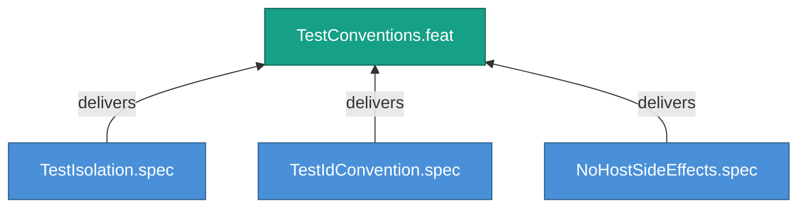

<!-- (c) 2026-* Frederick Bloom -- 20260826-144956-373263-7a0e-b2ea-826d3a003835-TestConventions.feat-0.0.1.md -- Hanaden AI -->
---
filename-id:   20260826-144956-373263-7a0e-b2ea-826d3a003835-TestConventions.feat-0.0.1
node-type:     FEAT
layer:         2
version:       0.0.1
status:        Draft
priority:      1
author:        Frederick Bloom
copyright:     "(c) 2026-* Frederick Bloom"
description: >
  Test isolation, ID conventions, and host side-effect
  prohibition.
parent:        20260826-144956-364216-7c46-8b78-046d80de4a3f-StructuredTestAutomation.moti-0.0.1
tdd:
  state:         NOT_STARTED
  test-file:     null
  last-run:      null
  iterations:    0
  coverage-lines: all
---

# TestConventions: Test Isolation and Convention Standards

## Goal

Every test MUST be isolated, identified by a spec-mapped ID, and free of
host side effects.

## Requirements

| ID | Requirement | Constraint |
|----|-------------|------------|
| R1 | Tests MUST be isolated — no shared state between tests | Clean state per test |
| R2 | Test IDs MUST map to spec constraint IDs | Traceability |
| R3 | Tests MUST NOT produce host side effects | No untracked tempfiles |

## Feature Tree

## Test Suite

> **Suite ID:** PENDING
> **Suite name:** TestConventions Feature Suite
> **Test file:** `null` (NOT_STARTED)

### ⚙️ Functional Tests

| ID | Description | Method | Pass Criteria | TDD |
|----|-------------|--------|---------------|-----|

## References

- SdlcEngineSpec.system-0.0.1

## Changelog

| Version | Date | Author | Changes |
|---------|------|--------|---------|
| 0.0.1 | 2026-08-26 | Frederick Bloom + AI | Initial feature |
