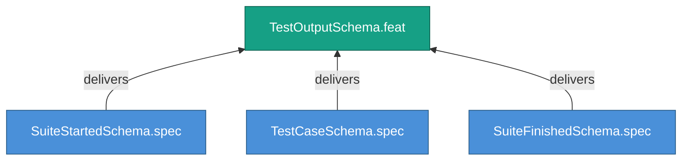

<!-- (c) 2026-* Frederick Bloom -- 20260826-144956-409175-7d11-a8b7-b2d1d1b1bcd3-TestOutputSchema.feat-0.0.1.md -- Hanaden AI -->
---
filename-id:   20260826-144956-409175-7d11-a8b7-b2d1d1b1bcd3-TestOutputSchema.feat-0.0.1
node-type:     FEAT
layer:         2
version:       0.0.1
status:        Draft
priority:      2
author:        Frederick Bloom
copyright:     "(c) 2026-* Frederick Bloom"
description: >
  Standardized JSONL output schema with suite_started,
  test_case, and suite_finished record types.
parent:        20260826-144956-364216-7c46-8b78-046d80de4a3f-StructuredTestAutomation.moti-0.0.1
tdd:
  state:         NOT_STARTED
  test-file:     null
  last-run:      null
  iterations:    0
  coverage-lines: all
---

# TestOutputSchema: Standardized JSONL Test Output Schema

## Goal

Every test suite MUST produce JSONL output with three record types for
machine aggregation.

## Requirements

| ID | Requirement | Constraint |
|----|-------------|------------|
| R1 | Output MUST be JSONL (one JSON object per line) | Valid JSON per line |
| R2 | Three record types: suite_started, test_case, suite_finished | Schema compliance |
| R3 | Fields MUST match the schema definitions | Validated by JSON Schema |

## Feature Tree

## Test Suite

> **Suite ID:** PENDING
> **Suite name:** TestOutputSchema Feature Suite
> **Test file:** `null` (NOT_STARTED)

### ⚙️ Functional Tests

| ID | Description | Method | Pass Criteria | TDD |
|----|-------------|--------|---------------|-----|

## References

- SdlcEngineSpec.system-0.0.1

## Changelog

| Version | Date | Author | Changes |
|---------|------|--------|---------|
| 0.0.1 | 2026-08-26 | Frederick Bloom + AI | Initial feature |
