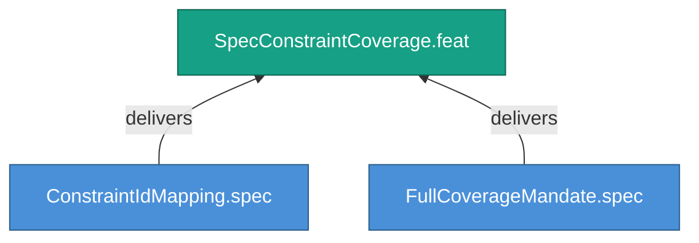

<!-- (c) 2026-* Frederick Bloom -- 20260826-144956-327764-7340-9083-21045d589ddd-SpecConstraintCoverage.feat-0.0.1.md -- Hanaden AI -->
---
filename-id:   20260826-144956-327764-7340-9083-21045d589ddd-SpecConstraintCoverage.feat-0.0.1
node-type:     FEAT
layer:         2
version:       0.0.1
status:        Draft
priority:      2
author:        Frederick Bloom
copyright:     "(c) 2026-* Frederick Bloom"
description: >
  Every constraint in a spec MUST be mapped to a test
  assertion, with no untested constraints allowed.
parent:        20260826-144956-292584-7eb2-aefa-537cf83236de-SpecTracedTDD.moti-0.0.1
tdd:
  state:         NOT_STARTED
  test-file:     null
  last-run:      null
  iterations:    0
  coverage-lines: all
---

# SpecConstraintCoverage: Full Constraint-to-Test Coverage

## Goal

Every constraint defined in a specification document MUST have a
corresponding test assertion. No constraint may exist untested.

## Requirements

| ID | Requirement | Constraint |
|----|-------------|------------|
| R1 | Every constraint ID MUST map to at least one test assertion | 1:1 minimum coverage |
| R2 | No untested constraints allowed | 100% coverage mandate |

## Feature Tree

## Test Suite

> **Suite ID:** PENDING
> **Suite name:** SpecConstraintCoverage Feature Suite
> **Test file:** `null` (NOT_STARTED)

### ⚙️ Functional Tests

| ID | Description | Method | Pass Criteria | TDD |
|----|-------------|--------|---------------|-----|

## References

- SdlcEngineSpec.system-0.0.1

## Changelog

| Version | Date | Author | Changes |
|---------|------|--------|---------|
| 0.0.1 | 2026-08-26 | Frederick Bloom + AI | Initial feature |
