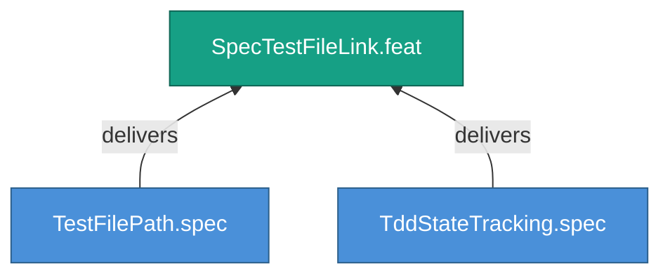

<!-- (c) 2026-* Frederick Bloom -- 20260826-144956-301396-7b91-baf2-1a0aef8c8aa9-SpecTestFileLink.feat-0.0.1.md -- Hanaden AI -->
---
filename-id:   20260826-144956-301396-7b91-baf2-1a0aef8c8aa9-SpecTestFileLink.feat-0.0.1
node-type:     FEAT
layer:         2
version:       0.0.1
status:        Draft
priority:      1
author:        Frederick Bloom
copyright:     "(c) 2026-* Frederick Bloom"
description: >
  Every spec MUST link to its test file via tdd.test-file
  and track its lifecycle via tdd.state.
parent:        20260826-144956-292584-7eb2-aefa-537cf83236de-SpecTracedTDD.moti-0.0.1
tdd:
  state:         NOT_STARTED
  test-file:     null
  last-run:      null
  iterations:    0
  coverage-lines: all
---

# SpecTestFileLink: Spec-to-Test File Linkage and TDD State Tracking

## Goal

Every specification document MUST carry a tdd: frontmatter block that
mechanically links it to its test file and tracks the test lifecycle.

## Requirements

| ID | Requirement | Constraint |
|----|-------------|------------|
| R1 | tdd.test-file MUST be a relative path to the test script | Relative to PROJECT_HOME |
| R2 | tdd.state MUST be one of NOT_STARTED, RED, GREEN, REFACTOR, PASS | Enum validation |

## Feature Tree

## Test Suite

> **Suite ID:** PENDING
> **Suite name:** SpecTestFileLink Feature Suite
> **Test file:** `null` (NOT_STARTED)

### ⚙️ Functional Tests

| ID | Description | Method | Pass Criteria | TDD |
|----|-------------|--------|---------------|-----|

## References

- SdlcEngineSpec.system-0.0.1

## Changelog

| Version | Date | Author | Changes |
|---------|------|--------|---------|
| 0.0.1 | 2026-08-26 | Frederick Bloom + AI | Initial feature |
