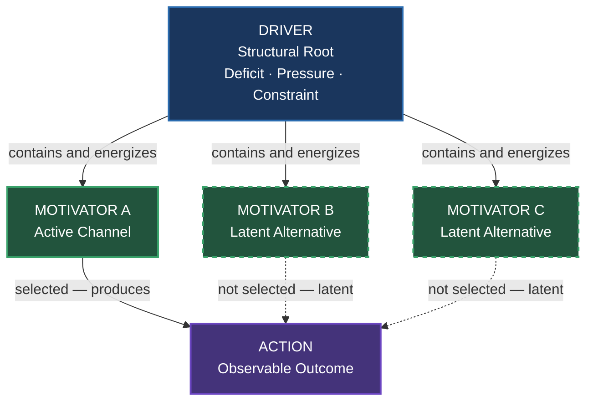
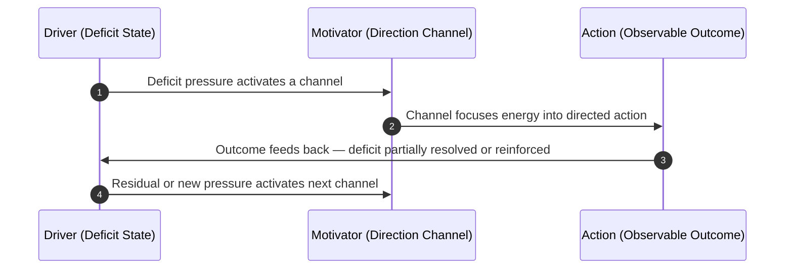

<!-- (c) 2026-* Frederick Bloom -- DriverVsMotivator-analysis.analys.md -- Hanaden AI -->
---
filename-id:   DriverVsMotivator-analysis.analys
node-type:     ANALYS
layer:         meta
version:       1.0.0
status:        Active
author:        Frederick Bloom
copyright:     (c) 2026-* Frederick Bloom
description: >
  Pure ontological analysis of the conceptual relationship between Driver and
  Motivator. Establishes their distinct roles, structural hierarchy, directional
  nature, and closed-loop interaction as universal concepts. Domain-agnostic.
  No project coupling. No framework coupling. Only the two words and what they mean.
scope:         universal
keywords:
  - ontology
  - driver
  - motivator
  - causation
  - hierarchy
  - feedback-loop
---

# Ontology Analysis: Driver and Motivator

A **Driver** and a **Motivator** are not synonyms. They occupy different
positions in a causal chain and perform structurally distinct roles. This
document defines each precisely and maps the relationship between them.

---

## 1. The Two Concepts Defined

### 1.1 Driver

A Driver is a **structural root force** — an underlying state of tension,
deficit, or constraint that makes action necessary. It does not point toward any
specific outcome. It simply establishes that the current state cannot persist
unchanged.

A Driver **pushes from behind**. It is the pressure that exists regardless of
what reward is offered. It is the *why* that cannot be suppressed by ignoring it.

Core properties:

| Property | Description |
|:---|:---|
| **Internal and structural** | Exists within the system before any external stimulus arrives |
| **Deficit-based** | Arises from a gap between current state and a required state |
| **Non-negotiable** | Does not dissolve because it is ignored or deferred |
| **Direction-neutral** | Creates pressure without specifying the path of release |
| **Persistent** | Continues until the underlying deficit is genuinely resolved |

### 1.2 Motivator

A Motivator is an **operational catalyst** — a specific incentive, reward
mechanism, or trigger that gives the energy of a Driver a concrete direction.
It converts unformed pressure into goal-directed action.

A Motivator **pulls forward**. It is the specific thing that makes one
particular path of action attractive or worthwhile at this moment.

Core properties:

| Property | Description |
|:---|:---|
| **External or contextual** | Arrives as a stimulus, opportunity, or perceived reward |
| **Reward-based** | Operates by making one direction more attractive than alternatives |
| **Situational** | Sensitive to context; the same Driver can be channeled by different Motivators |
| **Direction-specific** | Selects and focuses the release path for Driver energy |
| **Substitutable** | Can be replaced by a different Motivator without changing the underlying Driver |

---

## 2. Structural Hierarchy

The Driver is the **parent**. The Motivator is the **child**.

This is a dependency statement, not a value judgment. A Motivator has nothing
to channel without a Driver behind it. A Driver without a Motivator has energy
but no direction.

One Driver can have **many candidate Motivators**. At any moment, one is active
and the others remain latent. If the active Motivator is removed, the Driver
persists and will find or create another channel.

---

## 3. Directionality: Push vs Pull

The axis between Driver and Motivator is directional. They operate at opposite
ends of the causation chain.

| Dimension | Driver | Motivator |
|:---|:---|:---|
| **Direction** | Pushes from behind | Pulls forward |
| **Origin** | Internal deficit | External incentive |
| **Persistence** | Continuous until deficit resolved | Contextual and transient |
| **Function** | Establishes the necessity of action | Establishes the direction of action |
| **Framing** | Escaping an unwanted state | Approaching a desired state |

The Driver answers: **must something change?**
The Motivator answers: **toward what?**

---

## 4. The Closed Feedback Loop

Driver and Motivator do not operate in a single linear sequence. They form a
**closed feedback loop**: action produces an outcome that feeds back into the
Driver's state, which either sustains or dissolves the pressure, and activates
the same or a different Motivator for the next cycle.

Key observations about the loop:

- **Partial resolution:** A single action rarely fully resolves a Driver. The
  loop continues until the deficit is genuinely eliminated.
- **Motivator substitution:** If the outcome does not satisfy the Driver, the
  system will try a different Motivator on the next cycle.
- **Driver dissolution:** Only when the underlying deficit is genuinely resolved
  does the Driver release its pressure and the loop terminate.

---

## 5. Distinguishing the Two: Decision Tests

When it is unclear whether something is a Driver or a Motivator, apply these
tests in sequence.

### Test 1 — The Removal Test

Remove the candidate. Does the pressure to act remain?

- **Yes** → it was a Motivator. The Driver is still present; only the channel
  was removed.
- **No** → it is closer to the Driver itself. Its removal dissolved the
  underlying need.

### Test 2 — The Direction Test

Does the candidate explain *why* action is necessary, or *which* action is taken?

- *Why action is necessary* → Driver
- *Which action is taken* → Motivator

### Test 3 — The Substitution Test

Could a completely different candidate serve the same function without changing
the underlying need?

- **Yes** → it is a Motivator. It is one of several possible channels for the
  same Driver.
- **No** → it is more likely a structural Driver property, not a channel.

---

## 6. Summary

```mermaid
graph LR
    subgraph Driver ["DRIVER — Root Structural Force"]
        D1["Answers: Why must this change?"]
        D2["Source: Internal deficit / tension"]
        D3["Direction: Pushes — escaping a state"]
        D4["Time: Persistent"]
        D5["Position: Parent"]
    end

    subgraph Motivator ["MOTIVATOR — Operational Catalyst"]
        M1["Answers: What is specifically pursued?"]
        M2["Source: External incentive / reward"]
        M3["Direction: Pulls — approaching a state"]
        M4["Time: Situational"]
        M5["Position: Child"]
    end

    Driver -->|"energizes and bounds"| Motivator
    Motivator -->|"feedback resolves or sustains"| Driver

    style Driver fill:#1a365d,color:#fff,stroke:#2b6cb0
    style Motivator fill:#22543d,color:#fff,stroke:#38a169
```

| | Driver | Motivator |
|:---|:---|:---|
| **The question it answers** | Why must something change? | What is specifically pursued? |
| **Structural role** | Parent — root constraint | Child — operational channel |
| **Energy source** | Deficit / absence / tension | Reward / opportunity / trigger |
| **Temporal nature** | Persistent until deficit resolved | Situational and substitutable |
| **Direction** | Pushes — escaping a state | Pulls — approaching a state |

