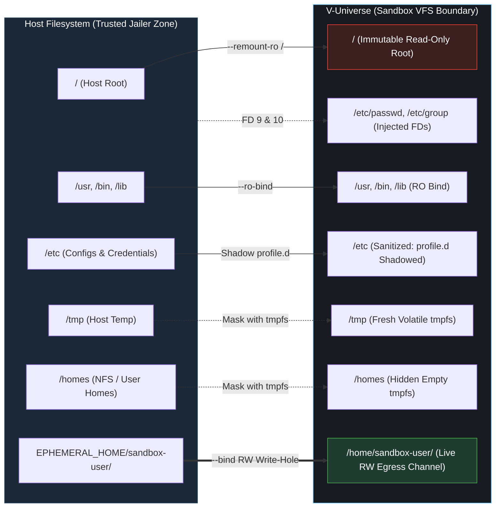
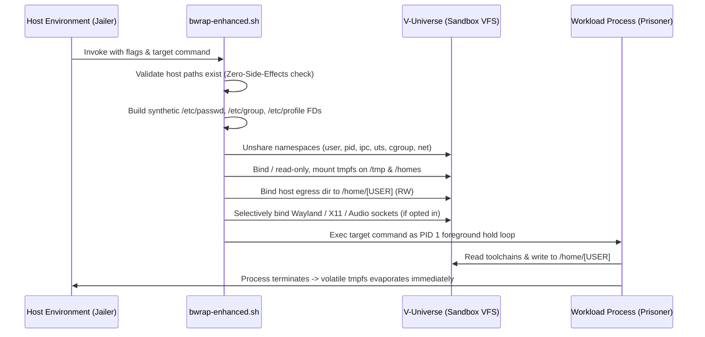

<!-- (c) 2026-* Frederick Bloom -- README.md -- Hanaden AI -->

# V-Universe by Hanaden

**Rootless, Namespace-Isolated Virtual Filesystem (VFS) Sandbox & Desktop Containerizer**

[](LICENSE)
[](PROJECT_HOME/docs/legal/FrederickBloom/LICENSE-COMMERCIAL.md)
[](PROJECT_HOME/src/test/hanaden-bwrap-enhanced/)
[](CONSTITUTION.md)

---

## What is V-Universe?

V-Universe creates an **inescapable virtual universe** -- a rootless, namespace-isolated
sandbox that lets autonomous AI coding agents, background language servers, and developer
scripts run with full apparent capabilities while being completely confined by the Linux
kernel. No root. No daemons. No host mutation.

The underlying engine is `bwrap-enhanced.sh` -- a Bash wrapper around
[Bubblewrap](https://github.com/containers/bubblewrap) that constructs a purpose-built
Virtual Filesystem (VFS) for each sandbox process. The host filesystem is never directly
accessible.

V-Universe is governed by **The Immutable Principle**:

1. **External Construction:** The jailer designs and provisions the jail before execution.
2. **External Enforcement:** The sandbox and kernel guards enforce the boundaries from the outside.
3. **Zero Self-Policing:** Never trust or enable a prisoner to build their own cell, alter their confines, or enforce rules upon themselves.

### Key Pillars

* **Zero Root / Zero Daemons:** Leverages unprivileged Linux user namespaces via Bubblewrap.
* **Zero Side Effects:** Never creates host directories or mutates host files during startup; fails fast on misconfiguration.
* **Controlled Egress:** Locks root (`/`) read-only and confines filesystem persistence strictly to a dedicated user home write-hole.
* **Native Desktop Passthrough:** Seamlessly runs GUI applications (Wayland, X11, PipeWire/PulseAudio) with fine-grained security tiers.

---

## Architecture & VFS Topology

V-Universe pivots the root filesystem, provisions volatile `tmpfs` layers for scratch storage, and exposes an isolated read-write egress channel.



### Sandbox Initialization Flow (MSC)



---

## Key Features

* **Namespace Isolation:** Enforces isolated user, PID, IPC, UTS, and cgroup namespaces (and default-deny network namespace).
* **Identity Injection:** Injects virtual user identities (`/etc/passwd`, `/etc/group`) via in-memory file descriptors without writing to disk.
* **Shell Environment Sanitization:** Suppresses host `/etc/profile.d` scripts and sanitizes environment variables via `--clear-env`.
* **Toolchain Passthrough:** Integrated `--mise-enable` support for seamless Mise/Cargo/Python development toolchains.
* **Foreground-Hold Engine:** Uses a non-polling bash built-in `/proc` watcher to keep GUI child processes and background daemons alive until complete.
* **Deterministic TDD:** Validated by 53 executable specification test suites across 10 feature areas.

---

## Quickstart & CLI Reference

### Basic Usage

```bash
# 1. Run a minimal isolated command (network denied, root RO, volatile /tmp)
./PROJECT_HOME/boot/bwrap-enhanced.sh \
  --clear-env \
  --host-real-root / \
  --host-real-home-parent /tmp/my-sandbox/home \
  -- /bin/bash -c 'echo "Inside V-Universe: HOME=$HOME, USER=$USER"'

# 2. Interactive development shell with Mise toolchain
./PROJECT_HOME/boot/bwrap-enhanced.sh \
  --clear-env \
  --host-real-root / \
  --mise-enable \
  -- /bin/bash

# 3. GUI Application (Firefox in Tier 1 Wayland + Audio sandbox)
./PROJECT_HOME/boot/bwrap-enhanced.sh \
  --clear-env \
  --host-real-root / \
  --share-net \
  --enable-wayland --enable-audio \
  -- /usr/bin/firefox
```

### Command-Line Options Matrix

| Flag | Argument | Description | Default |
| :--- | :--- | :--- | :--- |
| `--clear-env` | None | Discard all host environment variables except runtime essentials | Off (Inherit) |
| `--share-net` | None | Opt-in to share host network namespace | Isolated (Deny) |
| `--virtual-user-name` | `NAME` | Name of virtual user inside sandbox (`HOME=/home/NAME`) | `sandbox-user` |
| `--host-real-root` | `PATH` | Host path bound to container root `/` (must exist) | `~/virtual-roots` |
| `--host-real-home-parent`| `PATH` | Host directory containing the user home (must exist) | `~/virtual-roots/home` |
| `--enable-wayland` | None | Bind Wayland display socket read-only | Disabled |
| `--enable-x11` | None | Bind X11 socket and inject `XAUTHORITY` | Disabled |
| `--enable-audio` | None | Bind PipeWire and PulseAudio sockets | Disabled |
| `--enable-a11y` | None | Bind AT-SPI accessibility bus | Disabled |
| `--enable-dbus` | None | Bind D-Bus session bus (*Note: portal escape vector*) | Disabled |
| `--enable-gnome` | None | Enable GNOME desktop services (GVFS, dconf, Keyring) | Disabled |
| `--enable-kde` | None | Enable KDE desktop services (KWallet, KSMServer) | Disabled |
| `--mise-enable` | `[rw]` | Mount host Mise data & shims (RO by default, `rw` optional) | Disabled |
| `--` | `CMD...` | Command and arguments to execute inside the sandbox | Required |

---

## Security & Threat Model

The security model is codified in [`CONSTITUTION.md`](CONSTITUTION.md) -- a binding governance
document. All code changes must comply with the Constitution or be rejected.

### Security Tiers

| Tier | Configuration | Trust Level | Use Case |
| :--- | :--- | :--- | :--- |
| **Tier 0 (Strict CLI)** | `--clear-env` (default network deny) | **Maximum** | Autonomous AI agents, untrusted scripts, CI runners |
| **Tier 1 (Safe GUI)** | `--enable-wayland --enable-audio` | **High** | Isolated desktop apps (browsers, editors) with no host FS access |
| **Tier 2 (Accessible)**| Tier 1 + `--enable-a11y` | **High** | Screen readers and accessibility tooling |
| **Tier 3 (D-Bus Portal)**| Tier 2 + `--enable-dbus` | **Moderate (Caution)** | File-picker portals can display and access host filesystem |
| **Tier 4 (Full Desktop)**| Tier 3 + `--enable-gnome` / `--enable-kde`| **Low** | Full integration; keyring and virtual filesystem accessible |

---

## Documentation Site

The V-Universe documentation site is a static, file:// browsable HTML/CSS/JS site
with no build step, no server, and no framework dependencies. Browse it locally:

```
site/index.html
```

The site is organized into a 2x2 quadrant architecture:

| | Product (V-Universe Core) | SDLC (Development Lifecycle) |
| :--- | :--- | :--- |
| **Business** | About, Features, Pricing, Security, Drivers | Drivers, Architecture, Standards, Quality |
| **Technical** | Architecture, CLI Reference, Security Model, Test Harness | Architecture, Core Specifications, Standards, Quality |

30 pages total. All content is real (no stubs). All paths are relative (fully relocatable).

---

## Project Structure

```
hanaden-bwrap-enhanced/
|-- LICENSE                                    # AGPL-3.0-only (with Section 7 terms)
|-- NOTICE                                     # Canonical attribution and moral rights
|-- CONSTITUTION.md                            # Security governance (The Immutable Principle)
|-- CHANGELOG.md                               # Keep-a-Changelog format
|-- VERSION                                    # Current version
|-- README.md                                  # This file
|-- site/                                      # V-Universe documentation site (30 HTML pages)
|   |-- index.html                             # Landing page
|   |-- shared/                                # DRY: nav.js, style.css, mermaid.min.js, fonts
|   |-- business/                              # Business quadrant (product-core + project-sdlc)
|   `-- technical/                             # Technical quadrant (project-core + project-sdlc)
`-- PROJECT_HOME/                              # Virtual filesystem jail root
    |-- boot/
    |   `-- bwrap-enhanced.sh                  # Sandbox engine (source of truth)
    |-- docs/
    |   |-- legal/                             # Commercial license, CLA, third-party terms
    |   `-- architecture-design-features-specs/# SDLC strategy and specification hierarchy
    |-- generic-sdlc-and-engine-readonly/      # SDLC Engine Spec v0.0.1 through v0.0.6
    `-- src/
        |-- main/hanaden-bwrap-enhanced/       # Source of truth implementation
        `-- test/hanaden-bwrap-enhanced/        # TDD executable specification test suites
            `-- suites/                        # 53 test suites across 10 feature areas
```

---

## Verification & Testing

The test harness is a complete pipeline: `.bats` files through JUnit XML, JSONL event
streams, JaCoCo coverage, and a self-contained HTML SPA report.

```bash
# Execute full specification suite
./PROJECT_HOME/src/test/hanaden-bwrap-enhanced/run_phase1.sh
```

See [Test Harness Documentation](site/technical/project-core/test-harness.html) for the
full pipeline architecture, JSONL event schema, and report generator stack.

---

## Copyright & License

Copyright (c) 2026-* **Frederick Bloom**. All rights reserved.

Licensed under the **GNU Affero General Public License v3.0 (AGPL-3.0-only)** with
Section 7 Additional Terms (Perpetual Attribution, Moral Rights, Prohibition on
AI Training, and Mandatory CLA).

Commercial, proprietary, and SaaS deployment licenses are available.
For licensing inquiries and commercial terms: **devlabs@hanaden.com** |
[Commercial Licensing Guide](PROJECT_HOME/docs/legal/FrederickBloom/LICENSE-COMMERCIAL.md)
