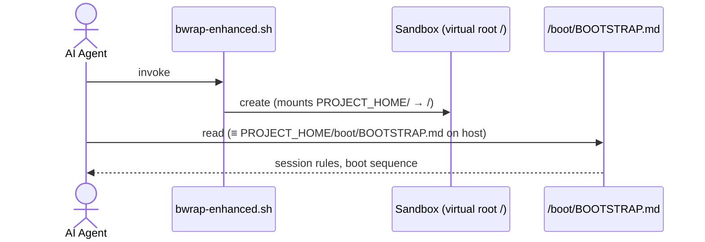

<!-- (c) 2026-* Frederick Bloom -- SCOPE-very-narrow.md -- Hanaden AI -->

# Scope — Very Narrow

This document defines the **minimum viable scope** for this workspace.
There are exactly three entry points an AI agent must ingest and act on.

## 1. Sandbox Entry Point — `bwrap-enhanced.sh`

`PROJECT_HOME/boot/bwrap-enhanced.sh` creates a **bubblewrap (bwrap) virtual sandbox**
with security model: **default deny, empty virtual filesystem** — add only what is needed.
Once launched, the sandbox remaps `PROJECT_HOME/` as the virtual filesystem root `/`.
All subsequent paths are relative to this new root.

**CLI contract one-liner:**
```
bwrap-enhanced.sh
  --net-passthrough       [true|false]   (default: false)
  --env-passthrough       [true|false]   (default: false)
  --x11-passthrough       [true|false]   (default: false; implied by wayland/gnome/kde — do not pass explicitly with an implying flag → [ERROR])
  --wayland-passthrough   [true|false]   (default: false; implies x11)
  --gnome-passthrough     [true|false]   (default: false; implies x11)
  --kde-passthrough       [true|false]   (default: false; implies x11)
  --audio-passthrough     [true|false]   (default: false)
  --a11y-passthrough      [true|false]   (default: false)
  --dbus-passthrough      [true|false]   (default: false; NEVER implied — always explicit)
  --mise-passthrough      [rw|ro]        (default: off; bare = ro)
  --local-bin-passthrough [rw|ro]        (default: off; bare = ro)
  --virtual-user-name     NAME           (default: sandbox_user)
  --host-real-root        PATH           (default: ~/virtual-roots)
  --host-real-home-parent PATH           (default: HOST_REAL_ROOT/home)
  --log-level             NAME|NUMBER    (default: INFO / 400)
  --dry-run                              (standard Unix dry-run: resolve all flags, print resolved argv, exit 0 — no bwrap exec)
  -- CMD [ARG...]
```

```
absent  <  ro  <  rw      (privilege escalation order)

bare flag = most restrictive ON state  (true for boolean; ro for graded)
flag absent = false = default deny     (never the most permissive)
--flag false = ERROR                   (false is implicit; omit the flag)
```

> [!CAUTION]
> `bwrap-enhanced.sh` has **ZERO SIDE EFFECTS** — it never creates directories or modifies host state.
> The script blindly uses whatever `--host-real-root` specifies (default: `~/virtual-roots`).
> If the path does not exist → immediate `[FATAL]` + <diagnostics and debugging information>`exit 1`.
> The **caller** MUST pre-create all required paths before invocation.

## 1a. Log Level Contract

```
FATAL (100) < ERROR (200) < WARN (300) < INFO (400) < DEBUG (500) < TRACE (600)
```

| Level | Tag | Exit | Diagnostics |
|:------|:----|:-----|:------------|
| FATAL | `[FATAL]` | 2 — unrecoverable, immediate termination | `<debug-level diagnostics>` emitted |
| ERROR | `[ERROR]` | 1 — grave, user-correctable | `<debug-level diagnostics>` emitted |
| WARN  | `[WARN]`  | 0 — unexpected, script continues | — |
| INFO  | `[INFO]`  | 0 — normal operational | — |
| DEBUG | `[DEBUG]` | 0 — diagnostic detail | `<debug-level diagnostics>` emitted |
| TRACE | `[TRACE]` | 0 — finest-grained | — |

- All log output → **stderr**. Default level: **INFO**.
- `--log-level NAME|NUMBER` — suppress messages above the given level.

## 2. Virtual Environment Configuration

`PROJECT_NAME` is derived **dynamically** from the basename of this project's parent directory:

```bash
PROJECT_NAME=$(basename "$(pwd)")   # e.g. "hanaden-bwrap-enhanced"
VIRTUAL_ROOT=~/virtual-roots/${PROJECT_NAME}
```

| Parameter | Value |
|:---|:---|
| **Virtual root** | `~/virtual-roots/${PROJECT_NAME}` — **becomes the sandbox's root filesystem itself via bind mount to `/`**; used as-is from host |
| **Username inside sandbox** | `sandbox_user` |
| **Environment** | `--env-passthrough` [true|false(default)] — clean env by default |
| **Network** | `--net-passthrough` [true|false(default)] |
| **X11** | `--x11-passthrough` [true|false(default)] — also implied by wayland/gnome/kde |
| **Wayland** | `--wayland-passthrough` [true|false(default)] → implies x11 |
| **Desktop (GNOME / KDE)** | `--gnome-passthrough`, `--kde-passthrough` [true|false(default)] → each imply x11 |
| **Audio** | `--audio-passthrough` [true|false(default)] — PipeWire + PulseAudio |
| **Accessibility (a11y)** | `--a11y-passthrough` [true|false(default)] |
| **D-Bus** | `--dbus-passthrough` [true|false(default)] [⚠ portal escape — always explicit] |
| **mise toolchain** | `--mise-passthrough` [rw|ro(default)] |
| **Local bin** | `--local-bin-passthrough` [rw|ro(default)] — ~/.local/bin |

**Caller setup (one-time, before first invocation):**

```bash
# The caller — not bwrap-enhanced.sh — is responsible for creating these paths.
# bwrap-enhanced.sh will exit 1 if they are missing.
# BWRAP path is defined once here; all examples below reference this variable.
BWRAP=PROJECT_HOME/boot/bwrap-enhanced.sh   # see §1 for canonical location
PROJECT_NAME=$(basename "$(pwd)")
VIRTUAL_ROOT=~/virtual-roots/${PROJECT_NAME}

# Create the OS skeleton — empty placeholder dirs for bwrap's explicit mounts.
# Because --host-real-root IS bound as sandbox /, every subdir in it is visible.
# Only the dirs explicitly mounted by bwrap (usr, etc, home, proc, dev, tmp,
# run, opt, var) are overlaid.  Keep virtual-roots to ONLY these dirs plus your
# project-specific files.  Any other directory you create here will be visible
# inside the sandbox as a top-level path.
mkdir -p "${VIRTUAL_ROOT}"/{usr,etc,home,proc,dev,tmp,run,opt,var}
ln -sfn usr/bin   "${VIRTUAL_ROOT}/bin"
ln -sfn usr/lib   "${VIRTUAL_ROOT}/lib"
ln -sfn usr/lib64 "${VIRTUAL_ROOT}/lib64"

# Create the sandbox user home (required — bwrap-enhanced.sh exits 1 if missing)
mkdir -p "${VIRTUAL_ROOT}/home/sandbox_user"
```

**Invocation:**

```bash
PROJECT_NAME=$(basename "$(pwd)")
VIRTUAL_ROOT=~/virtual-roots/${PROJECT_NAME}

$BWRAP \
  --net-passthrough                  \
  --wayland-passthrough              \
  --dbus-passthrough                 \
  --gnome-passthrough                \
  --kde-passthrough                  \
  --a11y-passthrough                 \
  --mise-passthrough      ro         \
  --virtual-user-name     sandbox_user          \
  --host-real-root        ${VIRTUAL_ROOT}       \
  --host-real-home-parent ${VIRTUAL_ROOT}/home  \
  -- bash --norc --noprofile
```

> [!NOTE]
> `--wayland-passthrough`, `--gnome-passthrough`, and `--kde-passthrough` each
> imply `--x11-passthrough true` automatically. Do not pass `--x11-passthrough` separately.
> `--dbus-passthrough` is NEVER implied — always explicit.

**Example — `project-sample` (concrete, no variables):**

```bash
# Caller setup (once — bwrap-enhanced.sh will exit 1 if this is missing)
mkdir -p ~/virtual-roots/project-sample/home/sandbox_user

# Invocation
$BWRAP \
  --net-passthrough                  \
  --wayland-passthrough              \
  --dbus-passthrough                 \
  --gnome-passthrough                \
  --kde-passthrough                  \
  --a11y-passthrough                 \
  --mise-passthrough      ro         \
  --virtual-user-name     sandbox_user                         \
  --host-real-root        ~/virtual-roots/project-sample       \
  --host-real-home-parent ~/virtual-roots/project-sample/home  \
  -- bash --norc --noprofile
```

## 3. AI Configuration Entry Point — `BOOTSTRAP.md`

`PROJECT_HOME/boot/BOOTSTRAP.md` (host path) is the AI bootloader and
configuration document. Inside the sandbox it is accessible as `/boot/BOOTSTRAP.md`.
These two paths are **semantically identical** — the same file, two names.

> [!IMPORTANT]
> AI agents MUST treat `PROJECT_HOME/boot/BOOTSTRAP.md` (host) and
> `/boot/BOOTSTRAP.md` (sandbox) as the **single source of truth** for all
> session boot, configuration, and process rules.

## Path Equivalence

| Host Path (outside sandbox) | Sandbox Path (inside bwrap) |
|:---|:---|
| `PROJECT_HOME/` | `/` (virtual root) |
| `PROJECT_HOME/boot/BOOTSTRAP.md` | `/boot/BOOTSTRAP.md` ← **AI entry point** |

## Boot Sequence



## 4. Testing — `bats-core`

Suite: `PROJECT_HOME/src/test/hanaden-bwrap-enhanced/bwrap-enhanced-v0.3.0.bats`

Wrapper: `PROJECT_HOME/src/test/hanaden-bwrap-enhanced/bats-run.sh`

- **`--help` conformance (first)** — §1 CLI contract: all flags, correct qualifiers, no extras, no contradictions, full coverage.
- **Test methodology — aggressive TDD loop**
- full process TDD generic-sdlc-and-engine-readonly
- FORBIDDEN: vibe coding, shortsighted quick fixes, over-optimizing, mocking the tests, assuming test results or using fabricated.  MUST always do all the work and full regression testing at each incermatle step as validation of success without introduction of regression breakage.
- test => fix => test (infinite improvement loop); min cycle delay ≤ 11 s; max parallel execution = 22 (tunable; sized for a typical 24-core CI node, 2 cores reserved for the runner).
- **Reporting & coverage** — via `bats-run.sh` wrapper around `bats --formatter tap`:<br>
  &nbsp;&nbsp;• Header: `START: <YYYY-MM-DDTHH:MM:SSZ>`<br>
  &nbsp;&nbsp;• Per-test line (printed immediately on completion): `<HH:MM:SSZ>  N/total ✓|✗  <name>  elapsed=<s>s  avg=<s>/test  ETA=<HH:MM:SSZ>  est=<s>s  init_est=<s>s  init_eta=<HH:MM:SSZ>`<br>
  &nbsp;&nbsp;&nbsp;&nbsp;(`est` and `ETA` update each test; `init_est`/`init_eta` frozen from first-test rate)<br>
  &nbsp;&nbsp;• Final report: `END: <Z>  passed=N  failed=M  actual=<s>s  init_est=<s>s  init_eta=<HH:MM:SSZ>  delta=±<s>s`<br>
  &nbsp;&nbsp;• JUnit XML via `bats --formatter junit`; bash line coverage via `kcov ≥ 93%`.
- **Full mandate** — 100% CLI flag combination/permutation coverage; leak possibility determined and tested for every combination.
