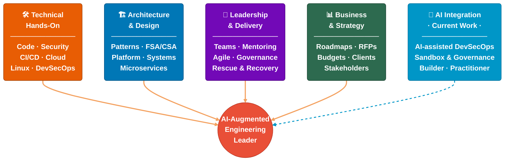
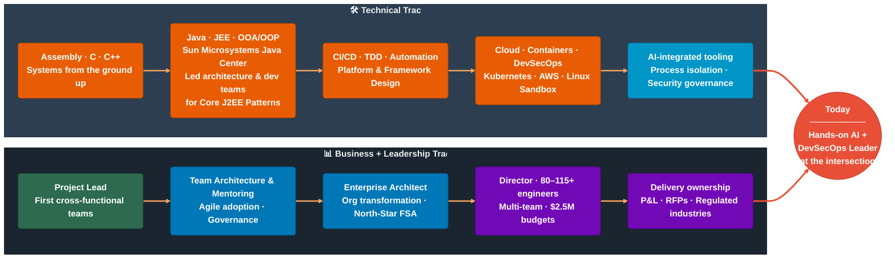

<!-- (c) 2026-* Frederick Bloom -->
<!-- source: PDF resumes 2000–2026 | no company names published | industry-abstracted -->

# Frederick Bloom

## Engineering Leader · Architect · Builder

Frederick Bloom works at the intersection of hands-on technical depth, platform architecture, business delivery, and leadership — and has spent the last few years integrating AI into that same practice.

He has led engineering across regulated industries for 25+ years: building platforms from scratch, modernizing legacy systems, growing teams, and delivering measurable results. He codes, he architects, and he manages — not as separate modes, but as one way of working.

---

## His Core — Vision | Architecture | AI Accelerated Delivery

---

## How He Got There — Technical and Business Tracks Converging

---

## The Work

**Architecture and development leadership — including Sun Microsystems.**
As Java Center Architect at Sun Microsystems, Frederick led the architecture and development teams producing *Core J2EE Patterns* (ISBN 0-13-0648841) — the enterprise Java reference that shaped how a generation of architects built distributed systems. He served as Project Manager and Pattern Subject Matter Expert on the book itself, coordinating a 20-engineer international team building the reference implementation library alongside it.

**Platform that serves many teams.**
At a major consulting engagement, he built a CI/CD/CT framework as a shared platform across 16 client teams. Cycle time dropped from 20 minutes to 3 minutes. 80+ engineers on 7+ teams used it. MTTR reduced ~60% through integrated observability (Prometheus, Grafana, Jaeger). By a 2026 federal agency engagement, that scale had grown to 115+ engineers and $2.5M in managed budget.

**Architecture with a mandate.**
Frederick's pattern across engagements: audit the current state, define the Future State Architecture (North-Star FSA), build the roadmap, execute. At a national insurance regulatory body, that meant a full transformation from self-hosted Waterfall operations to cloud-ready Agile microservices — with business case, capital approval, and 25% hardware overhead reduction.

**Programs in recovery.**
At a U.S. investment management firm, a third-party test automation program was slipping — scope, schedule, architecture. He refactored it, delivered MVP one month early, and raised production code compliance from 20% to 80%+. Setup time dropped from 4 hours to 45 minutes. Earlier in his career: a major financial system rewrite two years over schedule and budget, back on track in four months.

**Security designed in.**
$1.2M SSO implementation. Zero-trust patterns. OAuth, JWT, RBAC, kernel-level process isolation. His current work in Linux sandbox security applies the same principle: security is an architectural constraint, not a retrofit. Regulated-industry fluency: HIPAA, Sarbanes-Oxley, PCI.

**Global range.**
Banking · Insurance · Federal Government · Broadcasting · Security Technology · Power & Utilities · Consulting · Consumer Electronics. USA, Europe, Asia. On-shore/off-shore teams from 5 to 115+. RFP/RFI processes at $1.7M+. Monthly run rates exceeding $890K.

**Publishing and community.**
Project Manager and Architecture Lead — *Core J2EE Patterns* (ISBN 0-13-0648841, Sun Microsystems, 2001–2003). President, Kansas City Java Users Group — 10 years. Founder and Treasurer, Kansas City Agile Users Group. Speaker: Sun Microsystems Java Center through Shift-Left DevOps CI Pipelines (2020–2024).

**Current focus.**
Active projects in AI-integrated security tooling and developer platform automation:
- `hanaden-bwrap-enhanced` — Linux bubblewrap sandbox with kernel-enforced process isolation and AI-assisted governance
- `hanaden-ai-booter`, `hanaden-project-starter` — AI session bootstrapping, DevSecOps pipeline automation

---

## Credentials

| | |
|---|---|
| **Publication** | *Core J2EE Patterns* — ISBN 0-13-0648841, Project Manager & Architecture Lead (2001–2003) |
| **Certification** | Sun Microsystems Java Architect |
| **Education** | BS Computer Science & Software Engineering — University of Connecticut · Certificate in Project Management — George Washington University |
| **AWS** | Cloud Practitioner · TCO & Cloud Economics · Technical Professional · Business Professional |
| **Community** | KC Java Users Group President, 10 years · KC Agile Users Group Founder & Treasurer |
| **Speaking** | Sun Microsystems Java Center (2000–2002) · Shift-Left DevOps CI Pipelines (2020–2024) · Automated Testing Best Practices (2018–2023) |
| **Industries** | Banking · Insurance · Federal Government · Broadcasting · Security · Utilities · Consulting |

<!-- Internal notes — strip before publishing:
  All content sourced from PDF resumes: archives/me/Resume/ (2000-2026)
  No company names used — domain/industry abstractions only
  Current projects sourced from: /homes/home-local/hanasaki/data/dev-projects-local/
  LinkedIn blocked (HTTP 999) — verify LinkedIn-exclusive details before publishing
  fbloom-bio.md in same docs/ dir is the working scratch file — this is the canonical
-->
