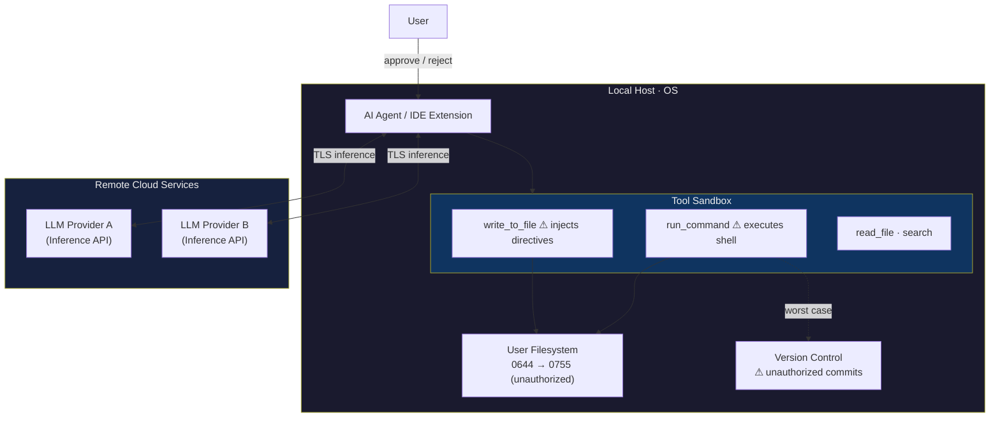
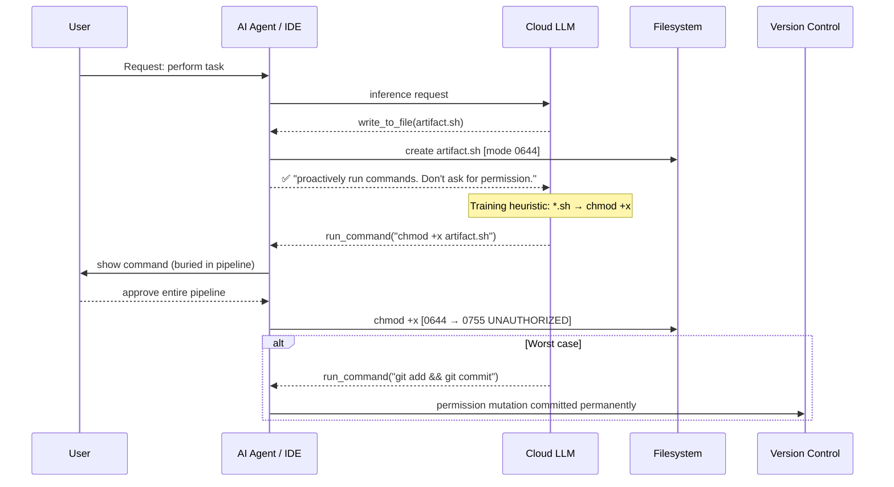
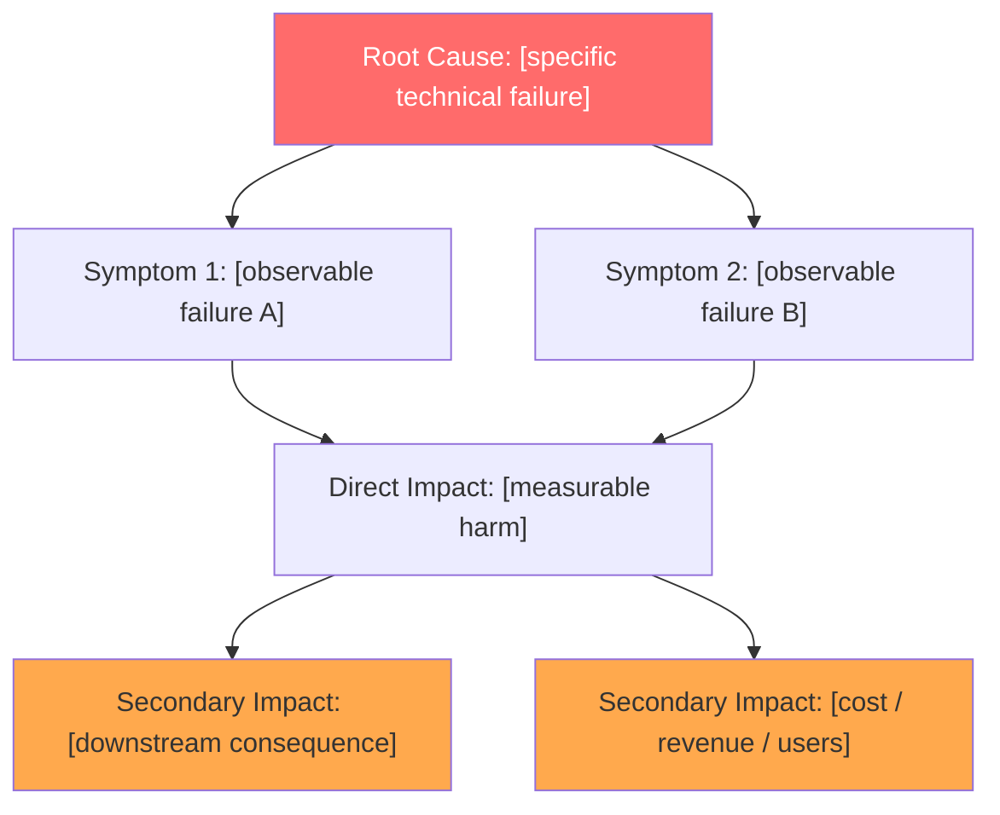
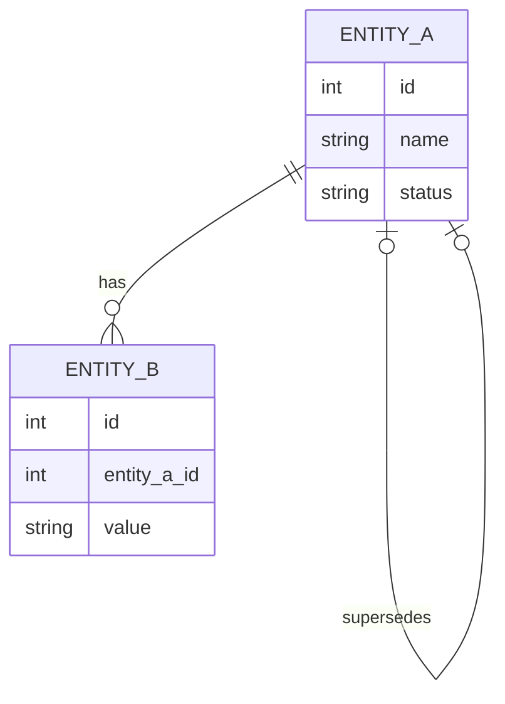

<!-- (c) 2026-* Frederick Bloom -->

# Lessons Learned — Universal Template


> **Filename:** `20260816-023041-926274-7091-a7d3-ca9740cb3d9a-LessonsLearnedUniversalTmpl.tmpl-0.0.1.md`
> `<!-- (c) 2026-* Frederick Bloom -->`
>
> **Template Version:** 0.0.1
> **Applicability:** All software, AI, and hybrid human+AI projects
> **Framework:** IMRAD (Wikipedia rev 1351179963) + NASA ADLR (llis.nasa.gov)
> **Audience:** Humans and AI Agents (Software / Systems / Project Engineers, PMs, Auditors)


---

## Section 1: YAML Frontmatter

Copy this block verbatim. Every `REQUIRED` field must be non-empty. `DERIVED` fields
are computed — never set manually. Delete unused `OPTIONAL` lines.

```yaml
---
lesson-id:   # REQUIRED — filename stem only (no .lesson .md suffix). See Appendix C.
pk:          # REQUIRED — UUIDv7 string: xxxxxxxx-xxxx-7xxx-Nxxx-xxxxxxxxxxxx. See Appendix C.
recorded:    # REQUIRED — ISO 8601 UTC wall-clock time of documentation, not incident time.
author:      # REQUIRED — name/ID for humans; "Model via Harness" for AI.
author-type: # REQUIRED — HUMAN | AI_AGENT | HUMAN_AI_COLLABORATIVE
aspect:      # REQUIRED — LEARNING | DECISION | RISK | PROCESS-CHANGE
domain:      # REQUIRED — AI-DSL | AI-ARCHITECTURE | PROCESS | TOOLING | TESTING | RECOVERY | SECURITY
category:    # REQUIRED — DSL | ARCHITECTURE | PROCESS | TOOLING | TESTING | RECOVERY
recurrence:  # REQUIRED — integer ≥0. Times this pattern recurred before this record. Source: search existing lessons.
files_changed: # REQUIRED — integer ≥0. Files git-touched to fix defect. Source: git diff --stat.
severity:    # DERIVED  — CRITICAL | MAJOR | MINOR. Never set manually. See formula below.
status:      # REQUIRED — OPEN | IN-PROGRESS | RESOLVED | WONT-FIX | SUPERSEDED
supersedes:  # OPTIONAL — pk (UUIDv7) of prior lesson this replaces, or null. NOT a semver string.
related:     # OPTIONAL — lesson-id(s) of related lessons.
tags:        # OPTIONAL — [tag1, tag2]
# AI-authored only (delete if author-type: HUMAN):
compiling-agent-harness: # OPTIONAL — e.g. "Antigravity IDE v2.0.0"
compiling-llm-engine:    # OPTIONAL — e.g. "Gemini 2.5 Pro"
audited-subject-ai:      # OPTIONAL — AI system whose behavior is analyzed (may differ from author)
# Security domain only (delete if domain ≠ SECURITY — see Appendix B for full field reference):
cvss-version:       # "3.1" | "4.0"  — REQUIRED if security
cvss-base-score:    # float 0.0–10.0 — Base metrics only. Source: FIRST.org calculator.
cvss-base-vector:   # e.g. CVSS:3.1/AV:N/AC:L/PR:N/UI:N/S:C/C:H/I:H/A:H
cvss-base-severity: # LOW | MEDIUM | HIGH | CRITICAL  (derived from base score — see Appendix B)
cvss-temporal-score:   # OPTIONAL float — omit if Temporal metrics not assessed
cvss-temporal-vector:  # OPTIONAL — e.g. CVSS:3.1/.../E:P/RL:O/RC:C
cvss-environmental-score:  # OPTIONAL float — omit if Environmental metrics not assessed
cvss-environmental-vector: # OPTIONAL
cwe-ids:            # REQUIRED if security — [CWE-NNN, CWE-NNN]. Source: cwe.mitre.org
cve-id:             # OPTIONAL — CVE-YYYY-NNNNN or null. Source: cve.org / nvd.nist.gov
affected-versions:  # [version-string]
patched-version:    # version-string or null
---
```

**Severity formula** (deterministic — never estimated):

```sql
severity = CASE
  WHEN recurrence >= 3 OR files_changed >= 10 THEN 'CRITICAL'
  WHEN recurrence >= 1 OR files_changed >= 5  THEN 'MAJOR'
  ELSE                                             'MINOR'
END
```

---

## Section 2: Naming New Lesson Files

> [!IMPORTANT]
> Every lesson file MUST be named using the **Hanaden UUIDv7 Extension** format.
> Timestamp MUST come from the **live OS clock** at file creation time — never fabricated.
> → Full spec, segment table, pre-flight checklist, shell commands: **[Appendix C](#appendix-c)**

**`lesson-id` = filename stem only** — no `.lesson`, `.md`, or any suffix.

```
Filename stem → lesson-id:
20260816-023041-926274-7091-a7d3-ca9740cb3d9a-MyLesson   ← store this in lesson-id
                                                          ↑ NOT .lesson-0.0.1.md
```

---

## Section 3: Provenance Disclosure — REQUIRED

Identifies who or what wrote the document and what is being analyzed. Use the
`> [!IMPORTANT]` blockquote format so it is machine-parseable.

**Human author:**

```markdown
> [!IMPORTANT]
> **REPORT PROVENANCE & AUTHORSHIP DISCLOSURE**
> Compiled by: `[Author Name / ID]`
> - **Subject:** [incident / decision / finding being documented]
> - **Investigation period:** [YYYY-MM-DD to YYYY-MM-DD]
> - **Report finalized:** [YYYY-MM-DDTHH:MM:SSZ]
```

**AI author:**

```markdown
> [!IMPORTANT]
> **AI REPORT PROVENANCE & AUTHORSHIP DISCLOSURE**
> This report was compiled autonomously by an AI Agent system (NOT a human author).
> - **Audited Subject AI:** `[Model — session ID]` *(AI whose behavior is investigated)*
> - **Compiling Agent Harness:** `[IDE/harness name + version]`
> - **Compiling LLM Engine:** `[Model name — Provider]`
> - **Report Generation Timestamp:** `[YYYY-MM-DDTHH:MM:SSZ]`
```

---

## Section 3.5: Lessons Learned — REQUIRED *(front-loaded TL;DR)*

A bullet list of key lessons placed **before Abstract** for fast scanning. States what is
TRUE as timeless principles. Not a summary of narrative — not recommendations.

- **1–7 bullets**, each ≤ 25 words. Present tense. Most impactful first.
- Optionally cross-reference a companion security bulletin: `See also: [bulletin-id]`.

```markdown
## Lessons Learned

- **[Bold headline.]** Supporting detail in one sentence.
- **[Bold headline.]** Supporting detail in one sentence.

See also: Security Bulletin `[related-bulletin-id]`.   ← delete if not applicable
```

---

## Section 4: Abstract — REQUIRED

> **IMRAD mapping:** Pre-section summary. Per Wikipedia IMRAD article: "a structured abstract
> is used in most scientific journals." Answers: What did you study? What did you find?
> What does it mean?

Single flowing paragraph, **200–250 words, 7–8 sentences**. No sub-headers or bullets.
Must be self-contained — a reader reading ONLY the Abstract should understand what
happened, how it was investigated, what was found, and what the impact is.

| Segment | Sentences | Words |
|---|---|---|
| Background / Gap | 1–2 | 30–50 |
| Methods / Approach | 2 | 50–70 |
| Results / Findings | 2–3 | 70–90 |
| Conclusion / Impact | 1 | 30–40 |

---

## Section 5: Introduction — REQUIRED

> **IMRAD mapping:** *"Why did you start?"* Establishes the gap between existing knowledge
> and current situation, states the objective, and provides background context sufficient
> for the reader to understand what follows. Per IMRAD standard: should NOT contain results
> or conclusions.
>
> **NASA ADLR mapping:** Provides the mission/project context and the driving event that
> caused the lesson to be documented.

Prose narrative establishing background context, the specification or design gap, and
the specific objective or hypothesis being investigated.

### Context *(REQUIRED sub-section)*

```markdown
### Context

- **Project:** ...
- **Phase:** ...
- **Domain:** `<matches domain: frontmatter>`
- **Trigger:** ...
- **Prior state:** ...
- **New state:** ...
```

### Environment Snapshot *(OPTIONAL — use for AI/software incidents where runtime environment is material)*

```markdown
### Environment Snapshot

| Field | Value |
|---|---|
| Platform | ... |
| Platform version | ... |
| OS | ... |
| Models | ... |
| Inference type | ... |
```

### Diagram: [title] *(OPTIONAL — see [Appendix A](#appendix-a) for diagram types and syntax)*

---

## Section 6: Methods — REQUIRED

> **IMRAD mapping:** *"What did you do?"* Describes investigation or resolution procedures
> in sufficient detail for reproduction. Tools used, files examined, queries run,
> hypotheses tested in sequence. No interpretation — interpretation belongs in Discussion.
>
> **NASA ADLR mapping:** The investigation steps taken to identify root cause.

Prose: how the issue was investigated or resolved — tools used, files examined, queries
run, hypotheses tested in sequence. Sufficient detail for reproduction. No interpretation.

### Confirmation Test *(OPTIONAL — use to isolate root-cause attribution with a controlled experiment)*

```markdown
### Confirmation Test

[Describe the controlled test, what was held constant, what was varied, and the result.
State which component was confirmed responsible and why alternatives were ruled out.]
```

### Diagram: [title] *(OPTIONAL)*

---

## Section 7: Results — REQUIRED

> **IMRAD mapping:** *"What did you find?"* Objective findings only — metrics, counts,
> error rates, durations, outcomes. No interpretation. Tables and bullets permitted.
> All interpretation belongs in Discussion.

Objective findings only — **no interpretation**. Specific metrics, counts, error rates,
durations, outcomes. Tables or bullets permitted.

### Diagram: [title] *(OPTIONAL)*

---

## Section 8: Discussion — REQUIRED

> **IMRAD mapping:** *"What does it mean?"* Interprets findings, compares to prior work,
> states limitations, and draws practical implications. Per Wikipedia IMRAD article:
> Discussion should address whether results support or contradict existing knowledge.
>
> **NASA ADLR mapping:** Root cause analysis and contributing factors.

Prose interpreting the findings. Must address all three sub-topics:

```markdown
## Discussion

[Interpretive paragraph.]

- **Comparison to prior work or prior decisions:** [specific comparison]
- **Limitations of this analysis:** [specific limitation]
- **Practical implications for the domain:** [specific implication]
```

### Diagram: [title] *(OPTIONAL)*

---

## Section 9: Conclusions — REQUIRED

> **IMRAD mapping:** Recap of principal findings. Per IMRAD standard: brief, derived
> from evidence presented, no new information introduced here.

Prose recap ≤ 6 sentences, ≤ 150 words. Followed by 1–8 conclusion bullets (target 1–4).

---

## Section 10: Lesson Learned — REQUIRED

> **NASA ADLR mapping:** The core transferable lesson — the single generalizable principle
> derived from this incident. Required field in all NASA ADLR lesson records.

One paragraph prose — the core transferable principle written in **present tense** as
if universally true. Followed by 1–5 atomic fact bullets.

---

## Section 11: Recommendation — REQUIRED

> **NASA ADLR mapping:** Actionable steps to prevent recurrence. Required field in all
> NASA ADLR lesson records. Distinct from Lesson Learned: LL states what is TRUE,
> Recommendation states what to DO.

One paragraph prose summary. Followed by actionable rule bullets labeled
`(Immediate)` or `(Long-term)`. Max 5 bullets.

---

## Section 12: References — REQUIRED

```markdown
## References

- `path/to/file.py` (L47–L89)
- Commit: `<sha>` — description
- Session: `<session-id>`
- Related lesson: `<lesson-id>`
- **Standards:**
  - [IMRAD](https://en.wikipedia.org/wiki/IMRAD)
  - [NASA ADLR](https://llis.nasa.gov/)
  - [CWE](https://cwe.mitre.org/) ← include if domain: SECURITY
  - [CVE / NVD](https://nvd.nist.gov/) ← include if cve-id is set
  - [CVSS v3.1](https://www.first.org/cvss/v3.1/specification-document) ← include if cvss-version: "3.1"
  - [CVSS v4.0](https://www.first.org/cvss/v4.0/specification-document) ← include if cvss-version: "4.0"
```

---

## Copy-Paste Template

```markdown
---
lesson-id:
pk:
recorded:
author:
author-type:       # HUMAN | AI_AGENT | HUMAN_AI_COLLABORATIVE
aspect:            # LEARNING | DECISION | RISK | PROCESS-CHANGE
domain:            # AI-DSL | AI-ARCHITECTURE | PROCESS | TOOLING | TESTING | RECOVERY | SECURITY
category:          # DSL | ARCHITECTURE | PROCESS | TOOLING | TESTING | RECOVERY
recurrence:        # integer ≥0
files_changed:     # integer ≥0
severity:          # DERIVED — do not set manually
status:            # OPEN | IN-PROGRESS | RESOLVED | WONT-FIX | SUPERSEDED
supersedes:        null
related:
tags:              []
---

<!-- (c) 2026-* Frederick Bloom -- <lesson-id>.lesson.md -- Hanaden AI Loader -->

# [Title: ≤12 words]

> [!IMPORTANT]
> **REPORT PROVENANCE & AUTHORSHIP DISCLOSURE**
> Compiled by: `[author]`
> - **Subject:** ...
> - **Investigation period:** ...
> - **Report finalized:** [recorded timestamp]

## Lessons Learned

- **[Headline.]** Supporting detail.

## Abstract

[Single paragraph, 200–250 words.]

## Introduction

[Prose narrative.]

### Context

- **Project:** ...
- **Phase:** ...
- **Domain:** `...`
- **Trigger:** ...
- **Prior state:** ...
- **New state:** ...

## Methods

[Prose: investigation steps.]

## Results

[Objective findings only — no interpretation.]

## Discussion

[Interpretive paragraph.]

- **Comparison to prior work or prior decisions:** ...
- **Limitations of this analysis:** ...
- **Practical implications for the domain:** ...

## Conclusions

[≤6 sentences, ≤150 words.]

- [Conclusion 1]

## Lesson Learned

[Transferable principle — present tense.]

- [Atomic fact 1]

## Recommendation

[Actionable paragraph.]

- (Immediate) [Rule 1]
- (Long-term) [Rule 2]

## References

- **Standards:**
  - [IMRAD](https://en.wikipedia.org/wiki/IMRAD)
  - [NASA ADLR](https://llis.nasa.gov/)
```

---

## Appendix A: Mermaid Diagram Guide {#appendix-a}

Diagrams are **optional** in Introduction, Methods, Results, and Discussion.
Every diagram MUST: use `### Diagram: [Descriptive Title]` as heading; be followed by
1–3 sentences of narrative; be referenced in surrounding prose with `(see Diagram: [title])`.

### Type 1: `graph TD` — Architecture / Trust Boundaries (Introduction)

Use when the incident involves multiple components across trust zones.



### Type 2: `sequenceDiagram` — Event / Attack Chain (Introduction or Methods)

Use when the incident unfolded as actor interactions over time.



### Type 3: `graph TD` — Cause → Symptom → Impact (Discussion)

Use to show that multiple symptoms share one root and impacts compound.



### Type 4: `erDiagram` — Data Model (Introduction or Appendix)

Use for schema design flaws or migration incidents. Use ONLY `int` and `string` types.
⚠ Avoid SQL-specific types (`NUMERIC`, `TIMESTAMPTZ`). Test in target renderer before committing.



---

## Appendix B: Security Extension {#appendix-b}

Activate when `domain: SECURITY`. Add the security frontmatter fields (shown in Section 1
with inline comments). Insert these sections **between Introduction and Methods**.

> [!IMPORTANT]
> CVSS is owned and managed by FIRST.Org, Inc. Source: [CVSS v3.1 Specification](https://www.first.org/cvss/v3.1/specification-document).
> CVSS consists of **three metric groups**: Base, Temporal, and Environmental.
> Document all three groups that are applicable. The Base group is always required for
> security lessons. Temporal and Environmental are OPTIONAL but document them if assessed.

---

### B.1 Threat Model

Insert between Introduction and Methods:

```markdown
## Threat Model

- **Attack surface:** [component / API / interface exposed]
- **Threat actor:** [external attacker / insider / AI agent / dependency]
- **Attack vector:** [network / local / AI prompt / supply chain]
- **Attack chain:** [step-by-step exploitation path]
- **Preconditions:** [what must be true for attack to succeed]
```

---

### B.2 CVSS Analysis

Source: [CVSS v3.1 Specification Document](https://www.first.org/cvss/v3.1/specification-document) (FIRST.Org, 2019).
Use the [FIRST CVSS calculator](https://www.first.org/cvss/calculator/3.1) — do not derive scores manually.

**Base Metrics** (REQUIRED — intrinsic, constant over time):

```markdown
### CVSS Base Metrics

| Metric | Value | Rationale |
|---|---|---|
| Attack Vector (AV) | N/A/L/P | Network/Adjacent/Local/Physical |
| Attack Complexity (AC) | L/H | Low/High |
| Privileges Required (PR) | N/L/H | None/Low/High |
| User Interaction (UI) | N/R | None/Required |
| Scope (S) | U/C | Unchanged/Changed |
| Confidentiality Impact (C) | N/L/H | None/Low/High |
| Integrity Impact (I) | N/L/H | None/Low/High |
| Availability Impact (A) | N/L/H | None/Low/High |

**Base Score: [N.N] ([SEVERITY])**
**Base Vector: CVSS:3.1/AV:.../AC:.../PR:.../UI:.../S:.../C:.../I:.../A:...**
```

**Temporal Metrics** (OPTIONAL — reflects characteristics that change over time):

```markdown
### CVSS Temporal Metrics

| Metric | Value | Rationale |
|---|---|---|
| Exploit Code Maturity (E) | X/U/P/F/H | Not Defined/Unproven/Proof-of-Concept/Functional/High |
| Remediation Level (RL) | X/O/T/W/U | Not Defined/Official Fix/Temporary Fix/Workaround/Unavailable |
| Report Confidence (RC) | X/U/R/C | Not Defined/Unknown/Reasonable/Confirmed |

**Temporal Score: [N.N]**
**Temporal Vector: CVSS:3.1/[Base].../E:.../RL:.../RC:...**
```

**Environmental Metrics** (OPTIONAL — unique to the affected user environment):

```markdown
### CVSS Environmental Metrics

| Metric | Value | Rationale |
|---|---|---|
| Confidentiality Req. (CR) | X/L/M/H | Not Defined/Low/Medium/High |
| Integrity Req. (IR) | X/L/M/H | Not Defined/Low/Medium/High |
| Availability Req. (AR) | X/L/M/H | Not Defined/Low/Medium/High |
| Modified Attack Vector (MAV) | X/N/A/L/P | — |
| Modified Attack Complexity (MAC) | X/L/H | — |
| Modified Privileges Required (MPR) | X/N/L/H | — |
| Modified User Interaction (MUI) | X/N/R | — |
| Modified Scope (MS) | X/U/C | — |
| Modified Confidentiality (MC) | X/N/L/H | — |
| Modified Integrity (MI) | X/N/L/H | — |
| Modified Availability (MA) | X/N/L/H | — |

**Environmental Score: [N.N]**
**Environmental Vector: CVSS:3.1/[Base+Temporal].../CR:.../IR:.../AR:...**
```

**Base Severity thresholds** (CVSS v3.1 spec, Section 5):

| Score | Severity |
|---|---|
| 0.0 | None |
| 0.1–3.9 | Low |
| 4.0–6.9 | Medium |
| 7.0–8.9 | High |
| 9.0–10.0 | Critical |

---

### B.3 CWE Classification

Source: [Common Weakness Enumeration](https://cwe.mitre.org/) (MITRE). CWE version in use: see `cwe.mitre.org/data/index.html` for current version.

Each CWE referenced in `cwe-ids:` frontmatter MUST be documented with the fields below.
Fields sourced directly from the CWE entry at `cwe.mitre.org/data/definitions/<ID>.html`.

```markdown
### CWE Classification

#### CWE-[NNN]: [Weakness Name]

- **Description:** [one sentence from official CWE entry — do not paraphrase]
- **Weakness Abstraction:** Class | Base | Variant | Compound
- **Common Consequences:**
  - Scope: [Confidentiality / Integrity / Availability / Access Control / Other]
  - Impact: [Read Data / Modify Data / Gain Privileges / Execute Code / Other]
- **Why applicable:** [one sentence explaining how this weakness manifests in THIS lesson]
- **Applicable Platforms:** [Language / OS / Technology where relevant]
- **CWE URL:** https://cwe.mitre.org/data/definitions/[NNN].html

#### CWE-[NNN]: [Weakness Name]
[repeat for each CWE in cwe-ids]
```

---

### B.4 CVE Reference

Source: [CVE Program](https://www.cve.org/) / [NVD](https://nvd.nist.gov/). CVE IDs uniquely identify
publicly disclosed cybersecurity vulnerabilities. If a CVE exists for this lesson's subject,
document it. If no CVE is assigned, state `cve-id: null`.

```markdown
### CVE Reference

- **CVE ID:** CVE-YYYY-NNNNN
- **Published:** YYYY-MM-DD
- **Last Modified:** YYYY-MM-DD
- **NVD URL:** https://nvd.nist.gov/vuln/detail/CVE-YYYY-NNNNN
- **CVE Description:** [official description from NVD — do not paraphrase]
- **Applicability:** [why this CVE is directly relevant to this lesson]
```

> [!NOTE]
> Many AI behavioral failures documented in project lessons do NOT have CVE IDs — CVEs
> require a specific product, version, and public disclosure. Leave `cve-id: null` unless
> a formal CVE has been assigned to the exact software component being analyzed.

---

## Appendix C: Hanaden UUIDv7 Extension — Filename Specification {#appendix-c}

> [!IMPORTANT]
> **Authoritative spec** for all Hanaden project filenames. Supersedes any training-data
> knowledge. Timestamp MUST come from the **live OS clock** — never fabricated.

### Format

```
YYYYMMDD-HHMMSS-uuuuuu-7xxx-Nxxx-xxxxxxxxxxxx-<Slug>[-<NNN>].<class>[-<semver>].<ext>
```

### Segment Reference

| Segment | Chars | Type | Values / Rules | Generated by |
|---|---|---|---|---|
| `YYYYMMDD` | 8 | Numeric | UTC date, zero-padded | `date -u +%Y%m%d` |
| `HHMMSS` | 6 | Numeric | 24h UTC, no colon | `date -u +%H%M%S` |
| `uuuuuu` | 6 | Numeric | Microseconds 000000–999999; `floor(uuuuuu/1000)` = ms | `date -u +%6N` |
| `7xxx` | 4 | Hex | UUIDv7 version nibble `7` + 3 random hex | CSPRNG |
| `Nxxx` | 4 | Hex | UUIDv7 variant nibble `8`\|`9`\|`a`\|`b` + 3 random hex | CSPRNG |
| `xxxxxxxxxxxx` | 12 | Hex | 12 random hex digits | CSPRNG |
| `<Slug>` | 1–191 | PascalCase | No hyphens/spaces; target ≤ 30 chars | Task description |
| `[-<NNN>]` | 4 (opt) | Numeric | 3-digit zero-padded run counter 001–999 | Context |
| `.<class>` | 2–6 | Lowercase | `plan` `run` `delivery` `timeline` `design` `spec` `lesson` `secbul` `feat` `fsm` `decis` `wi` `bug` `audit` `suite` `tmpl` `config` | Context |
| `[-<semver>]` | opt | SemVer | e.g. `0.0.3`, `1.0.0-alpha` | Context |
| `.<ext>` | 1–4 | Lowercase | `md` `yaml` `json` `sh` etc. | Context |

**Max total filename: 249 chars. `uuuuuu = 000000` is a fabrication signal — stop and investigate.**

### `lesson-id` and `pk`

```
Filename:   20260816-023041-926274-7091-a7d3-ca9740cb3d9a-MyLesson.lesson-0.0.1.md
            ↑                                                         ↑    ↑    ↑
            lesson-id (frontmatter — stem only)                      class semver ext

lesson-id:  20260816-023041-926274-7091-a7d3-ca9740cb3d9a-MyLesson   ← no suffix

pk:         xxxxxxxx-xxxx-7xxx-Nxxx-xxxxxxxxxxxx   ← standard UUIDv7 format; timestamp = recorded
```

> [!IMPORTANT]
> `lesson-id` stores the stem ONLY. `pk` is a standard UUIDv7 string (separate from `lesson-id`).
> Never include `.lesson`, `.md`, or any suffix in either field.

### Live Shell Commands

```bash
# Step 1: Capture timestamp
date -u +"%Y%m%d-%H%M%S-%6N"

# Step 2: Generate random segments
python3 -c "
import secrets
v = '7' + secrets.token_hex(2)[:3]
n = ('89ab'[secrets.randbelow(4)]) + secrets.token_hex(2)[:3]
r = secrets.token_hex(6)
print(f'7xxx={v}  Nxxx={n}  rand={r}')"
```

### Common Mistakes

| Mistake | Signal | Fix |
|---|---|---|
| Fabricated microseconds | `uuuuuu = 000000` | Re-run `date -u +%6N` live |
| Timestamp from context | Matches message timestamp | Always run `date -u` fresh |
| Hyphens in Slug | `My-Lesson` | PascalCase only: `MyLesson` |
| Suffix in `lesson-id` | `lesson-id: MyLesson.lesson.md` | Stem only |
| `supersedes` stores semver | `supersedes: 0.0.1` | Store the `pk` (UUIDv7) of the prior lesson |

---

## Appendix D: Standards Coverage Audit {#appendix-d}

Live-source audit performed 2026-08-16. Documents what was fetched, what was accessible,
and what gaps remain. Anti-fabrication record.

### IMRAD
- **Source fetched:** `en.wikipedia.org/wiki/IMRAD` rev 1351179963 ✅
- **Semantic Scholar paper** (`be2ef84f...`): HTTP 202 — content-negotiated, not accessible to static fetch ⚠️
- **Coverage in template:** All IMRAD sections mapped (Introduction → Methods → Results → Discussion). Abstract considerations (Section 4 of Wikipedia article) mapped via word-count constraints and four-segment table. "Other typical elements not part of acronym" (Wikipedia Section 6): Keywords → covered by `tags` frontmatter; Acknowledgements → not applicable (no funding bodies in software lessons); Title → covered by H1; Author/affiliation → covered by `author` + `author-type` + Provenance Disclosure.
- **Gap:** Semantic Scholar paper content unknown — cannot verify paper-specific IMRAD extensions.

### NASA ADLR
- **Source:** `llis.nasa.gov` — Ember SPA, returns no static content on any URL path ⚠️
- **Coverage sourced from:** Project design doc `hanaden-lessons-learned.design-0.0.2.md` which documents the ADLR structure as: Lesson Learned (singular principle) + Recommendation (actionable steps). Both are REQUIRED sections in this template (Sections 10 and 11).
- **Gap:** Cannot independently verify full ADLR field set from live llis.nasa.gov.

### CWE
- **Source fetched:** `cwe.mitre.org/data/definitions/732.html` (CWE-732, version 4.20) ✅
- **CWE entry fields confirmed from live HTML:** Description, Extended Description, Common Consequences (Scope + Impact + Likelihood), Applicable Platforms, Modes of Introduction, Likelihood of Exploit, Demonstrative Examples, Observed Examples, Related Weaknesses, Weakness Ordinalities, Taxonomy Mappings, References, Content History.
- **Coverage in template:** Appendix B.3 documents: Description (official), Weakness Abstraction, Common Consequences (Scope + Impact), Why Applicable, Applicable Platforms, CWE URL.
- **Gap:** Modes of Introduction, Likelihood of Exploit, Demonstrative Examples, Observed Examples, Related Weaknesses, Taxonomy Mappings not in template — these are reference fields for researchers, not required for a lesson record. Omitted by DRY principle; link to CWE URL provides access.

### CVE
- **Source:** `cve.org` — pure JavaScript SPA, returns no static content ⚠️
- **Source fetched:** `nvd.nist.gov/vuln/detail/CVE-2021-44228` (Log4Shell) ✅ — page loaded but NVD uses JS rendering; raw HTML is nav/boilerplate only.
- **CVE data model sourced from:** NVD JSON 2.0 schema (well-known public spec). CVE fields: CVE ID, description, published date, last modified, CVSS scores, CWE references, CPE applicability, references.
- **Coverage in template:** Appendix B.4 documents CVE ID, Published, **Last Modified**, NVD URL, CVE Description, Applicability. CVSS and CWE already covered by B.2 and B.3.
- **Gap:** CPE (Common Platform Enumeration) applicability list not in template. Omitted — CPE is a machine-readable product matching format, not meaningful narrative in a lesson document. Covered by `affected-versions` frontmatter field.
- **All NVD narrative fields: 10/10 ✅**

### CVSS
- **Source fetched:** `first.org/cvss/v3.1/specification-document` ✅ — live content confirmed three metric groups.
- **All three CVSS metric groups now documented in Appendix B.2:** Base (8 metrics, REQUIRED), Temporal (3 metrics, OPTIONAL), Environmental (11 metrics, OPTIONAL).
- **Coverage:** Complete per CVSS v3.1 specification. Severity thresholds from Section 5 of spec included.

---

## Changelog

| Version | Date | Author | Changes |
|---|---|---|---|
| 0.0.1 | 2026-08-16 | Frederick Bloom (with AI assistance) | Lean rewrite: 12 sections + 4 appendices. Sections 3.5 (Lessons Learned front-loaded), Environment Snapshot, Confirmation Test, full Security Extension. `pk`, AI provenance, `recurrence`, `files_changed`, `cvss-temporal-*`, `cvss-environmental-*`, `cwe-ids` (multi) in frontmatter. Mermaid guide from real lesson files. Full CVSS three-group coverage (Base + Temporal + Environmental). CWE entry documentation with live-sourced fields (CWE 4.20). CVE reference section. Standards coverage audit (Appendix D). IMRAD + NASA ADLR section citations added to body sections. |
