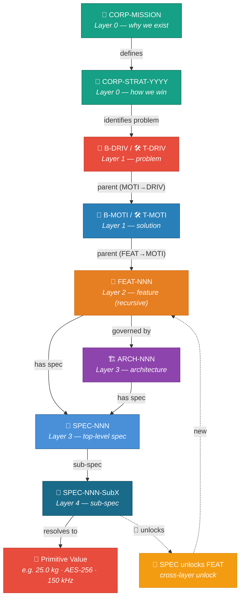

# Example Project Hierarchy Tree

> A reference example of the canonical hierarchical decomposition model used across HANADEN projects.
> This tree illustrates how corporate missions, strategic drivers, features, architectures, and specifications
> nest together — and how test suites attach at every layer.

---

## Overview

The hierarchy flows **top-down** through six semantic layers:

| Layer | Emoji | Label | Purpose |
|-------|-------|-------|---------|
| 0 | 👑 | CORP | Corporate mission / strategic objective |
| 1 | 💼 / 🛠️ | B-DRIV / T-DRIV · B-MOTI / T-MOTI | Business & Technical drivers / motivations |
| 2 | 🚗 | FEAT | Product / engineering feature |
| 3 | 🏗️ | ARCH | Architecture decision |
| 4 | 📐 | SPEC | Specification (may nest as sub-specs) |
| — | 🛑 | Primitive | Terminal value — cannot be decomposed further |

### Test Suite Annotation Key

| Emoji | Type |
|-------|------|
| ⚙️ | Functional test |
| 📊 | Performance / profiling test |
| 🧠 | CPU / memory profiling test |
| 🛡️ | Security test |
| 🌟 | Cross-layer unlock (spec enables feature) |

---

## Hub-and-Spoke Hierarchy Diagram

```mermaid
%%{init: {
  "theme": "base",
  "themeVariables": {
    "background":        "#0d0d0d",
    "primaryColor":      "#16a085",
    "primaryTextColor":  "#ffffff",
    "primaryBorderColor":"#0e6655",
    "lineColor":         "#888888",
    "secondaryColor":    "#1a1a2e",
    "tertiaryColor":     "#16213e"
  }
}}%%
flowchart LR
    %% Layer 0
    CM(["👑 CORP-MISSION\nAutomate global supply chains\nwith zero-emission logistics"]):::corp
    CS(["👑 CORP-STRAT-2026\nDominate fulfillment automation\n— cut delivery times in half"]):::corp

    %% Layer 1 — Business
    BD(["💼 B-DRIV-100\nE-commerce loses $2B/yr\nin worker transit fatigue"]):::driv
    BM(["💼 B-MOTI-101\nDeploy indoor drone fleet\nto move bins under 45s"]):::moti

    %% Layer 1 — Technical
    TD2(["🛠️ T-DRIV-200\nLegacy Wi-Fi drops signals\nin deep metallic aisles"]):::driv
    TM(["🛠️ T-MOTI-201\nLocal mesh routing to\nbypass Wi-Fi dependency"]):::moti

    %% Layer 2 — Features
    F300(["🚗 FEAT-300\nAutonomous Bin\nTransportation"]):::feat
    F300A(["🚗 FEAT-300-SubA\nPrecision Drone\nDocking"]):::feat
    F300A1(["🚗 FEAT-300-SubA1\nAutomated Battery\nHot-Swapping"]):::feat
    F301(["🚗 FEAT-301\n🌟 Blind-Spot\nNight-Vision Nav"]):::unlock

    %% Layer 3 — Architectures
    A500(["🏗️ ARCH-500\nSpatial Computer Vision\nGuidance System"]):::arch
    A501(["🏗️ ARCH-501\nUWB Decentralized\nMesh Network"]):::arch

    %% Layer 3-4 — Specifications
    SP400(["📐 SPEC-PERF-400\nPayload Carrying\nCapacity"]):::spec
    SP400A(["📐 SPEC-PERF-400-SubA\nMax Liftoff\nMass Limit"]):::spec
    SP400B(["📐 SPEC-PERF-400-SubB\nFrame Deflection\nTolerance"]):::spec
    SP600(["📐 SPEC-HW-600\nOptical LiDAR\nImaging Array"]):::spec
    SP600A(["📐 SPEC-HW-600-SubA\nLaser Emitter\nPulse Frequency"]):::spec
    SP700(["📐 SPEC-NET-700\nP2P Transceiver\nNetwork"]):::spec
    SP700A(["📐 SPEC-NET-700-SubA\nData Packet Transfer\nFrequency"]):::spec
    SP700B(["📐 SPEC-NET-700-SubB\nSignal Encryption\nStandard"]):::spec

    %% Leaf primitive values
    L1(["🛑 25.0 kg"]):::leaf
    L2(["🛑 <1.5mm full load"]):::leaf
    L3(["🛑 150 kHz"]):::leaf
    L4(["🛑 6.5 GHz"]):::leaf
    L5(["🛑 AES-256"]):::leaf

    %% Edges
    CM --> CS
    CS --> BD
    CS --> TD2
    BD --> BM
    TD2 --> TM
    BM --> F300
    F300 --> F300A
    F300A --> F300A1
    F300 --> SP400
    SP400 --> SP400A
    SP400 --> SP400B
    SP400A --> L1
    SP400B --> L2
    F300 --> A500
    A500 --> SP600
    SP600 --> SP600A
    SP600A --> L3
    SP600A -.->|"🌟 unlocks"| F301
    TM --> A501
    A501 --> SP700
    SP700 --> SP700A
    SP700 --> SP700B
    SP700A --> L4
    SP700B --> L5

    %% Color classes
    classDef corp   fill:#16a085,stroke:#0e6655,color:#fff,font-weight:bold
    classDef driv   fill:#922b21,stroke:#7b241c,color:#fff,font-weight:bold
    classDef moti   fill:#1a5276,stroke:#154360,color:#fff,font-weight:bold
    classDef feat   fill:#a04000,stroke:#873600,color:#fff,font-weight:bold
    classDef arch   fill:#6c3483,stroke:#5b2c6f,color:#fff,font-weight:bold
    classDef spec   fill:#154360,stroke:#1a5276,color:#ddeeff,font-style:italic
    classDef leaf   fill:#2c3e50,stroke:#566573,color:#aabbcc,font-style:italic
    classDef unlock fill:#b7950b,stroke:#9a7d0a,color:#fff,font-weight:bold
```




---

## Layer Stack Diagram



---

## Full Annotated Tree

```
👑 Layer 0: CORP-MISSION | Automate global supply chains with zero-emission logistics.
│   └── 🧪 TEST SUITE: Global Sustainability Audit
│       └── 📊 Perf: Validate carbon offset metrics against annual ESG targets.
│
└── 👑 Layer 0: CORP-STRAT-2026 | Dominate fulfillment center automation by cutting delivery times in half.
    │   └── 🧪 TEST SUITE: Market Strategy Validation
    │       └── 📊 Perf: Benchmark total logistics transit times across test facility layouts.
    │
    ├── 💼 Layer 1: B-DRIV-100 | E-commerce facilities lose $2B annually in worker transit fatigue.
    │   │   └── 🧪 TEST SUITE: Macro-Economic Analysis
    │   │       └── 📊 Perf: Monitor and verify facility-wide picker idle times.
    │   │
    │   └── 💼 Layer 1: B-MOTI-101 | Deploy an indoor drone fleet to move bins under 45 seconds.
    │       │   └── 🧪 TEST SUITE: Business Acceptance Suite (Integration Test to Business / Unit Test to Corporation)
    │       │       ├── ⚙️  Functional: Track fleet-wide asset utilization rates during peak traffic simulation.
    │       │       ├── 📊 Perf/Profile: Measure average warehouse order-to-dock cycle time metrics.
    │       │       └── 🛡️  Security: Run physical facility vulnerability scans for automated air corridors.
    │       │
    │       └── 🚗 Layer 2: FEAT-300 | Autonomous Bin Transportation Feature
    │           │   └── 🧪 TEST SUITE: System End-to-End Suite (Integration Test to Layer 2 / Unit Test to Layer 1)
    │           │       ├── ⚙️  Functional: Validate path planning: Drone lifts bin, routes through warehouse, drops bin.
    │           │       ├── 📊 Perf/Memory: Profile fleet telemetry log file sizes and network queue bottlenecks.
    │           │       └── 🛡️  Security: Trigger absolute physical emergency power cutoff when a person is detected.
    │           │
    │           ├── 🚗 [CASE: FEATURE HAS FEATURE]
    │           │   └── 🚗 Layer 2: FEAT-300-SubA | Precision Drone Docking Feature
    │           │       │   └── 🧪 TEST SUITE: Docking Sub-Feature Suite
    │           │       │       ├── ⚙️  Functional: Verify mechanical latch closure activates upon pad contact.
    │           │       │       ├── 📊 Perf/Memory: Monitor tracking state latency under simulated heavy vibration.
    │           │       │       └── 🛡️  Security: Test inductive pad short-circuit recovery under fluid spills.
    │           │       │
    │           │       └── 🚗 Layer 2: FEAT-300-SubA1 | Automated Battery Hot-Swapping Feature
    │           │           │   └── 🧪 TEST SUITE: Hot-Swap Component Suite
    │           │           │       ├── ⚙️  Functional: Verify continuous auxiliary power rail remains live during physical swap.
    │           │           │       ├── 🧠 CPU/Profile: Run memory leak tests on mechanical actuator state-machine code.
    │           │           │       └── 🛡️  Security: Ensure robotic arm locks and halts if enclosure door drops open.
    │           │
    │           ├── 🚗 [CASE: FEATURE HAS SPEC]
    │           │   └── 📐 Layer 3: SPEC-PERF-400 | Payload Carrying Capacity Spec
    │           │       │   └── 🧪 TEST SUITE: Mechanical Structural Suite
    │           │       │       ├── ⚙️  Functional: Verify torque values on carbon fiber motor mount assemblies.
    │           │       │       └── 📊 Perf/Memory: Measure structure stress fatigue across a 500-hour continuous flight profile.
    │           │       │
    │           │       ├── 📐 [CASE: SPEC HAS SPEC (SUBSPEC)]
    │           │       │   └── 📐 Layer 4: SPEC-PERF-400-SubA | Maximum Liftoff Mass Limit Spec
    │           │       │       │   └── 🧪 TEST SUITE: Static Weight Calibration
    │           │       │       │       └── ⚙️  Functional: Test physical load-cell sensor threshold alerts.
    │           │       │       │
    │           │       │       └── 🛑 [NOT POSSIBLE: HIT PRIMITIVE VALUE]
    │           │       │           └── Value: "25.0 kg"
    │           │       │               └── (Reason: This is a raw numeric unit. It cannot have sub-specs or nested tests.)
    │           │       │
    │           │       └── 📐 Layer 4: SPEC-PERF-400-SubB | Structural Frame Deflection Tolerance
    │           │           │   └── 🧪 TEST SUITE: Laser Interferometer Deflection Verification
    │           │           │       └── 📊 Perf/Profile: Chart physical frame bending measurements under maximum payload limits.
    │           │           └── Value: "< 1.5mm under full load"
    │           │
    │           └── 🏗️ Layer 3: ARCH-500 | Spatial Computer Vision Guidance System Architecture
    │               │   └── 🧪 TEST SUITE: Vision Subsystem Suite (Integration Test to Layer 3 / Unit Test to Layer 2)
    │               │       ├── ⚙️  Functional: Feed video matrices containing known static obstacles; evaluate system avoidance vectors.
    │               │       ├── 🧠 CPU/Profile: Measure frame drop frequency on the edge processor under full sensory ingestion loads.
    │               │       └── 🛡️  Security: Inject synthetic frame corruption to evaluate adversarial image attack resistance.
    │               │
    │               └── 📐 Layer 4: SPEC-HW-600 | Optical LiDAR Imaging Array Spec
    │                   │   └── 🧪 TEST SUITE: Component Optical Verification Suite (The Ultimate Hardware "Unit" Test)
    │                   │       ├── ⚙️  Functional: Confirm real-time point-cloud serialization outputs valid polar coordinate frames.
    │                   │       ├── 🧠 Memory/Hardware: Check for register buffer bounds exceptions inside firmware drivers.
    │                   │       └── 📊 Perf/Electrical: Profile total electrical current draw of the primary receiver circuitry.
    │                   │
    │                   ├── 📐 [CASE: SPEC HAS SPEC (SUBSPEC)]
    │                   │   └── 📐 Layer 4: SPEC-HW-600-SubA | Laser Emitter Pulse Frequency Spec
    │                   │       │   └── 🧪 TEST SUITE: Oscilloscope Frequency Measurement
    │                   │       │       └── 📊 Perf/Electrical: Validate pulse timing consistency across voltage fluctuations.
    │                   │       └── Value: "150 kHz"
    │                   │
    │                   └── 🌟 [CASE: SPEC UNLOCKS FEATURE]
    │                       └── 🚗 Layer 2: FEAT-301 | "Blind-Spot" Night-Vision Navigation Feature
    │                           │   └── 🧪 TEST SUITE: Zero-Lux System Verification Suite
    │                           │       ├── ⚙️  Functional: Test navigation loop in a sealed, unlit chamber.
    │                           │       └── 📊 Perf/Memory: Profile object distance update rates when infrared sensors take over.
    │                           └── 📋 Spec: Must resolve obstacles in 0.0 lux darkness.
    │
    └── 🛠️ Layer 1: T-DRIV-200 | Legacy facility Wi-Fi drops signals in deep metallic storage aisles.
        │   └── 🧪 TEST SUITE: RF Field Analysis
        │       └── 📊 Perf: Record wireless packet drop ratios across long warehouse storage aisles.
        │
        └── 🛠️ Layer 1: T-MOTI-201 | Implement local mesh data routing to bypass Wi-Fi dependency.
            │   └── 🧪 TEST SUITE: Infrastructure Topology Validation
            │       └── ⚙️  Functional: Confirm network healing routines initiate when arbitrary nodes are dropped.
            │
            └── 🏗️ Layer 3: ARCH-501 | Ultra-Wideband (UWB) Decentralized Mesh Network Architecture
                │   └── 🧪 TEST SUITE: Mesh Network Integration Suite
                │       ├── ⚙️  Functional: Verify multi-hop routing paths between nodes out of direct radio line-of-sight.
                │       ├── 🧠 CPU/Profile: Profile background task processing allocation of network protocol stack on the chip.
                │       └── 🛡️  Security: Test network node validation against rogue device injection attempts.
                │
                └── 📐 Layer 4: SPEC-NET-700 | Peer-to-Peer Transceiver Network Architecture Spec
                    │   └── 🧪 TEST SUITE: Transceiver Signal Layer Testing
                    │       └── 📊 Perf/Electrical: Measure RF transmission output dbm levels across full power curves.
                    │
                    ├── 📐 Layer 4: SPEC-NET-700-SubA | Data Packet Transfer Frequency
                    │   │   └── 🧪 TEST SUITE: Spectrum Analyzer Validation
                    │   │       └── ⚙️  Functional: Verify center frequency limits and channel bleeding constraints.
                    │   └── Value: "6.5 GHz"
                    │
                    └── 📐 Layer 4: SPEC-NET-700-SubB | Signal Encryption Standard
                        │   └── 🧪 TEST SUITE: Cryptographic Verification Suite
                        │       └── 🛡️  Security: Perform automated known-plaintext cryptanalysis attacks on captured air frames.
                        └── Value: "AES-256"
```

---

## Key Structural Rules

1. **Every node carries a test suite** — test scope telescopes inward (integration at the parent boundary, unit at the child boundary).
2. **Child→parent pointer only** — every non-root node has a `parent` field pointing to its parent's `filename-id`. There are no `children` lists. To find a node's children, scan for documents whose `parent` matches this node's `filename-id`.
3. **Single identity** — `filename-id` (Hanaden UUIDv7 Extended stem) is the sole identifier. No `node-id` field. The slug portion provides human readability.
4. **MOTI is a child of DRIV** — the hierarchy chain is: CORP-STRAT → DRIV (problem) → MOTI (solution) → FEAT. Motivations are not siblings of Drivers; they are children.
5. **Specs can nest** (`SPEC HAS SPEC`) to any depth, but terminate at a **primitive value** (`🛑`).
6. **A spec can unlock a feature** (`🌟 SPEC UNLOCKS FEATURE`) — the SPEC declares this via `unlocks: <FEAT filename-id>`. The FEAT does NOT carry an `unlocked-by` field. SSoT is on the enabler.
7. **Features can contain features** (`FEAT HAS FEAT`) — sub-features inherit the parent feature's integration test suite as their acceptance boundary.
8. **Architectures sit at Layer 3** and own the structural contract between features (Layer 2) and specs (Layer 4).
9. **All cross-document pointers use `filename-id`** — `parent`, `unlocks`, `governs`, `supersedes`, `references` all use the same format. One resolution algorithm, one validation rule.
