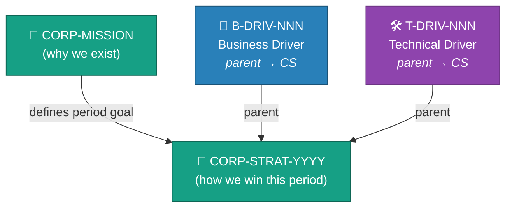

<!-- (c) 2026-* Frederick Bloom -- 20260816-035418-506403-7916-a3c7-c69d39d29f20-GoalStrategyTmpl.tmpl-0.0.1.md -- Hanaden AI Loader -->
---
tmpl-id:      20260816-035418-506403-7916-a3c7-c69d39d29f20-GoalStrategyTmpl
version:      0.0.1
status:       ACTIVE
category:     TEMPLATE
node-types-covered: [CORP-MISSION, CORP-STRAT]
layer:        0
description: >
  Reusable template for Hanaden Layer 0 goal and strategy documents.
  Covers CORP-MISSION (why the organisation exists) and CORP-STRAT (how to
  achieve the mission in a defined period). Defines frontmatter schema, body
  section order, and embedded TEST SUITE schema.
references:
  - 20260816-035411-784482-7cd5-a4a5-cbc587fb36cd-ExampleProjectHierarchyTree.tmpl-0.0.1.md
copyright: (c) 2026-* Frederick Bloom
---

# Goal / Strategy Template (Layer 0)

> **Hierarchy reference:** [`ExampleProjectHierarchyTree.tmpl-0.0.1.md`](./20260816-035411-784482-7cd5-a4a5-cbc587fb36cd-ExampleProjectHierarchyTree.tmpl-0.0.1.md)

## What Is a Goal / Strategy?

A **Goal** (`CORP-MISSION`) or **Strategy** (`CORP-STRAT`) is the **root node** of the
entire SDLC hierarchy. It is the organisational anchor — everything below it (drivers,
motivations, features, architectures, specifications) exists to serve this goal.

- **CORP-MISSION** — the timeless reason the organisation exists. It does not expire.
  *Example: "Automate global supply chains with zero-emission logistics."*
- **CORP-STRAT** — a time-bounded strategic objective that advances the mission.
  *Example: "Dominate fulfillment center automation by cutting delivery times in half (2026)."*

**When to create:** At project inception. One CORP-MISSION per organisation/project.
One or more CORP-STRAT per planning period. Layer 1 Drivers are children of a CORP-STRAT
(they set `parent` pointing to the CORP-STRAT's `filename-id`).

**This node is a root** — it has no `parent` field. Its children (Layer 1 Drivers)
discover this node via their own `parent` pointer.

### Layer Context



> **This template covers the shaded Layer 0 nodes** (CORP-MISSION, CORP-STRAT).
> Layer 1 Drivers point upward to this node via `parent`.

---

## Frontmatter Schema

```yaml
---
filename-id:   # REQUIRED — Hanaden UUIDv7 Extended stem (the single identity for this document)
node-type:     # REQUIRED — CORP-MISSION | CORP-STRAT
layer:         # REQUIRED — 0
version:       # REQUIRED — semver e.g. "0.0.1"
status:        # REQUIRED — Draft | Active | Superseded
author:        # REQUIRED — name / identifier
copyright:     # REQUIRED — "(c) YYYY Name"
description: > # REQUIRED — multiline block scalar, 1–4 sentences
  ...
supersedes:    # OPTIONAL — filename-id of prior version, or null
references:    # OPTIONAL — list of filename-ids or URLs
tdd:
  state:          # REQUIRED — NOT_STARTED | RED | GREEN | REFACTOR
  test-file:      # REQUIRED — relative path to test script in src/test/
  last-run:       # OPTIONAL — ISO 8601 timestamp of last test execution
  iterations:     # OPTIONAL — RED→GREEN cycle count (default: 0)
  coverage-lines: # OPTIONAL — source lines this node covers (e.g. "L1-L50")
---
```

> [!NOTE]
> **No `parent` field** — this is a root node.
> **No `children` field** — children discover this node via their own `parent` pointer.
> **No `children-order`, `depends-on`, or `order` field** — sibling ordering is determined
> by semantic inference from document content (see SdlcHierarchyOverview).
> **No `node-id` field** — `filename-id` is the single identity. Use the slug portion
> for human-readable reference (e.g. "BwrapEnhanced2026").

> [!NOTE]
> **Directory convention:** This document lives in a `Slug.strat/` directory.
> No UUIDv7 on the directory name. The file slug drops the `CorpStrat` prefix
> since `.strat` already carries the class information.
> `tdd.state` tracks the **test lifecycle** (RED/GREEN). `status` tracks the
> **document lifecycle** (Draft/Active). These are independent axes.
---

## Body — Copy-Paste Template

```markdown
<!-- (c) YYYY-* Author -- <filename-id>.<class>-<semver>.md -- Hanaden AI Loader -->

# [Slug from filename-id]: [Title — ≤12 words]

## Mission / Objective

[REQUIRED — 1 paragraph. State precisely what this goal achieves and for whom.
 For CORP-MISSION: timeless organisational purpose.
 For CORP-STRAT: bounded strategic objective (include year or period in title).]

## Success Criteria

[REQUIRED — measurable outcomes. Use a table.]

| Criterion | Metric | Target | Measurement Method |
|-----------|--------|--------|---------------------|
| [outcome] | [unit] | [value] | [how measured] |

## Scope

[REQUIRED]

**In scope:**
- [item]

**Out of scope:**
- [item]

## Test Suite

> **Suite ID:** [filename-id]-SUITE
> **Suite name:** [Human-readable name — e.g. "Global Sustainability Audit"]
> **Test file:** `src/test/{project}/Slug.strat/test_slug.sh`
> **Integration test boundary:** tests this goal as a unit against the organisation's stated purpose
> **Unit test boundary:** tests Layer 1 drivers as units against this goal

### ⚙️ Functional Tests

| ID | Description | Method | Pass Criteria | TDD |
|----|-------------|--------|---------------|-----|
| F-01 | [test description] | [how to run] | [pass condition] | NOT_STARTED |

### 📊 Performance / Profile / Electrical Tests

| ID | Description | Metric | Target | Tolerance | TDD |
|----|-------------|--------|--------|-----------|-----|

### 🛡️ Security Tests

| ID | Description | Attack / Scenario | Expected Defense | TDD |
|----|-------------|-------------------|------------------|-----|

### 🧠 Memory / CPU / Hardware Tests

| ID | Description | Resource | Threshold | TDD |
|----|-------------|----------|-----------|-----|

## References

- [filename-id or URL]
```

> [!NOTE]
> Omit any TEST SUITE sub-section (`### ⚙️`, `### 📊`, `### 🛡️`, `### 🧠`) that has zero test cases.
> Do not leave empty tables — remove the entire sub-section.

---

## Field Reference

| Field | Type | REQUIRED? | Valid values |
|-------|------|-----------|--------------|
| `filename-id` | string | ✅ | Hanaden UUIDv7 Extended stem |
| `node-type` | enum | ✅ | `CORP-MISSION` `CORP-STRAT` |
| `layer` | int | ✅ | `0` |
| `status` | enum | ✅ | `Draft` `Active` `Superseded` |
| `supersedes` | string | ⬜ | filename-id of prior version |
| `tdd.state` | enum | ✅ | `NOT_STARTED` `RED` `GREEN` `REFACTOR` |
| `tdd.test-file` | string | ✅ | Relative path to test script |
| `tdd.last-run` | string | ⬜ | ISO 8601 timestamp |
| `tdd.iterations` | int | ⬜ | RED→GREEN cycle count |
| `tdd.coverage-lines` | string | ⬜ | Source line range |

---

## Changelog

| Version | Date | Author | Changes |
|---------|------|--------|---------|
| 0.0.1 | 2026-08-16 | Frederick Bloom | Initial template — Layer 0 Goal/Strategy |
| 0.0.1 | 2026-08-16 | Frederick Bloom | Schema refactor: drop `node-id`, drop `children`, all pointers use `filename-id`, add definition block |
| 0.0.1 | 2026-08-16 | Frederick Bloom + AI | Add tdd: frontmatter block, TDD column in test tables, test-file ref, directory convention note |
