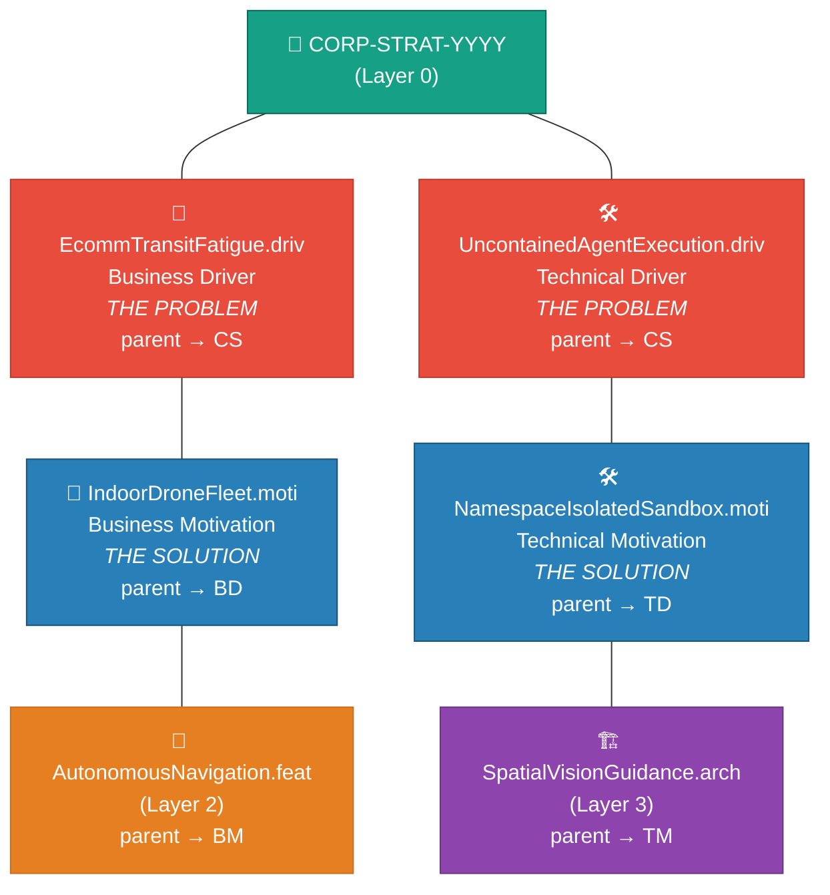

<!-- (c) 2026-* Frederick Bloom -- 20260816-035418-673000-72e4-a2e5-fbacfb28adcd-DriverMotivationTmpl.tmpl-0.0.1.md -- Hanaden AI Loader -->
---
tmpl-id:      20260816-035418-673000-72e4-a2e5-fbacfb28adcd-DriverMotivationTmpl
version:      0.0.1
status:       ACTIVE
category:     TEMPLATE
node-types-covered: [B-DRIV, B-MOTI, T-DRIV, T-MOTI]
layer:        1
description: >
  Reusable template for Hanaden Layer 1 driver and motivation documents.
  Covers B-DRIV (business problem), B-MOTI (business solution), T-DRIV (technical
  problem), and T-MOTI (technical solution). Defines frontmatter schema, body
  section order, and embedded TEST SUITE schema. MOTI is a child of DRIV (parent→DRIV).
references:
  - 20260816-035411-784482-7cd5-a4a5-cbc587fb36cd-ExampleProjectHierarchyTree.tmpl-0.0.1.md
copyright: (c) 2026-* Frederick Bloom
---

# Driver / Motivation Template (Layer 1)

> **Hierarchy reference:** [`ExampleProjectHierarchyTree.tmpl-0.0.1.md`](./20260816-035411-784482-7cd5-a4a5-cbc587fb36cd-ExampleProjectHierarchyTree.tmpl-0.0.1.md)

## What Is a Driver?

A **Driver** (`B-DRIV` or `T-DRIV`) is a **problem statement**. It identifies a pain point,
risk, gap, or opportunity that demands change. It answers the question: **"Why must we act?"**

A Driver is evidence-based. It cites data, metrics, market signals, or failure modes.
It does **NOT** propose a solution — that is the Motivation's job.

A Driver can exist without a Motivation (an unsolved problem). A Driver's `parent` points
to a Layer 0 CORP-STRAT.

| Domain | Node-type | Question it answers | Example |
|--------|-----------|---------------------|---------|
| Business | `B-DRIV` | "What business problem forces us to change?" | *"E-commerce facilities lose $2B annually in worker transit fatigue — pickers walk 12+ miles/day."* |
| Technical | `T-DRIV` | "What technical limitation blocks us?" | *"Legacy facility Wi-Fi drops below −85 dBm in 80% of metallic storage aisles, causing 12% packet loss."* |

## What Is a Motivation?

A **Motivation** (`B-MOTI` or `T-MOTI`) is a **proposed solution direction** to a specific Driver.
It answers the question: **"What will we do about it?"**

A Motivation is strategic, not tactical — it describes the *approach* at a high level,
not the implementation detail (that belongs in FEAT/ARCH/SPEC). A Motivation always has
a Driver as its parent (`parent` → DRIV's `filename-id`). It cannot exist without one —
no solution without a problem.

| Domain | Node-type | Question it answers | Example |
|--------|-----------|---------------------|---------|
| Business | `B-MOTI` | "What business initiative addresses the Driver?" | *"Deploy an indoor drone fleet to move bins directly to packing stations, eliminating picker transit entirely."* |
| Technical | `T-MOTI` | "What technical approach solves the Driver?" | *"Install a 5 GHz UWB mesh network with redundant APs per aisle to bypass Wi-Fi dependency."* |

## How Driver and Motivation Relate

```
DRIV = the PROBLEM         (why we must change)
MOTI = the SOLUTION        (what we will do about it)
MOTI.parent = DRIV         (every solution names its problem)
```

A Driver can have zero or one Motivation. A Motivation always has exactly one Driver parent.
Features (Layer 2) are children of a Motivation — they implement the solution.

### Hierarchy Chain



> **Drivers** (red) identify problems. **Motivations** (blue) propose solutions.
> The chain flows: CORP-STRAT → DRIV → MOTI → FEAT/ARCH.
> Every arrow represents a `parent` pointer on the child node.

---

## Frontmatter Schema — DRIVER (B-DRIV, T-DRIV)

```yaml
---
filename-id:   # REQUIRED — Hanaden UUIDv7 Extended stem
node-type:     # REQUIRED — B-DRIV | T-DRIV
layer:         # REQUIRED — 1
domain:        # REQUIRED — BUSINESS | TECHNICAL
role:          # REQUIRED — DRIVER
version:       # REQUIRED — semver
status:        # REQUIRED — Draft | Active | Superseded
author:        # REQUIRED
copyright:     # REQUIRED
description: > # REQUIRED
  ...
parent:        # REQUIRED — filename-id of the Layer 0 CORP-STRAT this problem serves
supersedes:    # OPTIONAL — filename-id of prior version
references:    # OPTIONAL
tdd:
  state:          # REQUIRED — NOT_STARTED | RED | GREEN | REFACTOR
  test-file:      # REQUIRED — relative path to test script in src/test/
  last-run:       # OPTIONAL — ISO 8601 timestamp of last test execution
  iterations:     # OPTIONAL — RED→GREEN cycle count (default: 0)
  coverage-lines: # OPTIONAL — source lines this node covers
---
```

## Frontmatter Schema — MOTIVATION (B-MOTI, T-MOTI)

```yaml
---
filename-id:   # REQUIRED — Hanaden UUIDv7 Extended stem
node-type:     # REQUIRED — B-MOTI | T-MOTI
layer:         # REQUIRED — 1
domain:        # REQUIRED — BUSINESS | TECHNICAL
role:          # REQUIRED — MOTIVATION
version:       # REQUIRED — semver
status:        # REQUIRED — Draft | Active | Superseded
author:        # REQUIRED
copyright:     # REQUIRED
description: > # REQUIRED
  ...
parent:        # REQUIRED — filename-id of the DRIV this solution addresses
               #   e.g. 20260816-...-EcommTransitFatigue
supersedes:    # OPTIONAL — filename-id of prior version
references:    # OPTIONAL
tdd:
  state:          # REQUIRED — NOT_STARTED | RED | GREEN | REFACTOR
  test-file:      # REQUIRED — relative path to test script in src/test/
  last-run:       # OPTIONAL — ISO 8601 timestamp of last test execution
  iterations:     # OPTIONAL — RED→GREEN cycle count (default: 0)
  coverage-lines: # OPTIONAL — source lines this node covers
---
```

> [!IMPORTANT]
> **DRIV `parent`** → Layer 0 CORP-STRAT filename-id.
> **MOTI `parent`** → Layer 1 DRIV filename-id (NOT CORP-STRAT).
> This is the key structural difference: MOTI is a child of DRIV.

> [!NOTE]
> **No `children` field** — children discover this node via their own `parent` pointer.
> **No `children-order`, `depends-on`, or `order` field** — sibling ordering is determined
> by semantic inference from document content (see SdlcHierarchyOverview).
> **No `node-id` field** — `filename-id` is the single identity.

> [!NOTE]
> **Directory convention:** DRIVER documents live in `Slug.driv/` directories.
> MOTIVATION documents live in `Slug.moti/` directories. No UUIDv7 on directory names.
> File slugs drop the class prefix (e.g. `UncontainedAgentExecution.driv` not
> `TDrivUncontainedAgentExecution.driv`).
> `tdd.state` tracks the **test lifecycle** (RED/GREEN). `status` tracks the
> **document lifecycle** (Draft/Active). These are independent axes.

---

## Body — Copy-Paste Template (DRIVER)

```markdown
<!-- (c) YYYY-* Author -- <filename-id>.<class>-<semver>.md -- Hanaden AI Loader -->

# [Slug]: [Title — ≤12 words]

## Problem Statement

[REQUIRED — 1–3 paragraphs describing the problem, its scope, and evidence of its existence.
 Include quantified impact where possible — e.g. "$2B annually", "signal drops in 80% of aisles".
 Do NOT propose a solution here — that is the Motivation's job.]

## Business / Technical Impact

[REQUIRED — quantified impact table.]

| Impact dimension | Current state | Target state | Delta |
|------------------|---------------|--------------|-------|
| [cost / time / risk / capability] | [value] | [value] | [value] |

## Constraints

[OPTIONAL — budget, timeline, regulatory, physical, organisational.]

- [constraint]

## Test Suite

> **Suite ID:** [filename-id]-SUITE
> **Suite name:** [Human-readable name — e.g. "Macro-Economic Analysis"]
> **Test file:** `src/test/{project}/Slug.driv/test_slug.sh`
> **Integration test boundary:** tests this driver against the parent Layer 0 goal
> **Unit test boundary:** tests the paired motivation as a unit against this driver

### ⚙️ Functional Tests

| ID | Description | Method | Pass Criteria | TDD |
|----|-------------|--------|---------------|-----|

### 📊 Performance / Profile / Electrical Tests

| ID | Description | Metric | Target | Tolerance | TDD |
|----|-------------|--------|--------|-----------|-----|

### 🛡️ Security Tests

| ID | Description | Attack / Scenario | Expected Defense | TDD |
|----|-------------|-------------------|------------------|-----|

### 🧠 Memory / CPU / Hardware Tests

| ID | Description | Resource | Threshold | TDD |
|----|-------------|----------|-----------|-----|

## References

- [filename-id or URL]
```

## Body — Copy-Paste Template (MOTIVATION)

```markdown
<!-- (c) YYYY-* Author -- <filename-id>.<class>-<semver>.md -- Hanaden AI Loader -->

# [Slug]: [Title — ≤12 words]

## Proposed Solution

[REQUIRED — 1–2 paragraphs describing the proposed solution at a non-implementation level.
 Answer: what will be built or changed, and how does it resolve the paired Driver?
 Do NOT go into implementation detail — that belongs in FEAT/ARCH/SPEC.]

## Business / Technical Impact

[REQUIRED — quantified impact table.]

| Impact dimension | Current state | Target state | Delta |
|------------------|---------------|--------------|-------|
| [cost / time / risk / capability] | [value] | [value] | [value] |

## Constraints

[OPTIONAL — budget, timeline, regulatory, physical, organisational.]

- [constraint]

## Test Suite

> **Suite ID:** [filename-id]-SUITE
> **Suite name:** [Human-readable name — e.g. "Business Acceptance Suite"]
> **Test file:** `src/test/{project}/Slug.driv/Slug.moti/test_slug.sh`
> **Integration test boundary:** tests this motivation against the parent driver
> **Unit test boundary:** tests Layer 2 features as units against this motivation

### ⚙️ Functional Tests

| ID | Description | Method | Pass Criteria | TDD |
|----|-------------|--------|---------------|-----|

### 📊 Performance / Profile / Electrical Tests

| ID | Description | Metric | Target | Tolerance | TDD |
|----|-------------|--------|--------|-----------|-----|

### 🛡️ Security Tests

| ID | Description | Attack / Scenario | Expected Defense | TDD |
|----|-------------|-------------------|------------------|-----|

### 🧠 Memory / CPU / Hardware Tests

| ID | Description | Resource | Threshold | TDD |
|----|-------------|----------|-----------|-----|

## References

- [filename-id or URL]
```

> [!NOTE]
> DRIVER body has `## Problem Statement`. MOTIVATION body has `## Proposed Solution`.
> Never both — a document is one or the other.
> Omit any TEST SUITE sub-section that has zero test cases.

---

## Quick Decision Guide: Is This a Driver or a Motivation?

| If the document... | It is a... |
|--------------------|-----------|
| Describes a pain point, gap, risk, or opportunity | **DRIVER** |
| Cites evidence/data about what's wrong | **DRIVER** |
| Answers "why must we change?" | **DRIVER** |
| Proposes an approach to fix a problem | **MOTIVATION** |
| Answers "what will we do about it?" | **MOTIVATION** |
| Could exist without a solution (unsolved problem) | **DRIVER** |
| Cannot exist without naming the problem it solves | **MOTIVATION** |

---

## Field Reference

| Field | Type | REQUIRED? | Valid values |
|-------|------|-----------|--------------|
| `filename-id` | string | ✅ | Hanaden UUIDv7 Extended stem |
| `node-type` | enum | ✅ | `B-DRIV` `B-MOTI` `T-DRIV` `T-MOTI` |
| `domain` | enum | ✅ | `BUSINESS` `TECHNICAL` |
| `role` | enum | ✅ | `DRIVER` `MOTIVATION` |
| `parent` | string | ✅ | DRIV: Layer 0 filename-id · MOTI: DRIV filename-id |
| `supersedes` | string | ⬜ | filename-id of prior version |
| `tdd.state` | enum | ✅ | `NOT_STARTED` `RED` `GREEN` `REFACTOR` |
| `tdd.test-file` | string | ✅ | Relative path to test script |
| `tdd.last-run` | string | ⬜ | ISO 8601 timestamp |
| `tdd.iterations` | int | ⬜ | RED→GREEN cycle count |
| `tdd.coverage-lines` | string | ⬜ | Source line range |

---

## Changelog

| Version | Date | Author | Changes |
|---------|------|--------|---------|
| 0.0.1 | 2026-08-16 | Frederick Bloom | Initial template — Layer 1 Driver/Motivation |
| 0.0.1 | 2026-08-16 | Frederick Bloom | Schema refactor: MOTI parent→DRIV, drop `node-id`/`children`/`paired-with`, all pointers use `filename-id`, separate DRIV/MOTI body templates, add definition blocks with examples and decision guide |
| 0.0.1 | 2026-08-16 | Frederick Bloom + AI | Add tdd: frontmatter (both schemas), TDD column, test-file ref, Slug.class IDs, dir convention notes |
