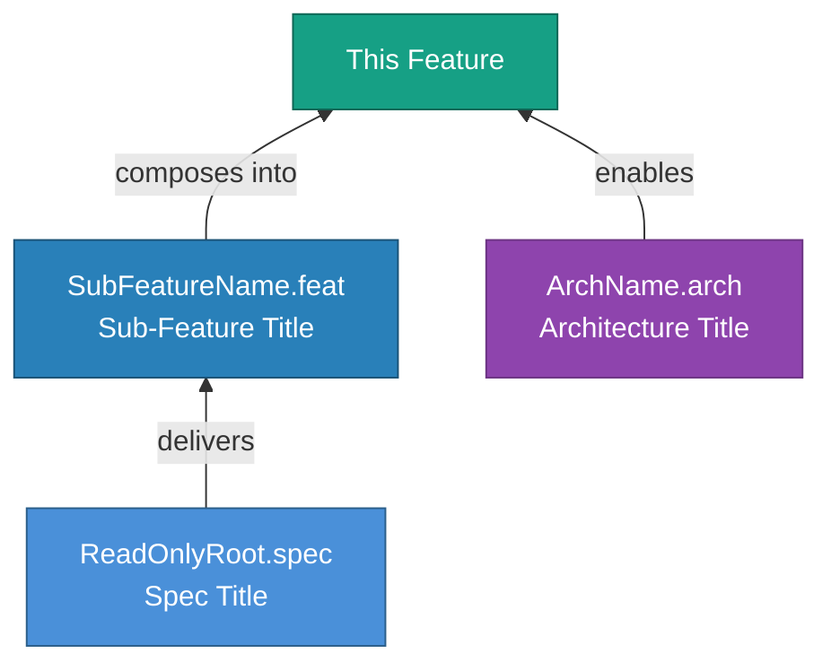

<!-- (c) 2026-* Frederick Bloom -- 20260816-035418-832920-7b8b-850b-fdc1425d9d8c-FeatureTmpl.tmpl-0.0.1.md -- Hanaden AI Loader -->
---
tmpl-id:      20260816-035418-832920-7b8b-850b-fdc1425d9d8c-FeatureTmpl
version:      0.0.1
status:       ACTIVE
category:     TEMPLATE
node-types-covered: [FEAT]
layer:        2
description: >
  Reusable template for Hanaden Layer 2 Feature documents (FEAT).
  Features are recursive — a FEAT may contain sub-FEATs. A FEAT may also have
  ARCH and SPEC children. A SPEC may unlock a new FEAT via the cross-layer
  unlock pattern (the SPEC declares this via its `unlocks` field).
  Defines frontmatter schema, body section order, Feature Tree diagram pattern,
  Spec block pattern, and embedded TEST SUITE schema.
references:
  - 20260816-035411-784482-7cd5-a4a5-cbc587fb36cd-ExampleProjectHierarchyTree.tmpl-0.0.1.md
copyright: (c) 2026-* Frederick Bloom
---

# Feature Template (Layer 2)

> **Hierarchy reference:** [`ExampleProjectHierarchyTree.tmpl-0.0.1.md`](./20260816-035411-784482-7cd5-a4a5-cbc587fb36cd-ExampleProjectHierarchyTree.tmpl-0.0.1.md)

## What Is a Feature?

A **Feature** (`FEAT`) is the **primary unit of product / engineering delivery**.
It describes a concrete capability that the system will provide — something a user, operator,
or subsystem can observe, invoke, or benefit from.

Features answer the question: **"What does the system DO?"**

- Features are **recursive** — a FEAT may contain sub-FEATs to any depth
  (FEAT-SomeCapability → FEAT-SomeCapability-SubA → FEAT-SomeCapability-SubA1).
- A Feature's `parent` is either a **MOTI** (top-level feature implementing a solution)
  or a **parent FEAT** (sub-feature decomposition).
- A SPEC may **unlock** a new Feature via the cross-layer unlock pattern (🌟).
  The SPEC declares this via its own `unlocks` field — the Feature does NOT carry
  an `unlocked-by` field.

**Examples:**
- *"Autonomous Indoor Drone Navigation — drones navigate warehouse aisles without human control."*
- *"Automated Battery Hot-Swapping — robotic arm swaps depleted batteries without landing."*
- *"Blind-Spot Night-Vision Navigation — drone navigates in 0.0 lux darkness."* (unlocked by LiDAR spec)

---

## Frontmatter Schema

```yaml
---
filename-id:   # REQUIRED — Hanaden UUIDv7 Extended stem
node-type:     # REQUIRED — FEAT
layer:         # REQUIRED — 2 (sub-features also use layer: 2 regardless of depth)
version:       # REQUIRED — semver
status:        # REQUIRED — Draft | Review | Accepted | Implemented
priority:      # REQUIRED — integer 1–N (1 = highest priority)
author:        # REQUIRED
copyright:     # REQUIRED
description: > # REQUIRED — 1–4 sentences
  ...
parent:        # REQUIRED — filename-id of parent node
               #   Top-level FEAT → parent MOTI's filename-id
               #   Sub-FEAT → parent FEAT's filename-id
supersedes:    # OPTIONAL — filename-id of prior version, or null
references:    # OPTIONAL — list of filename-ids
sdlc-type:     # OPTIONAL — feature (default) | enhancement | spike
tdd:
  state:          # REQUIRED — NOT_STARTED | RED | GREEN | REFACTOR
  test-file:      # REQUIRED — relative path to test script in src/test/
  last-run:       # OPTIONAL — ISO 8601 timestamp of last test execution
  iterations:     # OPTIONAL — RED→GREEN cycle count (default: 0)
  coverage-lines: # OPTIONAL — source lines this node covers
---
```

> [!NOTE]
> **No `children` field** — children discover this node via their own `parent` pointer.
> **No `children-order`, `depends-on`, or `order` field** — sibling ordering is determined
> by semantic inference from document content (see SdlcHierarchyOverview).
> **No `unlocked-by` field** — the SPEC that unlocks this FEAT declares it via `unlocks` on the SPEC side.
> **No `node-id` field** — `filename-id` is the single identity.

> [!NOTE]
> **Directory convention:** Feature documents live in `Slug.feat/` directories.
> Child specs live in `Slug.spec/` subdirectories. No UUIDv7 on directory names.
> File slugs drop the class prefix (e.g. `VfsIsolation.feat` not `FeatVfsIsolation.feat`).
> `tdd.state` tracks the **test lifecycle** (RED/GREEN). `status` tracks the
> **document lifecycle** (Draft/Active). These are independent axes.

---

## Body — Copy-Paste Template

```markdown
<!-- (c) YYYY-* Author -- <filename-id>.<class>-<semver>.md -- Hanaden AI Loader -->

# [Slug]: [Title — ≤12 words]

## Goal

[REQUIRED — 1 paragraph. What does this feature deliver, from the user's perspective?
 Use domain language, not implementation language.]

## Requirements

[REQUIRED]

| ID | Requirement | Constraint |
|----|-------------|------------|
| R1 | [MUST statement — observable behavior] | [bound / limit] |

## Feature Tree

[REQUIRED if this feature has sub-features, specs, or architectures.
 Use Mermaid flowchart BT (bottom-to-top composition).]



## Sub-Features

[OPTIONAL — one block per immediate child FEAT. Omit section if no sub-features.]

### Feature: [SubFeatureName.feat] — [Title]

[1 sentence description]

#### Spec: [SpecName.spec] — [Title]

##### Given
[precondition — system state before the action]

##### When
[action — the operation or event under test]

##### Then
[postcondition — the expected observable result]

##### Test Data Table

| # | Input | Expected Output | f(x) Description | Box | Scope | Aspect |
|---|-------|----------------|-------------------|-----|-------|--------|
| 1 | [value] | [value] | [what this row tests] | BLACK|WHITE | Unit|Integration|E2E | Functional|Perf|Security |

## Test Suite

> **Suite ID:** [filename-id]-SUITE
> **Suite name:** [Human-readable name]
> **Test file:** `src/test/{project}/.../Slug.feat/test_slug.sh`
> **Integration test boundary:** tests this feature as a unit against the parent motivation / feature
> **Unit test boundary:** tests child features and specs as units against this feature's requirements

### ⚙️ Functional Tests

| ID | Description | Method | Pass Criteria | TDD |
|----|-------------|--------|---------------|-----|

### 📊 Performance / Profile / Electrical Tests

| ID | Description | Metric | Target | Tolerance | TDD |
|----|-------------|--------|--------|-----------|-----|

### 🛡️ Security Tests

| ID | Description | Attack / Scenario | Expected Defense | TDD |
|----|-------------|-------------------|------------------|-----|

### 🧠 Memory / CPU / Hardware Tests

| ID | Description | Resource | Threshold | TDD |
|----|-------------|----------|-----------|-----|

## References

- [filename-id or URL]
```

> [!NOTE]
> Omit any TEST SUITE sub-section that has zero test cases.
> Repeat the `### Feature:` block for each sub-feature. Sub-features live in `Slug.feat/` subdirectories.
> The `## Feature Tree` Mermaid diagram is REQUIRED whenever children exist — it is the
> machine-readable composition map for the SDLC hierarchy.

---

## Field Reference

| Field | Type | REQUIRED? | Valid values |
|-------|------|-----------|--------------|
| `filename-id` | string | ✅ | Hanaden UUIDv7 Extended stem |
| `node-type` | enum | ✅ | `FEAT` |
| `layer` | int | ✅ | `2` (all depths of FEAT) |
| `status` | enum | ✅ | `Draft` `Review` `Accepted` `Implemented` |
| `priority` | int | ✅ | 1 = highest |
| `parent` | string | ✅ | MOTI filename-id or parent FEAT filename-id |
| `sdlc-type` | enum | ⬜ | `feature` `enhancement` `spike` |
| `tdd.state` | enum | ✅ | `NOT_STARTED` `RED` `GREEN` `REFACTOR` |
| `tdd.test-file` | string | ✅ | Relative path to test script |
| `tdd.last-run` | string | ⬜ | ISO 8601 timestamp |
| `tdd.iterations` | int | ⬜ | RED→GREEN cycle count |
| `tdd.coverage-lines` | string | ⬜ | Source line range |

## Test Data Table — Column Definitions

| Column | Values |
|--------|--------|
| `Box` | `BLACK` (observable behavior) / `WHITE` (internal implementation) |
| `Scope` | `Unit` / `Integration` / `E2E` / `Hardware` |
| `Aspect` | `Functional` / `Perf` / `Memory` / `Security` / `Electrical` |

---

## Changelog

| Version | Date | Author | Changes |
|---------|------|--------|---------|
| 0.0.1 | 2026-08-16 | Frederick Bloom | Initial template — Layer 2 Feature (recursive, cross-layer unlock) |
| 0.0.1 | 2026-08-16 | Frederick Bloom | Schema refactor: drop `node-id`/`children`/`unlocked-by`, all pointers use `filename-id`, add definition block |
| 0.0.1 | 2026-08-16 | Frederick Bloom + AI | Add tdd: frontmatter, TDD column, test-file ref, Slug.class naming, dir convention |
