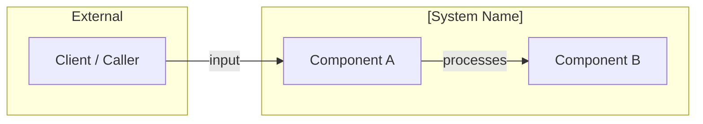
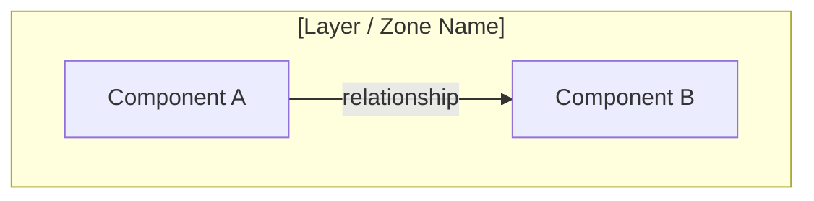
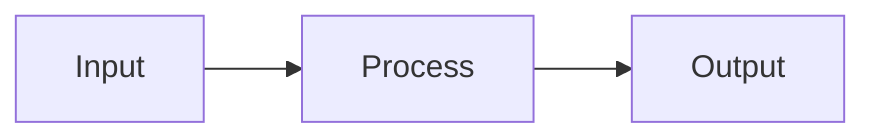

<!-- (c) 2026-* Frederick Bloom -- 20260816-035418-995136-76f5-bf0a-866855053397-ArchitectureTmpl.tmpl-0.0.1.md -- Hanaden AI Loader -->
---
tmpl-id:      20260816-035418-995136-76f5-bf0a-866855053397-ArchitectureTmpl
version:      0.0.2
status:       ACTIVE
category:     TEMPLATE
node-types-covered: [ARCH]
layer:        3
description: >
  Reusable template for Hanaden Layer 3 Architecture documents (ARCH).
  Architectures define the structural contract between features (Layer 2) and
  specifications (Layer 4). They sit at the system boundary and govern component
  decomposition, data flow, lifecycle events, and function contracts.
  Uses .design class with node-type: ARCH frontmatter discriminator.
references:
  - 20260816-035411-784482-7cd5-a4a5-cbc587fb36cd-ExampleProjectHierarchyTree.tmpl-0.0.1.md
copyright: (c) 2026-* Frederick Bloom
---

# Architecture Template (Layer 3)

> **Hierarchy reference:** [`ExampleProjectHierarchyTree.tmpl-0.0.1.md`](./20260816-035411-784482-7cd5-a4a5-cbc587fb36cd-ExampleProjectHierarchyTree.tmpl-0.0.1.md)

## What Is an Architecture?

An **Architecture** (`ARCH`) defines the **structural contract** of a system, subsystem,
or component. It sits between Features (what the system does) and Specifications (what
the system must measurably satisfy). It answers the question:
**"How is the system structured and how do the parts interact?"**

An Architecture document describes:
- **Component decomposition** — what are the parts and their responsibilities
- **Data flow** — how data moves between components
- **Lifecycle / execution model** — boot sequence, event model, runtime tiers
- **Function contracts** — API signatures, preconditions, postconditions

An Architecture's `parent` is a **FEAT** (the feature it enables) or a **MOTI**
(when an architecture directly serves a motivation without an intermediate feature).
Its children (Specifications) point upward via their own `parent` pointer.

**Examples:**
- *"Spatial Computer Vision Guidance System — component decomposition for the drone's obstacle avoidance subsystem."*
- *"UWB Decentralized Mesh Network — protocol stack and routing architecture for warehouse mesh communication."*

> **Generation note:** Early-era files (bootstrap.design-0.0.1–0.0.3) use no YAML frontmatter —
> only inline bold metadata fields. Both forms are valid; YAML is preferred for new documents.

---

## Frontmatter Schema

```yaml
---
filename-id:   # REQUIRED — Hanaden UUIDv7 Extended stem
node-type:     # REQUIRED — ARCH
layer:         # REQUIRED — 3
version:       # REQUIRED — semver
status:        # REQUIRED — Draft | Normative | Active | Research | Superseded
author:        # REQUIRED
copyright:     # REQUIRED
description: > # REQUIRED — 1–4 sentences
  ...
applies-to:    # REQUIRED — system / project / component this architecture governs
parent:        # REQUIRED — filename-id of FEAT or MOTI this architecture serves
supersedes:    # OPTIONAL — filename-id of prior version, or null
superseded-by: # OPTIONAL — filename-id of newer version
language:      # OPTIONAL — DSL version if this doc is written in a DSL (e.g. "Hanaden AI DSL v0.0.2")
references:    # OPTIONAL — list of filename-ids or URLs
shebang:       # OPTIONAL — "#!ai-exec flow_type=RAW-DATA" (place as HTML comment BEFORE YAML block)
---
```

> [!NOTE]
> **No `children` field** — child SPECs discover this node via their own `parent` pointer.
> **No `node-id` field** — `filename-id` is the single identity.
> If `shebang` is set, place `<!-- #!ai-exec flow_type=RAW-DATA -->` as the **first line** of the file,
> before the YAML `---` block.

---

## Body — Copy-Paste Template

```markdown
<!-- (c) YYYY-* Author -- <filename-id>.design-<semver>.md -- Hanaden AI Loader -->
<!-- #!ai-exec flow_type=RAW-DATA -->   ← OPTIONAL: include only if AI-executable

# [Slug] — Design & Specification

**Version:** N.N.N
**Status:** [Draft | Normative | Active | Research | Superseded]
**Applies to:** [system / component name]
**Author:** [name]            ← OPTIONAL (include for attribution)
**Language:** [DSL version]   ← OPTIONAL (include if doc is written in a DSL)
**Supersedes:** [link]        ← OPTIONAL

[1–3 sentence scope statement: what this architecture covers and governs.]

---

## Table of Contents

[REQUIRED for documents > 200 lines. Numbered list of ## sections with anchor links.]

1. [System Overview](#1-system-overview)
2. [Architecture](#2-architecture)
...

---

## 1. [System Overview | Purpose]

[REQUIRED — what this system does, what it is not, and any grounding analogy.]

### 1.1 Design Goals

[REQUIRED]

| Goal | Description |
|------|-------------|
| [goal name] | [what it means and why it matters] |

### 1.2 Changes from X → Y

[OPTIONAL — include when this document supersedes a prior version.]

| Area | Prior version | This version |
|------|--------------|--------------|

### 1.x System Boundary / Analogy

[OPTIONAL — Mermaid diagram OR prose analogy (e.g. "like GRUB for hardware...")]



---

## 2. Architecture

### 2.1 Component Diagram

[REQUIRED — Mermaid graph showing components and relationships.]



### 2.2 Data Flow

[OPTIONAL — Mermaid flowchart showing data movement.]



---

## 3. [Lifecycle | Execution Model | Protocol]

[REQUIRED — primary operational model. Sub-sections are variable per domain.]

### 3.1 [Boot Sequence | Runtime Tiers | Event Model]

[Content specific to the system being specified.]

---

## 4–N. [Numbered Feature / Domain Sections]

[REQUIRED — 1 or more domain-specific sections (e.g. File Discovery, Shebang Detection,
 Memory Management, Anti-Shortcut Enforcement). Number sequentially after Section 3.]

---

## [N]. Function Reference

[REQUIRED for executable / DSL specs. List all functions with signature and contract.]

```
funct function_name(param1, param2):
    [CONTRACT: preconditions, side effects, return value]
```

---

## [N]. Open Questions

[OPTIONAL — always the last section before Test Suite. Remove when resolved.]

- [ ] [question]

---

## Test Suite

> **Suite ID:** [filename-id]-SUITE
> **Suite name:** [Human-readable name]
> **Integration test boundary:** tests this architecture as a unit against the parent feature
> **Unit test boundary:** tests child specs as units against this architecture's contracts

### ⚙️ Functional Tests

| ID | Description | Method | Pass Criteria |
|----|-------------|--------|---------------|

### 📊 Performance / Profile / Electrical Tests

| ID | Description | Metric | Target | Tolerance |
|----|-------------|--------|--------|-----------|

### 🛡️ Security Tests

| ID | Description | Attack / Scenario | Expected Defense |
|----|-------------|-------------------|------------------|

### 🧠 Memory / CPU / Hardware Tests

| ID | Description | Resource | Threshold |
|----|-------------|----------|-----------|

---

## References

- [filename-id or URL]
```

> [!NOTE]
> Omit any TEST SUITE sub-section that has zero test cases.
> Section numbering (`## 3.`, `## 4–N.`) is REQUIRED — this is a formally numbered document.
> Section titles after `## 3.` are variable — name them for the domain (e.g. "File Change Detection",
> "Shebang Detection", "Anti-Shortcut Enforcement").

---

## Field Reference

| Field | Type | REQUIRED? | Valid values |
|-------|------|-----------|--------------|
| `filename-id` | string | ✅ | Hanaden UUIDv7 Extended stem |
| `node-type` | enum | ✅ | `ARCH` |
| `layer` | int | ✅ | `3` |
| `status` | enum | ✅ | `Draft` `Normative` `Active` `Research` `Superseded` |
| `applies-to` | string | ✅ | system or component name |
| `parent` | string | ✅ | FEAT or MOTI filename-id |
| `language` | string | ⬜ | DSL version string |
| `shebang` | string | ⬜ | `"#!ai-exec flow_type=RAW-DATA"` |
| `superseded-by` | string | ⬜ | filename-id of newer version |

---

## Changelog

| Version | Date | Author | Changes |
|---------|------|--------|---------|
| 0.0.1 | 2026-08-16 | Frederick Bloom | Initial template — Layer 3 Architecture (.design, node-type: ARCH) |
| 0.0.2 | 2026-08-16 | Frederick Bloom | Schema refactor: drop `node-id`/`children`, all pointers use `filename-id`, add definition block |
