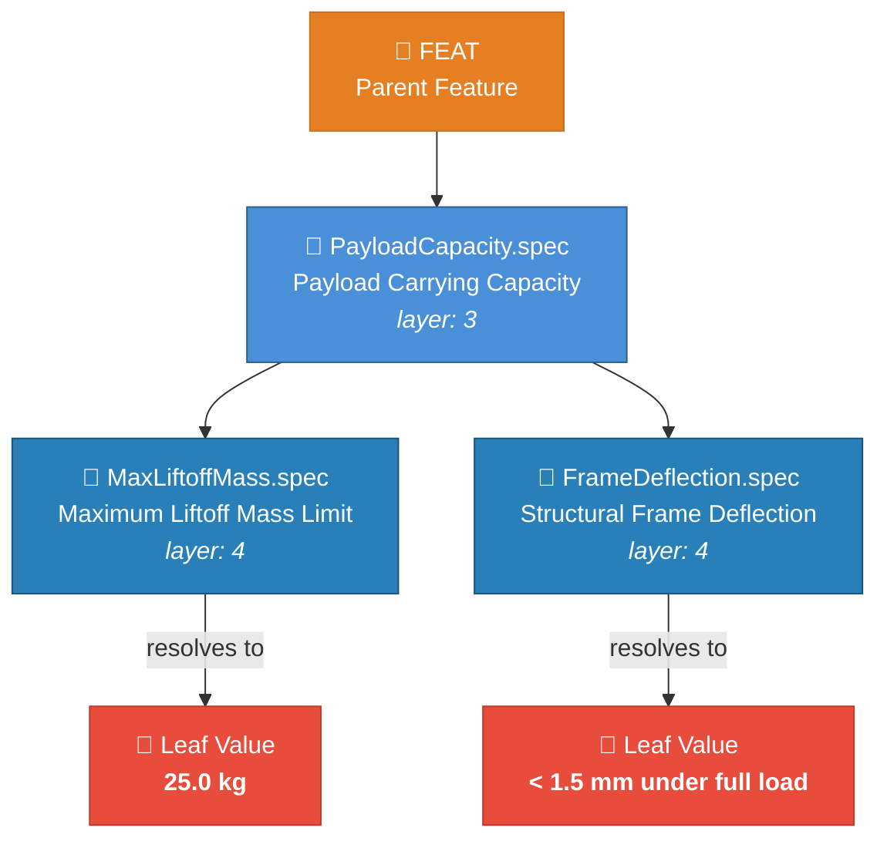
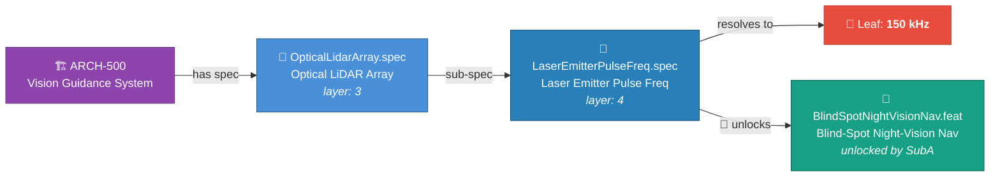

<!-- (c) 2026-* Frederick Bloom -- 20260816-035419-161812-77ab-8fb0-d4d2c0e1cb0d-SpecificationTmpl.tmpl-0.0.1.md -- Hanaden AI Loader -->
---
tmpl-id:      20260816-035419-161812-77ab-8fb0-d4d2c0e1cb0d-SpecificationTmpl
version:      0.0.1
status:       ACTIVE
category:     TEMPLATE
node-types-covered: [SPEC]
layer:        "3 | 4"
description: >
  Reusable template for Hanaden Layer 3–4 Specification documents (SPEC).
  Specifications are recursive — a SPEC may contain sub-SPECs (SPEC HAS SPEC pattern).
  A SPEC terminates at a primitive leaf value (cannot be decomposed further).
  A SPEC may unlock a new FEAT via the cross-layer unlock pattern (SPEC UNLOCKS FEATURE).
  Defines frontmatter schema, body section order, leaf-value block, and embedded TEST SUITE schema.
references:
  - 20260816-035411-784482-7cd5-a4a5-cbc587fb36cd-ExampleProjectHierarchyTree.tmpl-0.0.1.md
copyright: (c) 2026-* Frederick Bloom
---

# Specification Template (Layer 3–4)

> **Hierarchy reference:** [`ExampleProjectHierarchyTree.tmpl-0.0.1.md`](./20260816-035411-784482-7cd5-a4a5-cbc587fb36cd-ExampleProjectHierarchyTree.tmpl-0.0.1.md)

## What Is a Specification?

A **Specification** (`SPEC`) defines a **measurable, testable constraint** on the system.
It is the most precise node in the hierarchy — every SPEC must be falsifiable (there must
exist a measurement that can pass or fail it). It answers the question:
**"What must the system measurably satisfy?"**

Specifications are:
- **Recursive** — a SPEC may contain sub-SPECs (Parent.spec → ChildA.spec → ChildB.spec).
- **Terminal at a leaf primitive** — when a SPEC resolves to a single measurable value
  (e.g. `25.0 kg`, `AES-256`, `150 kHz`), it cannot be decomposed further (🛑).
  Document it with `## Leaf Value`.
- **Capable of unlocking features** — a SPEC may satisfy a precondition that enables
  a new FEAT (🌟 cross-layer unlock). The SPEC declares this via `unlocks`.

A SPEC's `parent` is a **FEAT**, **ARCH**, or **parent SPEC**.

**Examples:**
- *"Payload Carrying Capacity — the drone frame MUST sustain 25.0 kg maximum liftoff mass."* (leaf: 25.0 kg)
- *"Structural Frame Deflection — carbon fiber frame MUST deflect < 1.5 mm under full load."* (leaf: < 1.5 mm)
- *"Laser Emitter Pulse Frequency — LiDAR array MUST emit at 150 kHz."* (leaf: 150 kHz, unlocks night-vision FEAT)
- *"Signal Encryption Standard — all mesh traffic MUST use AES-256."* (leaf: AES-256)

### Pattern 1 — Recursive SPEC Structure (SPEC HAS SPEC → leaf)



### Pattern 2 — Cross-Layer Unlock (🌟 SPEC UNLOCKS FEAT)



> Set `leaf-value` XOR sub-spec children — never both.

---

## Frontmatter Schema

```yaml
---
filename-id:   # REQUIRED — Hanaden UUIDv7 Extended stem
node-type:     # REQUIRED — SPEC
layer:         # REQUIRED — 3 (top-level SPEC) | 4 (sub-spec)
spec-domain:   # REQUIRED — PERF | HW | NET | SEC | FUNC | GENERAL
               #   PERF     — performance / throughput / latency
               #   HW       — hardware / firmware / electrical
               #   NET      — networking / protocol / RF
               #   SEC      — security / cryptography / access control
               #   FUNC     — functional / behavioral
               #   GENERAL  — does not fit a specific domain
version:       # REQUIRED — semver
status:        # REQUIRED — Draft | Review | Accepted | Implemented | Superseded
author:        # REQUIRED
copyright:     # REQUIRED
description: > # REQUIRED — 1–4 sentences
  ...
parent:        # REQUIRED — filename-id of parent (FEAT, ARCH, or parent SPEC)
leaf-value:    # OPTIONAL — primitive value this spec resolves to
               #   e.g. "25.0 kg" | "< 1.5mm under full load" | "AES-256" | "150 kHz"
               #   Set ONLY when this spec is a terminal node (cannot be sub-specified further)
leaf-unit:     # OPTIONAL — SI or standard unit of leaf-value (e.g. "kg" "kHz" "GHz" "mm")
unlocks:       # OPTIONAL — filename-id of FEAT this spec enables (🌟 cross-layer unlock)
supersedes:    # OPTIONAL — filename-id of prior version
references:    # OPTIONAL
shebang:       # OPTIONAL — "#!ai-exec flow_type=RAW-DATA"
tdd:
  state:          # REQUIRED — NOT_STARTED | RED | GREEN | REFACTOR
  test-file:      # REQUIRED — relative path to test script in src/test/
  last-run:       # OPTIONAL — ISO 8601 timestamp of last test execution
  iterations:     # OPTIONAL — RED→GREEN cycle count (default: 0)
  coverage-lines: # OPTIONAL — source lines this node covers
---
```

> [!NOTE]
> **No `children` field** — sub-specs discover this node via their own `parent` pointer.
> **No `node-id` field** — `filename-id` is the single identity.
> `unlocks` uses `filename-id` of the FEAT this spec enables.

---

## Body — Copy-Paste Template

```markdown
<!-- (c) YYYY-* Author -- <filename-id>.spec-<semver>.md -- Hanaden AI Loader -->

# [Slug]: [Title — ≤12 words]

## Specification Statement

[REQUIRED — one precise, testable sentence stating exactly what this spec requires.
 Must be falsifiable: there must exist a measurement that can pass or fail it.
 Example: "The drone payload system MUST sustain a maximum liftoff mass of 25.0 kg."]

## Rationale

[REQUIRED — why this constraint exists. What failure mode does it prevent?
 What standard, regulation, or engineering analysis defines this value?]

## Constraints

[REQUIRED — bounds, tolerances, edge cases, operating conditions.]

| Constraint | Value | Condition |
|------------|-------|-----------|
| [dimension] | [value + unit] | [when this applies] |

## Leaf Value

[REQUIRED only when leaf-value is set in frontmatter — i.e. this is a terminal spec.
 Omit this section entirely for non-leaf specs (those with sub-specs).]

> 🛑 **Primitive** — this specification resolves to a single measurable value.
> It cannot be decomposed into sub-specifications.

**Value:** `[N unit]`
**Rationale:** [why this specific value — measurement, standard reference, safety margin]
**Source:** [test result, datasheet reference, regulatory standard, or engineering calculation]

## Sub-Specifications

[REQUIRED if sub-specs exist. Omit section entirely if this is a leaf spec.]

| Sub-Spec filename-id slug | Title | Leaf Value | Unit | Layer |
|---------------------------|-------|------------|------|-------|
| [SubA slug] | [title] | [value] | [unit] | 4 |
| [SubB slug] | [title] | [value] | [unit] | 4 |

## Unlocks Feature

[REQUIRED if unlocks is set in frontmatter. Omit section if not applicable.]

> 🌟 **Cross-layer unlock** — satisfying this specification enables a new feature.

**Unlocks:** [FEAT filename-id] — [Feature Title]
**Precondition satisfied:** [What this spec proves that makes the feature buildable.
 Example: "The 150 kHz LiDAR pulse rate provides sufficient temporal resolution to
 detect obstacles in 0.0 lux conditions, enabling the Blind-Spot Night-Vision feature."]

## Measurement Method

[REQUIRED — how this spec is objectively measured or verified in practice.
 Name the instrument, test procedure, or computational method.
 Example: "Calibrated load cell (±0.01 kg) with drone at rest on weighing platform."]

## Test Suite

> **Suite ID:** [filename-id]-SUITE
> **Suite name:** [Human-readable name — e.g. "Mechanical Structural Suite"]
> **Test file:** `src/test/{project}/.../Slug.spec/test_slug.sh`
> **Integration test boundary:** tests this spec as a unit against the parent feature or architecture
> **Unit test boundary:** tests sub-specs as units against this spec's constraints

### ⚙️ Functional Tests

| ID | Description | Method | Pass Criteria | TDD |
|----|-------------|--------|---------------|-----|

### 📊 Performance / Profile / Electrical Tests

| ID | Description | Metric | Target | Tolerance | TDD |
|----|-------------|--------|--------|-----------|-----|

### 🛡️ Security Tests

| ID | Description | Attack / Scenario | Expected Defense | TDD |
|----|-------------|-------------------|------------------|-----|

### 🧠 Memory / CPU / Hardware Tests

| ID | Description | Resource | Threshold | TDD |
|----|-------------|----------|-----------|-----|

## References

- [standard, datasheet, regulation, or filename-id]
```

> [!NOTE]
> `## Leaf Value` and `## Sub-Specifications` are mutually exclusive:
> - A SPEC with `leaf-value` set = terminal node → include `## Leaf Value`, omit `## Sub-Specifications`
> - A SPEC with sub-spec children = non-terminal node → include `## Sub-Specifications`, omit `## Leaf Value`
> A SPEC cannot have both (a value AND sub-specs) — that would be ambiguous.
> Omit any TEST SUITE sub-section that has zero test cases.

---

## Field Reference

| Field | Type | REQUIRED? | Valid values |
|-------|------|-----------|--------------|
| `filename-id` | string | ✅ | Hanaden UUIDv7 Extended stem |
| `node-type` | enum | ✅ | `SPEC` |
| `layer` | int | ✅ | `3` (top-level) or `4` (sub-spec) |
| `spec-domain` | enum | ✅ | `PERF` `HW` `NET` `SEC` `FUNC` `GENERAL` |
| `status` | enum | ✅ | `Draft` `Review` `Accepted` `Implemented` `Superseded` |
| `parent` | string | ✅ | FEAT / ARCH / parent SPEC filename-id |
| `leaf-value` | string | ⬜ | primitive value string — mutually exclusive with sub-spec children |
| `leaf-unit` | string | ⬜ | SI or standard unit |
| `unlocks` | string | ⬜ | FEAT filename-id (🌟 cross-layer unlock) |

---

## Changelog

| Version | Date | Author | Changes |
|---------|------|--------|---------|
| 0.0.1 | 2026-08-16 | Frederick Bloom | Initial template — Layer 3-4 Specification (recursive, leaf primitive, cross-layer unlock) |
| 0.0.2 | 2026-08-16 | Frederick Bloom | Schema refactor: drop `node-id`/`children`, `unlocks` uses `filename-id`, add definition block with examples |
