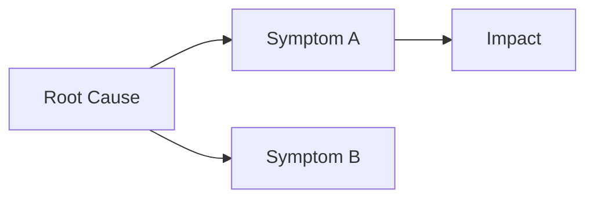

<!-- (c) 2026-* Frederick Bloom -- 20260816-035419-315585-7cc7-a0de-136c1e1cb603-DecisionRecordTmpl.tmpl-0.0.1.md -- Hanaden AI Loader -->
---
tmpl-id:      20260816-035419-315585-7cc7-a0de-136c1e1cb603-DecisionRecordTmpl
version:      0.0.1
status:       ACTIVE
category:     TEMPLATE
node-types-covered: [DECIS]
layer:        cross-cutting
description: >
  Reusable template for Hanaden Decision Record documents (.decis).
  Decision records are cross-cutting — they can govern choices made at any layer
  (FEAT, ARCH, SPEC). Two body variants are supported: the standard Decision Record
  (D{N}: Context / Alternatives / Decision / Rationale) and the Comparison Analysis
  variant (Problem / Approaches / Decision Matrix). Decision records have NO embedded
  TEST SUITE — they are rationale artifacts, not testable artifacts.
references:
  - 20260816-035411-784482-7cd5-a4a5-cbc587fb36cd-ExampleProjectHierarchyTree.tmpl-0.0.1.md
copyright: (c) 2026-* Frederick Bloom
---

# Decision Record Template (Cross-cutting)

> **Hierarchy reference:** [`ExampleProjectHierarchyTree.tmpl-0.0.1.md`](./20260816-035411-784482-7cd5-a4a5-cbc587fb36cd-ExampleProjectHierarchyTree.tmpl-0.0.1.md)

## What Is a Decision Record?

A **Decision Record** (`DECIS`) captures the **rationale behind a design or architectural
choice**. It is NOT a hierarchy node — it is an annotation on one or more hierarchy nodes.
It answers the question: **"Why was this approach chosen over the alternatives?"**

Decision records are **cross-cutting** — a single decision can govern artifacts at any
layer (a FEAT, an ARCH, a SPEC, or all three). They are linked to the artifacts they
govern via the `governs` field, which uses `filename-id` references.

Decision records have **NO TEST SUITE** — they are rationale artifacts. Tests belong
to the FEAT / ARCH / SPEC documents the decision governs.

**Two body variants:**
- **Standard** — repeating `## D{N}` blocks (Context / Alternatives / Decision / Rationale).
  Use for discrete architectural choices.
- **Comparison Analysis** — structured multi-approach comparison with a Decision Matrix.
  Use when evaluating fundamentally different approaches to a design problem.

**Examples:**
- *"TDD DSL Design Decisions — why we chose persistent bash over subprocess spawning, why shebang over file extension for dispatch."*
- *"Variable Scoping Comparison Analysis — evaluating dynamic scoping vs lexical scoping vs hybrid for the DSL."*

---

## Frontmatter Schema

```yaml
---
filename-id:   # REQUIRED — Hanaden UUIDv7 Extended stem
node-type:     # REQUIRED — DECIS
version:       # REQUIRED — semver
status:        # REQUIRED — proposed | accepted | superseded | rejected
author:        # REQUIRED
date:          # REQUIRED — YYYY-MM-DD (date decision was made or recorded)
copyright:     # REQUIRED
description: > # REQUIRED — 1–4 sentences
  ...
governs:       # REQUIRED — list of filename-ids this decision applies to
               #   e.g. [20260816-...-VisionGuidance, 20260816-...-AutonomousNav]
supersedes:    # OPTIONAL — filename-id of prior decision, or null
references:    # REQUIRED — list of filename-ids of documents this decision depends on
shebang:       # OPTIONAL — "#!ai-exec flow_type=RAW-DATA"
---
```

> [!IMPORTANT]
> Decision records have **no** `layer`, `parent`, or `children` fields.
> They are not nodes in the SDLC hierarchy — they are annotations on nodes.
> The `governs` field is the cross-reference mechanism, using `filename-id` exclusively.

---

## Body Variant 1 — Standard Decision Record

Use when recording one or more discrete architectural or design decisions.

```markdown
<!-- (c) YYYY-* Author -- <filename-id>.decis-<semver>.md -- Hanaden AI Loader -->

# [System / Component] — Decision Record

**Version:** N.N.N
**Status:** [proposed | accepted | superseded | rejected]
**Author:** [name]
**Date:** YYYY-MM-DD

---

## D1: [Decision Title — ≤10 words]

### Context

[REQUIRED — what situation or requirement forced this decision?
 Include any relevant constraints (timeline, compatibility, resources).]

### Alternatives Considered

[REQUIRED — table with all realistic options evaluated.]

| Option | [Criterion A] | [Criterion B] | Compliant? | Verdict |
|--------|---------------|---------------|------------|---------|
| Option A | [value] | [value] | YES / NO | Accept / Reject |
| Option B | [value] | [value] | YES / NO | Accept / Reject |

### Decision

[REQUIRED — one clear sentence stating the chosen option and its identifier.]

Use **[Option Name]** — [one sentence summary of what this means in practice].

### Rationale

[REQUIRED — why this option was chosen over the alternatives.
 Reference the Alternatives table. State any acknowledged trade-offs.]

- [rationale point]

---

## D2: [Next Decision Title]

[Repeat D{N} block for each additional decision. Number sequentially.]

---

## References

- [filename-id or URL]
```

---

## Body Variant 2 — Comparison Analysis

Use when evaluating fundamentally different approaches to a design problem
(e.g., variable scoping strategies, protocol choices, algorithm trade-offs).

```markdown
<!-- (c) YYYY-* Author -- <filename-id>.decis-<semver>.md -- Hanaden AI Loader -->

# [System] — [Problem Area] Comparison Analysis

**Version:** N.N.N
**Status:** [proposed | accepted]
**Author:** [name]
**Date:** YYYY-MM-DD

---

## 1. Problem Statement

[REQUIRED — what design problem triggered this comparison?
 Include code snippet, configuration, or specification excerpt that illustrates the issue.]

## 2. Root Cause Analysis

[REQUIRED — what underlying sub-problems does this decision address?]

| Sub-Problem | Description |
|-------------|-------------|
| [name] | [what it is and why it matters] |

| Approach | Fixes Sub-Problem A? | Fixes Sub-Problem B? |
|----------|---------------------|---------------------|
| Approach A | YES / Partially / NO | YES / Partially / NO |

### Root Cause Diagram

[OPTIONAL — Mermaid flowchart showing cause → symptom → impact chain.]



## 3. Language / Prior Art Research

[OPTIONAL — how do established languages, standards, or projects solve this problem?]

## 4. Approach A — [Name]

[REQUIRED per approach — one section per approach evaluated.]

[Description of the approach. Include code/pseudocode where it aids clarity.]

### Pros
- [pro]

### Cons
- [con]

## 5. Approach B — [Name]

[Repeat for each approach. Number sequentially.]

---

## [N]. Side-by-Side Feature Comparison

[REQUIRED]

| Feature | Approach A | Approach B | Approach C |
|---------|-----------|-----------|-----------|
| [criterion] | [value] | [value] | [value] |

## [N]. Pros and Cons Summary

[REQUIRED]

| Approach | Pros | Cons |
|----------|------|------|

## [N]. Decision Matrix

[REQUIRED — weighted scoring across all approaches.]

| Criterion | Weight | Approach A | Approach B | Approach C |
|-----------|--------|-----------|-----------|-----------|
| [criterion] | [0–1] | [score 0–10] | [score] | [score] |
| **Weighted Total** | — | **[sum]** | **[sum]** | **[sum]** |

**Decision:** Use **[Approach Name]**. [One sentence justification referencing matrix result.]

---

## References

- [filename-id or URL]
```

---

## Field Reference

| Field | Type | REQUIRED? | Valid values |
|-------|------|-----------|--------------|
| `filename-id` | string | ✅ | Hanaden UUIDv7 Extended stem |
| `node-type` | enum | ✅ | `DECIS` |
| `status` | enum | ✅ | `proposed` `accepted` `superseded` `rejected` |
| `date` | date | ✅ | `YYYY-MM-DD` |
| `governs` | list | ✅ | filename-ids of governed documents |
| `references` | list | ✅ | filename-ids of dependency documents |
| `supersedes` | string | ⬜ | filename-id of prior decision |

---

## Changelog

| Version | Date | Author | Changes |
|---------|------|--------|---------|
| 0.0.1 | 2026-08-16 | Frederick Bloom | Initial template — Decision Record (standard + comparison analysis variants, no TEST SUITE) |
| 0.0.2 | 2026-08-16 | Frederick Bloom | Schema refactor: `governs` uses `filename-id` exclusively, add definition block |
