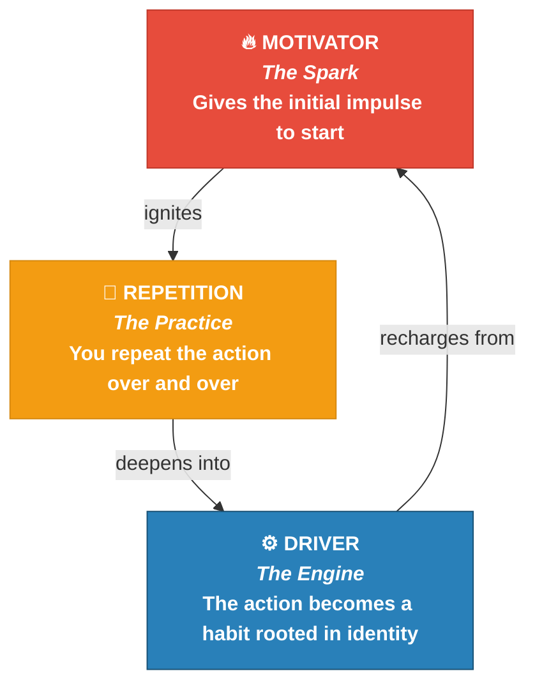
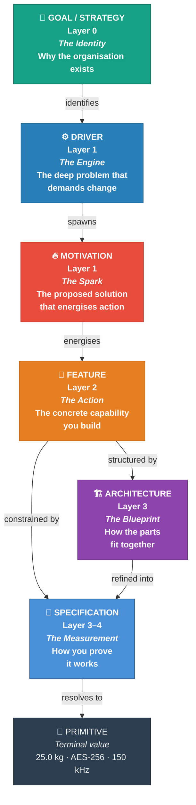
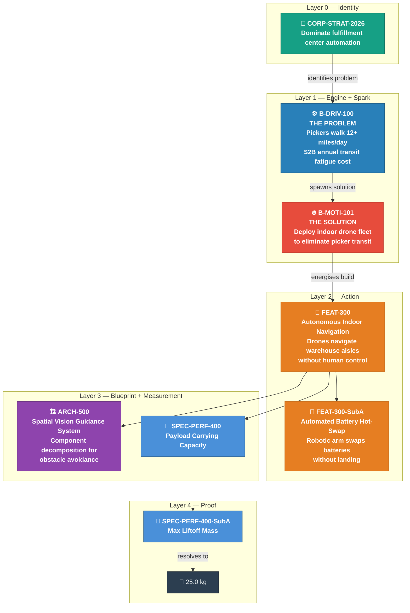
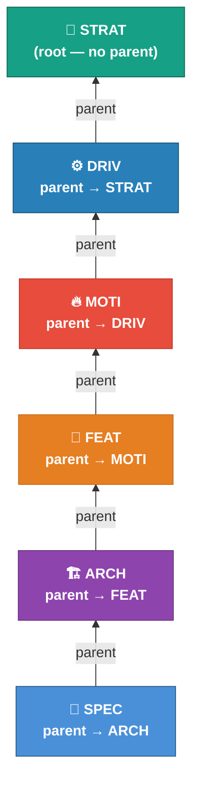
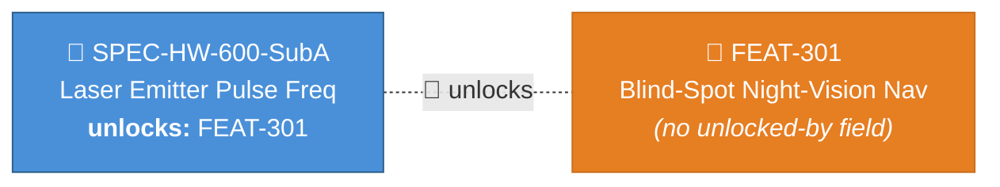

<!-- (c) 2026-* Frederick Bloom -- 20260816-140252-321141-01a0-0ae1-e82170a79586-SdlcHierarchyOverview.tmpl-0.0.1.md -- Hanaden AI Loader -->
---
tmpl-id:      20260816-140252-321141-01a0-0ae1-e82170a79586-SdlcHierarchyOverview
version:      0.0.1
status:       ACTIVE
category:     REFERENCE
description: >
  High-level behavioral and structural overview of the Hanaden SDLC hierarchy.
  Explains the six-layer model (Goal → Driver → Motivation → Feature → Architecture →
  Specification) using the Spark-and-Engine analogy. Shows how motivators (short-term,
  external sparks) and drivers (long-term, internal engines) interact in a self-reinforcing
  cycle that maps directly to the SDLC document hierarchy.
references:
  - 20260816-035411-784482-7cd5-a4a5-cbc587fb36cd-ExampleProjectHierarchyTree.tmpl-0.0.1.md
  - 20260816-035418-506403-7916-a3c7-c69d39d29f20-GoalStrategyTmpl.tmpl-0.0.1.md
  - 20260816-035418-673000-72e4-a2e5-fbacfb28adcd-DriverMotivationTmpl.tmpl-0.0.1.md
  - 20260816-035418-832920-7b8b-850b-fdc1425d9d8c-FeatureTmpl.tmpl-0.0.1.md
  - 20260816-035418-995136-76f5-bf0a-866855053397-ArchitectureTmpl.tmpl-0.0.1.md
  - 20260816-035419-161812-77ab-8fb0-d4d2c0e1cb0d-SpecificationTmpl.tmpl-0.0.1.md
  - 20260816-035419-315585-7cc7-a0de-136c1e1cb603-DecisionRecordTmpl.tmpl-0.0.1.md
copyright: (c) 2026-* Frederick Bloom
---

# Hanaden SDLC Hierarchy — The Spark and the Engine

> Every great project begins with a spark and runs on an engine.
> This document explains how the six layers of the Hanaden SDLC hierarchy
> map to human motivation, and why that mapping produces systems that endure.

---

## The Two Forces

### 🔥 Motivators — The Sparks

A **motivator** is an **external, short-term impulse** that gets you moving.
It is immediate, tangible, and often circumstantial. It answers:
**"What made me start?"**

Motivators are reactive — they respond to a specific situation:

| Domain | Motivator example |
|--------|-------------------|
| Student | Getting an A on a specific test |
| Employee | Avoiding a penalty or lecture from a manager |
| User | A fun, gamified learning app streak |
| Business | A competitor launching a disruptive product |
| Engineering | A production outage that exposed a weakness |

Motivators are **powerful but fragile**. They get you through the door,
but they do not keep you in the room.

### ⚙️ Drivers — The Engine

A **driver** is an **internal, long-term force** that sustains effort when motivation fades.
It is identity-level, persistent, and self-reinforcing. It answers:
**"Why do I keep going when it gets hard?"**

Drivers are proactive — they persist even without external triggers:

| Domain | Driver example |
|--------|---------------|
| Student | An insatiable curiosity about how the world works |
| Professional | A long-term vision of becoming a medical doctor |
| Builder | A personal standard of never leaving a problem unsolved |
| Business | E-commerce facilities lose $2B annually in worker transit fatigue |
| Engineering | Legacy Wi-Fi drops below −85 dBm in 80% of warehouse aisles |

Drivers are **durable but heavy**. They keep you moving for years,
but they need occasional sparks to stay energised.

---

## How They Work Together

Motivators and drivers are not opposites. They are not substitutes.
They are partners in a self-reinforcing cycle:

### 1. Motivators Introduce You to Drivers

You rarely start a hard journey with a deep internal driver.
You start with a simple motivator.

> **Example:** You go to the gym because you want to look good for a summer
> vacation *(motivator)*. While working out, you discover you love the feeling
> of strength. Over time, that external goal transforms into an internal need
> for physical resilience *(driver)*.

### 2. Drivers Sustain You When Motivators Die

Motivators are unreliable. They disappear when you are tired, sick, or stressed.
When the motivator fades, the driver takes over.

> **Example:** You start a business because you see a video about making fast money
> *(motivator)*. The business gets hard, and you lose money. If you stay, it is
> because you have a deeper drive to build something of your own and prove your
> capability *(driver)*.

### 3. Motivators Recharge Drivers

Even the most driven people get exhausted. When a long-term driver feels heavy,
a short-term motivator provides a quick burst of energy.

> **Example:** A writer driven by a love for storytelling feels burned out. Winning
> a small local writing contest *(motivator)* gives them the quick burst of joy
> needed to keep writing their big novel.

---

## Mapping to the SDLC Hierarchy

The spark-and-engine cycle maps directly to the Hanaden document hierarchy.
Each layer in the SDLC has a behavioural role:

### The Behavioural Role of Each Layer

| Layer | Node Type | Behavioural Role | Analogy | Question it answers |
|-------|-----------|------------------|---------|---------------------|
| 0 | CORP-MISSION / CORP-STRAT | **The Identity** | Who you are and what you are aiming for | "Why do we exist?" |
| 1 | B-DRIV / T-DRIV | **The Engine** | The deep, persistent problem that sustains effort | "Why must we change?" |
| 1 | B-MOTI / T-MOTI | **The Spark** | The proposed solution that gets everyone moving | "What will we do about it?" |
| 2 | FEAT | **The Action** | The concrete capability you build | "What does the system DO?" |
| 3 | ARCH | **The Blueprint** | The structural contract — components, data flow, lifecycle | "How do the parts fit together?" |
| 3–4 | SPEC | **The Measurement** | The testable constraint that proves correctness | "How do we prove it works?" |
| — | Primitive | **The Truth** | The terminal value — no further decomposition | "What is the number?" |

---

## The Cycle in Practice — A Concrete SDLC Example

Reading bottom-up, the cycle re-emerges:

1. **The Engine persists:** Even when the team is tired of drones, the $2B transit fatigue
   problem hasn't gone away *(Driver)*. The engine keeps turning.
2. **The Spark re-energises:** A successful hot-swap test proves 25.0 kg payload capacity
   *(Spec → Leaf)*. That measurable win *(Motivator)* recharges the team for the next sprint.
3. **The Action compounds:** Each completed Feature makes the next Feature easier to build.
   The system grows organically because the engine and sparks reinforce each other.

---

## Structural Rules — How the Tree Holds Together

Every relationship in the tree uses a single mechanism: **child→parent pointer**.

| Rule | What it means |
|------|---------------|
| **Single identity** | Every document has one ID: `filename-id` (Hanaden UUIDv7 Extended stem). No `node-id`. |
| **Parent pointer only** | Every non-root node has `parent: <filename-id>`. No `children` lists. |
| **No sibling pairing** | MOTI is a child of DRIV, not a sibling. The chain is linear: STRAT → DRIV → MOTI → FEAT. |
| **SSoT on the enabler** | When a SPEC unlocks a FEAT, the SPEC declares `unlocks: <FEAT filename-id>`. The FEAT carries nothing. |
| **One pointer format** | `parent`, `unlocks`, `governs`, `supersedes`, `references` — all use `filename-id`. |
| **Discover children by scanning** | To find a node's children: `grep -r 'parent: <this-filename-id>' docs/` |

### The Only Exception: Cross-Layer Unlock

One relationship breaks the strict parent chain — the **SPEC UNLOCKS FEAT** pattern (🌟).
A Specification at Layer 4 may satisfy a precondition that enables an entirely new Feature
at Layer 2. This is declared on the SPEC via `unlocks`, not on the FEAT.

---

## Quick Reference — Layer Summary

| Layer | Emoji | Type | Role | Parent points to |
|-------|-------|------|------|------------------|
| 0 | 👑 | CORP-MISSION / CORP-STRAT | Identity | *(root — no parent)* |
| 1 | ⚙️ | B-DRIV / T-DRIV | Engine (problem) | CORP-STRAT |
| 1 | 🔥 | B-MOTI / T-MOTI | Spark (solution) | DRIV |
| 2 | 🚗 | FEAT | Action (capability) | MOTI or parent FEAT |
| 3 | 🏗️ | ARCH | Blueprint (structure) | FEAT or MOTI |
| 3–4 | 📐 | SPEC | Measurement (constraint) | FEAT, ARCH, or parent SPEC |
| — | 🛑 | Primitive | Truth (terminal value) | *(leaf-value on SPEC)* |
| ✂️ | 📜 | DECIS | Rationale (annotation) | *(no parent — uses `governs`)* |

---

## Template Reference

| Template | Covers | Link |
|----------|--------|------|
| Goal / Strategy | CORP-MISSION, CORP-STRAT | [`GoalStrategyTmpl`](./20260816-035418-506403-7916-a3c7-c69d39d29f20-GoalStrategyTmpl.tmpl-0.0.1.md) |
| Driver / Motivation | B-DRIV, T-DRIV, B-MOTI, T-MOTI | [`DriverMotivationTmpl`](./20260816-035418-673000-72e4-a2e5-fbacfb28adcd-DriverMotivationTmpl.tmpl-0.0.1.md) |
| Feature | FEAT | [`FeatureTmpl`](./20260816-035418-832920-7b8b-850b-fdc1425d9d8c-FeatureTmpl.tmpl-0.0.1.md) |
| Architecture | ARCH | [`ArchitectureTmpl`](./20260816-035418-995136-76f5-bf0a-866855053397-ArchitectureTmpl.tmpl-0.0.1.md) |
| Specification | SPEC | [`SpecificationTmpl`](./20260816-035419-161812-77ab-8fb0-d4d2c0e1cb0d-SpecificationTmpl.tmpl-0.0.1.md) |
| Decision Record | DECIS | [`DecisionRecordTmpl`](./20260816-035419-315585-7cc7-a0de-136c1e1cb603-DecisionRecordTmpl.tmpl-0.0.1.md) |
| Hierarchy Tree | All layers | [`ExampleProjectHierarchyTree`](./20260816-035411-784482-7cd5-a4a5-cbc587fb36cd-ExampleProjectHierarchyTree.tmpl-0.0.1.md) |

---

## Changelog

| Version | Date | Author | Changes |
|---------|------|--------|---------|
| 0.0.1 | 2026-08-16 | Frederick Bloom | Initial overview — Spark-and-Engine analogy, full layer mapping, structural rules |
