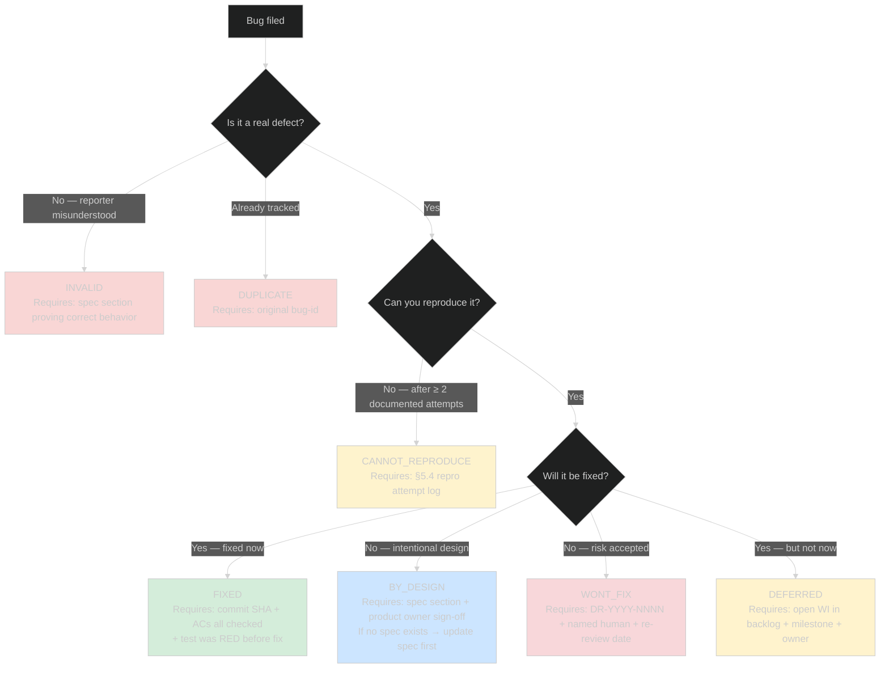

<!-- (c) 2026-* Frederick Bloom -- 20260817-145224-590203-76c5-8764-5cf35c4a5227-ent-bug-report.tmpl-0.0.1.md -- Hanaden AI -->
---
template-id: TMPL-BUG-REPORT
template-version: 0.0.1
template-type: bug-report
scope: enterprise
status: active
tiers: [LEAN, FULL, SEC]
keywords: [bug, defect, severity, cvss, epss, ssvc, owasp, cwe, tlp, ieee-1044, istqb]
cross-references:
  - SPEC-DEFECT-SEVERITY
  - SPEC-SDLC-ARTIFACT-MODEL
  - SPEC-SDLC-KANBAN
  - SPEC-INCIDENT-REPORTS
  - SPEC-IDENTIFIER-NAMING-CONVENTION
standards:
  - IEEE 1044:2009
  - ISTQB Glossary v4.0
  - ISO/IEC 29119-3
  - ISO/IEC 12207:2017
  - CVSS v4.0 (FIRST.org)
  - CVSS v3.1 (FIRST.org)
  - EPSS v4.0 (FIRST.org)
  - SSVC v2.1 (CISA/CMU-SEI)
  - OWASP Risk Rating Methodology
  - CWE (MITRE)
  - TLP v2.0 (FIRST.org)
  - SOC 2 (AICPA)
  - ISO/IEC 27001:2022
  - NIST SP 800-30 Rev 1

bug-id: "`<YYYYMMDD-HHMMSS-uuuuuu-7xxx-Nxxx-xxxxxxxxxxxx>`"
title: "`<Short imperative description of the defect — ≤ 80 chars>`"
status: open
close-reason: null

tier: "`<LEAN | FULL | SEC>`"

security-severity: "`<CRITICAL | HIGH | MEDIUM | LOW | INFO>`"
business-severity: "`<CRITICAL | HIGH | MEDIUM | LOW | INFO>`"
effective-severity: "`<CRITICAL | HIGH | MEDIUM | LOW | INFO>`"
effective-override: false
effective-justification: null

project: "`<project-name>`"
component: "`<subsystem, module, or file>`"
affects: "`<file path(s), API endpoint, feature name>`"
version: "`<semantic version or commit SHA where bug exists>`"

reported-by:
  type: "`<HUMAN | AI_AGENT | SCANNER | AUTOMATED_TEST>`"
  id: "`<username or agent-id>`"
  display-name: "`<Full Name or Agent Name>`"
  ai-model: null
  ai-platform: null
  conversation-id: null
  verified-by: null

reported-at: "`<YYYY-MM-DDTHH:MM:SSZ>`"
sla-deadline: "`<YYYY-MM-DDTHH:MM:SSZ>`"

work-item-id: null
incident-report-id: null
specs: []
features: []
related-bugs: []
related-cve: null

tlp: "`<TLP:CLEAR | TLP:GREEN | TLP:AMBER | TLP:AMBER+STRICT | TLP:RED>`"
---

# Bug: `<bug-id>` — `<Title>`


## 0. Metadata Snapshot

| Field | Value |
|---|---|
| **Bug ID** | `<bug-id>` |
| **Title** | `<Title>` |
| **Status** | 🔓 `open` |
| **Tier** | `LEAN` / `FULL` / `SEC` |
| **Effective Severity** | `CRITICAL` / `HIGH` / `MEDIUM` / `LOW` / `INFO` |
| **Security Severity** | `<value>` |
| **Business Severity** | `<value>` |
| **SLA Deadline** | `<YYYY-MM-DDTHH:MM:SSZ>` |
| **Project** | `<project-name>` |
| **Component** | `<component>` |
| **Affects Version** | `<version>` |
| **Reported By** | `<id>` (`<type>`) |
| **Reported At** | `<ISO 8601 UTC>` |
| **Work Item** | `<WI-ID>` or `(not yet created)` |
| **TLP** | ⬜ `TLP:CLEAR` |

---


## 1. Tier Declaration

> **❗ IMPORTANT**
> **MUST** declare the tier that applies to this bug before triage begins.
> The tier determines which sections are MUST vs. optional.

| Tier | Description | When to Use |
|---|---|---|
| **LEAN** | Minimum viable defect record | Solo dev, prototype, non-regulated, internal tooling |
| **FULL** | Complete defect record with traceability | Team projects, SOC 2 / ISO 27001 regulated workloads |
| **SEC** | Security defect with CVSS/CWE scoring and disclosure | Any bug with exploitability, CVE applicability, or external exposure |

**This bug is: `<LEAN | FULL | SEC>`**

> **ℹ️ NOTE**
> A `SEC` tier bug MUST also satisfy all `FULL` tier requirements.
> A bug may be escalated to a higher tier at any time during triage — never downgraded without a Decision Record.

---


## 2. Severity Matrix

> **❗ IMPORTANT**
> **MUST NOT** use qualitative language ("seems bad", "minor annoyance") anywhere in this section.
> All severity values MUST be derived from the objective criteria tables below.

### 2.1 Security Severity

**MUST** use the following threshold decision table. Apply the **highest** matching row.

| Severity | CVSS v4.0 Base Score | EPSS (30-day) | SSVC Outcome | Non-CVE Proxy Criteria |
|---|---|---|---|---|
| `CRITICAL` | ≥ 9.0 | ≥ 50% | `ACT` | Auth bypass / data loss / PII exfiltration / production corruption |
| `HIGH` | 7.0 – 8.9 | ≥ 10% | `ATTEND` | Core feature completely broken / ≥ 10 users blocked / SLA breach |
| `MEDIUM` | 4.0 – 6.9 | ≥ 1% | `TRACK*` | Feature degraded, workaround exists / 1–9 users affected |
| `LOW` | 0.1 – 3.9 | < 1% | `TRACK` | Visual / cosmetic / non-functional defect / workaround trivial |
| `INFO` | 0.0 | N/A | N/A | Enhancement or observation — not a defect |

**Derived value:** `security-severity: <value>`

*If CVSS is not computable (non-security bug), use the "Non-CVE Proxy Criteria" column only.*

---

### 2.2 Business Severity

**MUST** use the following criteria table. Business severity is set by an **accountable human stakeholder**,
never by the reporter alone, never by an AI agent without countersign.

| Severity | Revenue Impact (per hour) | Users Affected (confirmed) | SLA Breach | Data Integrity |
|---|---|---|---|---|
| `CRITICAL` | ≥ $1,000,000 OR complete outage | ≥ 1,000 users | YES — contractual breach | Data loss or corruption confirmed |
| `HIGH` | $100,000 – $999,999 OR major feature loss | 100 – 999 users | YES — internal SLA breach | Schema divergence affecting live data |
| `MEDIUM` | $10,000 – $99,999 OR partial feature degradation | 10 – 99 users | NO | No integrity impact |
| `LOW` | < $10,000 OR cosmetic / UX only | 1 – 9 users | NO | No integrity impact |
| `INFO` | $0 — dev / test environment only | 0 (internal only) | NO | No integrity impact |

**Derived value:** `business-severity: <value>`
**Set by:** `<human stakeholder name/ID>`  **Date:** `<YYYY-MM-DD>`

---

### 2.3 Effective Severity Decision Rule

```
effective-severity = max(security-severity, business-severity)
```

If `business-severity` is LOWER than `security-severity`:

> **🔴 CAUTION**
> **MUST** set `effective-override: true` and provide `effective-justification`
> referencing a Decision Record (DR-YYYY-NNNN).
> Downgrades require documented risk acceptance signed by a named human accountable party.
> **AI agents MUST NOT self-authorize downgrade overrides.**

| Field | Value |
|---|---|
| `effective-severity` | `<CRITICAL | HIGH | MEDIUM | LOW | INFO>` |
| `effective-override` | `false` / `true` |
| `effective-justification` | `null` / `"DR-YYYY-NNNN — `<one-line rationale>`"` |
| `override-direction` | `null` / `DOWNGRADE` / `UPGRADE` |
| `override-authorized-by` | `null` / `<human-id>` |

---

### 2.4 SLA

| Effective Severity | Enterprise SLA | Lean SLA |
|---|---|---|
| `CRITICAL` | Fix within **24 hours** | Fix before next release |
| `HIGH` | Fix within **72 hours** | Fix within current sprint |
| `MEDIUM` | Fix within **2 weeks** | Fix within next 2 sprints |
| `LOW` | Fix within **1 sprint** | Backlog (no deadline) |
| `INFO` | No SLA | No SLA |

**Computed SLA deadline:** `<YYYY-MM-DDTHH:MM:SSZ>`
*Override SLA (if applicable):* `<value>` — Justification: `<DR-YYYY-NNNN>`

---


## 3. Reporter Identity

> **❗ IMPORTANT**
> **MUST** declare reporter type. AI-reported bugs at severity `HIGH` or above
> **MUST** have `verified-by` set to a human ID before the bug is escalated or acted upon.

| Field | Value | M/S/O | Notes |
|---|---|---|---|
| `type` | `HUMAN` / `AI_AGENT` / `SCANNER` / `AUTOMATED_TEST` | **M** | One of the four types |
| `id` | `<username or agent-id>` | **M** | Machine-readable identifier |
| `display-name` | `<Full Name or Model Name>` | **M** | Human-readable |
| `ai-model` | `null` or `<model-name>` | S | Required if type = `AI_AGENT` |
| `ai-platform` | `null` or `<platform-name>` | S | Required if type = `AI_AGENT` |
| `conversation-id` | `null` or `<UUID>` | S | For AI agents — conversation trace |
| `tool-version` | `null` or `<scanner-version>` | S | For `SCANNER` / `AUTOMATED_TEST` |
| `verified-by` | `null` or `<human-id>` | **M** if AI | Human who confirmed the AI-reported bug |
| `verified-at` | `null` or `<ISO 8601>` | **M** if AI | Timestamp of human verification |

```yaml
reported-by:
  type: HUMAN
  id: "hanasaki"
  display-name: "Frederick Bloom"
  ai-model: null
  ai-platform: null
  conversation-id: null
  tool-version: null
  verified-by: null
  verified-at: null
```

---


## 4. Description

> **❗ IMPORTANT**
> **MUST** complete all three sub-sections. Vague descriptions ("it doesn't work") are not acceptable.
> Each sub-section MUST be specific enough that a developer who has never seen this code can understand the defect.

### 4.1 Summary [MUST — ALL TIERS]

*One paragraph (2–5 sentences) describing what is wrong, in which component, and its observable effect.*

`<TEMPLATE: Write the summary here. Be specific about component, trigger, and effect.>`

### 4.2 Expected Behavior [MUST — ALL TIERS]

*What SHOULD happen according to the spec or documented contract. Cite the spec section if applicable.*

> **Per:** `<SPEC-ID §section>` / `<feature requirement>` / `<documented API contract>`

`<TEMPLATE: Describe the correct behavior.>`

### 4.3 Actual Behavior [MUST — ALL TIERS]

*What DOES happen. Be precise. Include exact error messages, exit codes, return values.*

`<TEMPLATE: Describe the observed incorrect behavior.>`

```
`<PASTE EXACT ERROR MESSAGE, EXIT CODE, OR OUTPUT HERE>`
```

---


## 5. Reproducibility

> **❗ IMPORTANT**
> **Steps to Reproduce is NEVER optional**, regardless of tier.
> If the bug cannot be reproduced, MUST document all reproduction attempts before closing as `CANNOT_REPRODUCE`.

### 5.1 Reproducibility Assessment [MUST — ALL TIERS]

| Field | Value | M/S/O |
|---|---|---|
| **Reproducibility Rate** | `Always` / `Intermittent: N of M attempts` / `Unable to reproduce` | **M** |
| **Repro Complexity** | `Trivial (1 step)` / `Simple (2–5 steps)` / `Complex (> 5 steps or special setup required)` | **M** |
| **Minimum Repro Exists** | `YES` / `NO — partial repro only` | **M** |
| **Automated Test Exists** | `YES — <test_file:line>` / `NO` | S (LEAN) / **M** (FULL, SEC) |
| **Platforms Confirmed** | `Linux x86_64` / `macOS ARM64` / `Windows x64` / `All` / `Unknown` | S (LEAN) / **M** (FULL, SEC) |

---

### 5.2 Steps to Reproduce [MUST — ALL TIERS]

> Steps MUST be:
> - Atomic — one action per step
> - Copy-pasteable — exact commands, exact inputs, no ambiguity
> - Complete — starting from a clean state described in Environment (§6)

**Preconditions:**
- `<State the required starting condition — e.g., "Daemon is running," "File X exists at path Y">`
- `<Any required credentials, environment variables, or setup>`

**Steps:**

1. `<exact command or UI action>`
2. `<exact command or UI action>`
3. `<exact command or UI action — add more as needed>`

**Observed result at step `<N>`:** `<what went wrong>`

---

### 5.3 Minimum Reproducible Case [SHOULD — LEAN | MUST — FULL, SEC]

> The **smallest possible** input, configuration, or code that triggers the bug.
> This removes noise and isolates the defect for faster diagnosis.

```bash
# `<language hint>`
# Minimum reproducible case:
`<CODE OR SCRIPT HERE>`
```

*If no minimum repro is achievable, document why:*
`<e.g., "Requires specific race condition under load — minimum repro is a 3-node cluster with 1000 RPS">`

---

### 5.4 Cannot Reproduce — Documentation [MUST if Rate = "Unable"]

> **🔴 CAUTION**
> A bug MUST NOT be closed as `CANNOT_REPRODUCE` without:
> 1. A log of all environments tried
> 2. The exact steps attempted
> 3. A hypothesis for why reproduction may fail

| Attempt | Environment | Steps Tried | Result |
|---|---|---|---|
| 1 | `<OS/version>` | `<steps>` | `<outcome>` |
| 2 | `<OS/version>` | `<steps>` | `<outcome>` |

**Hypothesis:** `<Why might this be environment-specific or intermittent?>`

---


## 6. Environment

> **ℹ️ NOTE**
> **LEAN tier:** Complete subsection 6.1 only.
> **FULL tier:** Complete subsections 6.1 + 6.2.
> **SEC tier:** Complete all subsections 6.1 + 6.2 + 6.3.

### 6.1 Minimal Environment [MUST — ALL TIERS]

| Property | Value |
|---|---|
| **OS** | `<Distro, version, kernel — e.g., Debian GNU/Linux 13, kernel 6.19.8>` |
| **Architecture** | `<x86_64 | arm64 | etc.>` |
| **Primary Language Runtime** | `<e.g., Python 3.12.4 | Rust 1.79.0 | Node 22.5.1>` |
| **Package Manager** | `<e.g., uv 0.2.1 | cargo 1.79 | npm 10.8>` |
| **Project Version** | `<semver or commit SHA>` |
| **Relevant Tool Version** | `<specific tool directly involved in bug>` |

### 6.2 Standard Environment [MUST — FULL, SEC]

| Property | Value |
|---|---|
| **Git Version** | `<git --version>` |
| **Shell** | `<bash --version | zsh --version>` |
| **Mise Version** | `<mise --version>` |
| **Container Runtime** | `None` / `Docker <version>` / `Podman <version>` |
| **CI/CD System** | `None` / `<system and version>` |
| **Workspace Path** | `<absolute path>` |
| **Environment Variables** | `<relevant env vars — redact secrets>` |
| **Timezone / Locale** | `<TZ=America/New_York, LANG=en_US.UTF-8>` |

### 6.3 Full Forensic Environment [MUST — SEC]

| Property | Value |
|---|---|
| **Hardware** | `<CPU model, core count, RAM>` |
| **Filesystem** | `<ext4 | btrfs | nfs | etc.>, mount options: <options>` |
| **Disk Health** | `<dmesg I/O errors: NONE | FOUND>` |
| **System Uptime** | `<uptime at time of bug>` |
| **Available RAM at time** | `<free -h output>` |
| **Swap Usage** | `<swap used / total>` |
| **NTP Sync Status** | `<synchronized | unsynchronized>` |
| **System Clock (UTC)** | `<ISO 8601 UTC at time of bug>` |
| **IDE / Agent Platform** | `<name, version, installation ID, conversation ID>` |

---


## 7. Evidence

> **❗ IMPORTANT**
> **MUST** provide at least one piece of concrete evidence. "I saw it happen" is not evidence.
> Evidence MUST be independently verifiable — a third party MUST be able to examine it.

| Evidence Type | M/S/O (Tier) | Content |
|---|---|---|
| Error output / stack trace | **M** — ALL | Exact verbatim output |
| Log excerpt | **M** — FULL, SEC | With file path and line numbers |
| Git commit SHA | S — LEAN / **M** — FULL, SEC | The commit that introduced the bug (if known) |
| Git blob hash | S | Proof of file content state (e.g., `git cat-file -t <SHA>`) |
| File `stat` output | S — FULL / **M** — SEC (for filesystem bugs) | `stat(1)` output proving file state |
| SHA-256 checksum | S — FULL / **M** — SEC | `sha256sum <file>` — proves content |
| Screenshot / recording | S | For UI bugs — annotated preferred |
| Transcript excerpt | S — AI bugs | Conversation transcript line range |
| Automated test failure output | **M** — FULL, SEC (if test exists) | Full test runner output with exit code |

### 7.1 Primary Evidence

```
`<PASTE VERBATIM OUTPUT, LOG EXCERPT, OR STACK TRACE>`
```

**Source:** `<file path : line number>` / `<command that produced this>`
**Timestamp:** `<ISO 8601 UTC>`

### 7.2 Supporting Evidence [SHOULD — FULL, SEC]

| # | Type | Location / Reference | Description |
|---|---|---|---|
| E1 | `<type>` | `<path or SHA>` | `<what it proves>` |
| E2 | `<type>` | `<path or SHA>` | `<what it proves>` |

### 7.3 Git Forensics [SHOULD — FULL | MUST — SEC]

| Commit | Date (ISO 8601) | Description | Relevance |
|---|---|---|---|
| `<SHA>` | `<date>` | `<message>` | `<why this commit matters>` |

---


## 8. Impact Analysis

### 8.1 Blast Zone [MUST — FULL, SEC | SHOULD — LEAN]

> Quantified impact. Numbers, not adjectives.

| Metric | Value |
|---|---|
| **Files directly affected** | `<count>` |
| **Files transitively affected** | `<count>` |
| **Components affected** | `<list>` |
| **Users affected (confirmed)** | `<count>` |
| **Users potentially affected** | `<count>` |
| **Data records affected** | `<count or "N/A">` |
| **Environments affected** | `dev` / `staging` / `production` / `all` |
| **Atomic rollback possible** | `YES` / `NO — reason: <explain>` |

### 8.2 Business Impact [MUST — FULL, SEC for HIGH+ | SHOULD — LEAN]

| Stakeholder | Impact Description | Measurable Loss |
|---|---|---|
| `<role>` | `<impact>` | `<$, users, SLA points>` |

### 8.3 Compliance Impact [SHOULD — FULL | MUST — SEC for CRITICAL/HIGH]

| Standard | Control | Impact |
|---|---|---|
| SOC 2 | CC7.2 — Incident Detection | `<applies | not applicable>` |
| ISO/IEC 27001:2022 | A.12.6 — Technical Vulnerability Mgmt | `<applies | not applicable>` |
| NIST SP 800-30 | Risk Assessment | `<applies | not applicable>` |

---


## 9. Root Cause Analysis

> **ℹ️ NOTE**
> **LEAN tier:** SHOULD provide a preliminary RCA. MAY leave as "TBD" during triage.
> **FULL / SEC tier:** MUST complete RCA before the bug can be closed as FIXED.
> For major incidents, a separate Incident Report (TMPL-INCIDENT-REPORT) MUST also be filed.

### 9.1 Primary Root Cause [MUST — FULL, SEC]

> State the deepest proximate cause — not the symptom. Answer: "Why did this happen?"

`<Primary root cause, specific and falsifiable>`

### 9.2 Contributing Factors [SHOULD — FULL, SEC]

1. `<Factor 1 — why did this root cause go undetected?>`
2. `<Factor 2 — what process or guard was missing?>`

### 9.3 Root Cause Chain [SHOULD — FULL | MUST — SEC]

```
[Trigger: `<what initiated the sequence>`]
        ↓
[Mechanism: `<how the defect manifested>`]
        ↓
[Effect: `<what the user/system observed>`]
        ↓
[Detection: `<how it was found, and after how long>`]
```

### 9.4 Why Now / Why This System [SHOULD]

`<Why did this bug appear at this point in time? Was it a regression? A new code path? A configuration change?>`

---


## 10. Proposed Fix Options

> **ℹ️ NOTE**
> List options — do not prescribe. The implementing developer or team picks the approach
> and records the decision in the Work Item (WI).

| Option | Description | Trade-offs | Risk |
|---|---|---|---|
| **Option A** | `<approach>` | `<pros vs. cons>` | `<risk level>` |
| **Option B** | `<approach>` | `<pros vs. cons>` | `<risk level>` |

**Recommended:** Option `<A/B>` — `<one-line rationale>`

---


## 11. Acceptance Criteria

> **❗ IMPORTANT**
> **MUST** define acceptance criteria before work begins. A Work Item (WI) MUST NOT
> be closed as `FIXED` until ALL criteria below are checked.
> **MUST apply The Sabotage Test:** If you removed this bug from the spec, would the
> test still pass? If YES → the test is fake. Rewrite it.

- [ ] Bug behavior is no longer reproducible using Steps to Reproduce (§5.2)
- [ ] Regression test exists AND passes (the test MUST have failed before the fix — TDD RED was verified)
- [ ] No new test regressions introduced (full suite passes)
- [ ] Evidence of fix is committed (commit SHA: `<to be filled>`)
- [ ] `<Additional criterion specific to this bug>`
- [ ] `<Additional criterion specific to this bug>`

**Work Item linked:** `<WI-ID>` | **Branch:** `fix/<WI-ID>`

---


## 12. Traceability

> *IEEE 1044 §5.5 — Cross-references. ISO/IEC 12207:2017 §6.4 — Traceability.*

| Artifact Type | ID | Description |
|---|---|---|
| **Spec violated** | `SPEC-<ID>` | `<section and rule that was violated>` |
| **Feature** | `FEAT-<ID>` | `<feature this bug falls under>` |
| **Work Item** | `WI-<ID>` | `<link to the fix work item>` |
| **Incident Report** | `IR-<ID>` | `<if this bug is part of a larger incident>` |
| **Decision Record** | `DR-<ID>` | `<if a design decision caused this bug>` |
| **Brain Entry** | `<UUID>` | `<lesson learned from this bug>` |
| **Related Bug** | `<bug-id>` | `<related or parent bug>` |
| **Test File** | `<path>` | `<test that covers this defect>` |

---


## 13. Security Classification

> **❗ IMPORTANT**
> **SEC tier MUST** complete this section. FULL tier SHOULD complete if the bug has
> any security implication. LEAN MAY omit entirely for non-security bugs.

### 13.1 CVSS v4.0 Scoring [MUST — SEC]

> *Standard: FIRST.org CVSS v4.0 — https://www.first.org/cvss/v4.0/specification-document*
> *Calculator: https://www.first.org/cvss/calculator/4.0*

**Base Score: `<N.N>` — `<NONE | LOW | MEDIUM | HIGH | CRITICAL>`**
**Vector String: `CVSS:4.0/<vector>`**

#### Base Metrics

| Metric Group | Metric | Value | Code | Rationale |
|---|---|---|---|---|
| **Exploitability** | Attack Vector | `Network` / `Adjacent` / `Local` / `Physical` | `AV:<N/A/L/P>` | `<why>` |
| **Exploitability** | Attack Complexity | `Low` / `High` | `AC:<L/H>` | `<why>` |
| **Exploitability** | Attack Requirements | `None` / `Present` | `AT:<N/P>` | `<why>` |
| **Exploitability** | Privileges Required | `None` / `Low` / `High` | `PR:<N/L/H>` | `<why>` |
| **Exploitability** | User Interaction | `None` / `Passive` / `Active` | `UI:<N/P/A>` | `<why>` |
| **Vulnerable System** | Confidentiality Impact | `None` / `Low` / `High` | `VC:<N/L/H>` | `<why>` |
| **Vulnerable System** | Integrity Impact | `None` / `Low` / `High` | `VI:<N/L/H>` | `<why>` |
| **Vulnerable System** | Availability Impact | `None` / `Low` / `High` | `VA:<N/L/H>` | `<why>` |
| **Subsequent System** | Confidentiality Impact | `None` / `Low` / `High` | `SC:<N/L/H>` | `<why>` |
| **Subsequent System** | Integrity Impact | `None` / `Low` / `High` | `SI:<N/L/H>` | `<why>` |
| **Subsequent System** | Availability Impact | `None` / `Low` / `High` | `SA:<N/L/H>` | `<why>` |

#### CVSS v4.0 Severity Scale Reference

| Rating | Score Range |
|---|---|
| None | 0.0 |
| Low | 0.1 – 3.9 |
| Medium | 4.0 – 6.9 |
| High | 7.0 – 8.9 |
| Critical | 9.0 – 10.0 |

---

### 13.2 CVSS v3.1 Mapping [SHOULD — SEC]

> *Standard: FIRST.org CVSS v3.1 — https://www.first.org/cvss/v3.1/specification-document*
> *Provided for backward compatibility with tools that do not yet support CVSS v4.0.*

**Base Score: `<N.N>` — `<NONE | LOW | MEDIUM | HIGH | CRITICAL>`**
**Vector String: `CVSS:3.1/<vector>`**

| Metric | Value | Code |
|---|---|---|
| Attack Vector | `Network` / `Adjacent` / `Local` / `Physical` | `AV:<N/A/L/P>` |
| Attack Complexity | `Low` / `High` | `AC:<L/H>` |
| Privileges Required | `None` / `Low` / `High` | `PR:<N/L/H>` |
| User Interaction | `None` / `Required` | `UI:<N/R>` |
| Scope | `Unchanged` / `Changed` | `S:<U/C>` |
| Confidentiality Impact | `None` / `Low` / `High` | `C:<N/L/H>` |
| Integrity Impact | `None` / `Low` / `High` | `I:<N/L/H>` |
| Availability Impact | `None` / `Low` / `High` | `A:<N/L/H>` |

---

### 13.3 EPSS v4.0 [SHOULD — SEC]

> *Standard: FIRST.org EPSS — https://www.first.org/epss/*
> *EPSS is only meaningful for bugs with an existing or candidate CVE.*

| Field | Value |
|---|---|
| **EPSS Score** | `<0.000 – 1.000>` (probability of exploitation in 30 days) |
| **EPSS Percentile** | `<0th – 100th>` |
| **EPSS Date** | `<YYYY-MM-DD>` (scores are updated daily — record the date used) |
| **CVE (if assigned)** | `CVE-<YYYY-NNNNN>` |

*If CVE not yet assigned:* `EPSS: N/A — no CVE; using CVSS proxy for prioritization`

---

### 13.4 SSVC Decision Tree [SHOULD — SEC]

> *Standard: CISA / CMU-SEI SSVC v2.1 — https://www.cisa.gov/ssvc*

| Decision Node | Value | Rationale |
|---|---|---|
| **Exploitation** | `None` / `PoC` / `Active` | `<evidence of exploitation status>` |
| **Automatable** | `No` / `Yes` | `<can an attacker automate the exploit?>` |
| **Technical Impact** | `Partial` / `Total` | `<scope of system compromise>` |
| **Mission Impact** | `Minimal` / `Support Crippled` / `MEF Support Compromised` / `MEF Failure` / `Mission Failure` | `<operational impact>` |

**SSVC Outcome:** `ACT` / `ATTEND` / `TRACK*` / `TRACK`

| Outcome | Meaning |
|---|---|
| `ACT` | Address immediately — treat as emergency |
| `ATTEND` | Dedicate resources to fix on accelerated schedule |
| `TRACK*` | Track closely — prioritize above routine |
| `TRACK` | Monitor during normal patch cycle |

---

### 13.5 OWASP Risk Rating [MAY — SEC, web-facing projects only]

> *Standard: OWASP Risk Rating Methodology — https://owasp.org/www-community/OWASP_Risk_Rating_Methodology*

| Factor Group | Factor | Value (0–9) | Rationale |
|---|---|---|---|
| **Threat Agent** | Skill Level | `<0–9>` | `<justification>` |
| **Threat Agent** | Motive | `<0–9>` | `<justification>` |
| **Threat Agent** | Opportunity | `<0–9>` | `<justification>` |
| **Threat Agent** | Size | `<0–9>` | `<justification>` |
| **Vulnerability** | Ease of Discovery | `<0–9>` | `<justification>` |
| **Vulnerability** | Ease of Exploit | `<0–9>` | `<justification>` |
| **Vulnerability** | Awareness | `<0–9>` | `<justification>` |
| **Vulnerability** | Intrusion Detection | `<0–9>` | `<justification>` |
| **Impact** | Loss of Confidentiality | `<0–9>` | `<justification>` |
| **Impact** | Loss of Integrity | `<0–9>` | `<justification>` |
| **Impact** | Loss of Availability | `<0–9>` | `<justification>` |
| **Impact** | Loss of Accountability | `<0–9>` | `<justification>` |

**OWASP Likelihood:** `LOW` / `MEDIUM` / `HIGH`
**OWASP Impact:** `LOW` / `MEDIUM` / `HIGH` / `CRITICAL`
**OWASP Overall Risk:** `NOTE` / `LOW` / `MEDIUM` / `HIGH` / `CRITICAL`

---

### 13.6 CWE Classification [MUST — SEC]

> *Standard: MITRE CWE — https://cwe.mitre.org/*

| CWE ID | Name | How It Applies |
|---|---|---|
| [CWE-`<NNN>`](https://cwe.mitre.org/data/definitions/`<NNN>`.html) | `<CWE Name>` | `<how this weakness applies to the bug>` |

#### Common CWE Reference (AI / System Bugs)

| CWE | Name | When to Apply |
|---|---|---|
| CWE-732 | Incorrect Permission Assignment for Critical Resource | AI mutates file/directory permissions |
| CWE-250 | Execution with Unnecessary Privileges | AI runs commands with higher privileges |
| CWE-284 | Improper Access Control | AI bypasses authorization gate |
| CWE-693 | Protection Mechanism Failure | Safety mechanism disabled by platform |
| CWE-362 | Race Condition | Concurrent access causes inconsistent state |
| CWE-400 | Uncontrolled Resource Consumption | Resource exhaustion / DoS |
| CWE-116 | Improper Encoding / Escaping | Character encoding violations |
| CWE-476 | NULL Pointer Dereference | Null/nil access causing crash |

---

### 13.7 CVE Reference [MAY — SEC]

| Field | Value |
|---|---|
| **CVE ID** | `CVE-<YYYY-NNNNN>` or `Pending` or `N/A` |
| **CVE Status** | `Reserved` / `Published` / `Disputed` / `Rejected` |
| **CNA (assigning authority)** | `MITRE` / `GitHub` / `<vendor>` |
| **NVD URL** | `https://nvd.nist.gov/vuln/detail/CVE-<YYYY-NNNNN>` |
| **CVSS v3.1 from NVD** | `<score>` (for cross-reference only) |

---


## 14. Disclosure and TLP Classification

> *Standard: TLP v2.0 (FIRST.org) — https://www.first.org/tlp/*
> *See Appendix A for full TLP definitions and usage guidance.*
> *Process reference: FIRST PSIRT Services Framework — https://www.first.org/standards/frameworks/psirts*

> **❗ IMPORTANT**
> **MUST** assign a TLP classification to every `SEC` tier bug at time of filing.
> Default is 🟠 `TLP:AMBER` during active investigation. Promote to ⬜ `TLP:CLEAR` after public fix.

### 14.1 Current TLP Status

| Field | Value | M/S/O |
|---|---|---|
| **TLP Classification** | 🔴 `TLP:RED` / 🟠 `TLP:AMBER` / 🟠 `TLP:AMBER+STRICT` / 🟢 `TLP:GREEN` / ⬜ `TLP:CLEAR` | **M** |
| **Classification Rationale** | `<why this TLP level>` | **M** |
| **Set By** | `<human name/ID>` (MUST be human) | **M** |
| **Set At** | `<ISO 8601 UTC>` | **M** |
| **Expected Promotion Date** | `<ISO 8601 date>` or `null` | S |

---

### 14.2 Coordinated Vulnerability Disclosure (CVD) Timeline

> *Process: FIRST PSIRT Services Framework — https://www.first.org/standards/frameworks/psirts*
> *Default disclosure deadline: 90 days from reporter's initial submission (Google Project Zero standard)*

| Milestone | Date (ISO 8601) | Status |
|---|---|---|
| Reporter private submission | `<date>` | ✅ / ⏳ / 📋 |
| Vendor/PSIRT acknowledgment | `<date — target: within 7 days>` | ✅ / ⏳ / 📋 |
| Vendor confirms vulnerability | `<date>` | ✅ / ⏳ / 📋 |
| Fix developed and tested | `<date>` | ✅ / ⏳ / 📋 |
| Fix released to users | `<date>` | ✅ / ⏳ / 📋 |
| CVE assigned | `<date>` | ✅ / ⏳ / 📋 |
| Public disclosure | `<date — default: 90 days from submission>` | ✅ / ⏳ / 📋 |
| **90-day deadline** | `<reported-at + 90 days>` | Mandatory |

> **🔴 CAUTION**
> If the fix is not released by the 90-day deadline, the reporter MAY publish.
> If deadline extension is needed, MUST obtain reporter agreement in writing and document here.

**Deadline extension:** `null` / `<new date — must be agreed by reporter>`
**Extension justification:** `null` / `<explanation>`
**Reporter notified:** `null` / `<ISO 8601 date and method>`

---

### 14.3 Coordinating Parties

| Role | Name / Organization | Contact | Notified At |
|---|---|---|---|
| Reporter | `<name>` | `<contact method>` | `<ISO 8601>` |
| Vendor PSIRT | `<team>` | `<email or URL>` | `<ISO 8601>` |
| Coordinator (if any) | `CISA` / `CERT/CC` / `null` | `<contact>` | `<ISO 8601>` |
| Affected Users / Downstream | `<who>` | `<method>` | `<ISO 8601>` |

---


## 15. Escalation Paths

> Defines who needs to act at each tier of investigation.
> Written so a developer, security analyst, exec, and vendor can each find their instructions.

### 15.1 Tier 1 — Developer / Reporter

**Audience:** The developer or team first encountering the bug.

- Verify and document the reproduction (§5)
- Collect evidence (§7)
- Assign preliminary severity (§2)
- Create Work Item in `kanban/backlog/`
- Escalate to Tier 2 if severity ≥ HIGH

### 15.2 Tier 2 — Security / Engineering Lead [FULL, SEC]

**Audience:** Security team or engineering lead responsible for the component.

- Validate severity assignment — override requires Decision Record
- Assign CVSS/SSVC/EPSS scores (§13)
- Assign disclosure timeline (§14.2)
- Brief business stakeholder if business-severity ≥ HIGH
- Approve or reject proposed fix options (§10)

### 15.3 Tier 3 — Platform / Infrastructure [SEC — CRITICAL/HIGH]

**For platform-level investigation (e.g., tool implementation bugs, VFS issues, kernel interactions):**

`<Questions to investigate at platform level:>`
- `<Question 1 — specific, investigable>`
- `<Question 2 — specific, investigable>`

### 15.4 Tier 4 — Executive / Product Leadership [SEC — CRITICAL | FULL — CRITICAL]

**Audience:** CTO, VP Engineering, Product Leadership.

**Summary for leadership:**
`<2–3 sentence plain-English summary of what happened, impact, and current status>`

**Business impact:** `<$, users, SLA>`
**Customer commitment:** `<what we've told customers, if anything>`
**Recommended response:** `<patch, advisory, compensation>`

---


## 16. Close Record

> **🔴 CAUTION**
> **MUST NOT** close this bug without completing this section.
> The close reason determines what evidence is mandatory. See Appendix D for the close reason decision tree.

### 16.1 Close Reason

| Close Reason | When to Use | Mandatory Evidence Required |
|---|---|---|
| `FIXED` | Bug is corrected, regression test passes | Commit SHA + all ACs checked + test failure→pass proof |
| `INVALID` | Not a bug — behavior is correct | Spec section (§ number) proving correct behavior |
| `DUPLICATE` | Already tracked elsewhere | Original bug ID that supersedes this one |
| `CANNOT_REPRODUCE` | All repro attempts failed | §5.4 completed with ≥ 2 documented attempts |
| `WONT_FIX` | Known, valid bug — intentionally not fixed | **Decision Record ID** + named human approver + re-review date |
| `DEFERRED` | Valid bug, fix postponed | **Open WI ID in backlog** + target milestone + accountable owner |
| `BY_DESIGN` | Behavior is intentional per spec | **Spec section + product owner sign-off** (if no spec covers it, update the spec FIRST) |

> **🔴 CAUTION**
> **ANTI-ESCAPE-HATCH RULES:**
>
> **`WONT_FIX`**: MUST have a Decision Record (DR-YYYY-NNNN) documenting risk acceptance.
> A named human (not AI) MUST be the accountable party. MUST include a re-review date.
>
> **`DEFERRED`**: MUST have an open Work Item in `kanban/backlog/` with a target milestone.
> "Someday" is not a milestone. MUST have a named accountable owner.
>
> **`BY_DESIGN`**: MUST cite a spec section by number. If the spec does not cover the behavior,
> the spec MUST be updated to explicitly document the design decision BEFORE this close reason is used.
>
> **AI agents MUST NOT self-authorize `WONT_FIX`, `DEFERRED`, or `BY_DESIGN`.
> A human MUST countersign all three.**

---

### 16.2 Closure Evidence

| Field | Value | M/S/O |
|---|---|---|
| **Close Reason** | `<reason>` | **M** |
| **Closed By** | `<human-id>` | **M** |
| **Closed At** | `<ISO 8601 UTC>` | **M** |
| **Commit SHA** | `<SHA>` or `null` | **M** if FIXED |
| **All ACs Checked** | `YES` / `NO — <which ones remain>` | **M** if FIXED |
| **Test Was RED Before Fix** | `YES — <test file:line>` / `N/A` | **M** if FIXED (FULL/SEC) |
| **Spec Reference** | `SPEC-ID §section` or `null` | **M** if INVALID / BY_DESIGN |
| **Original Bug ID** | `<bug-id>` or `null` | **M** if DUPLICATE |
| **Decision Record** | `DR-YYYY-NNNN` or `null` | **M** if WONT_FIX |
| **WI Backlog ID** | `WI-<ID>` or `null` | **M** if DEFERRED |
| **Re-review Date** | `<YYYY-MM-DD>` or `null` | **M** if WONT_FIX |
| **Human Countersign** | `<human-id>` or `null` | **M** if WONT_FIX / DEFERRED / BY_DESIGN |
| **Updated TLP** | ⬜ `TLP:CLEAR` or `<other>` | **M** if SEC tier at close |

---


## 17. References

### 17.1 Internal

| Type | ID / Path | Description |
|---|---|---|
| Spec | `SPEC-<ID>` | `<what it specifies>` |
| Feature | `FEAT-<ID>` | `<what it defines>` |
| Work Item | `WI-<ID>` | `<the fix work item>` |
| Decision Record | `DR-YYYY-NNNN` | `<rationale>` |
| Brain Entry | `<UUID>` | `<lesson captured>` |
| Incident Report | `IR-<ID>` | `<if spawned from incident>` |
| Test File | `<path:line>` | `<regression test>` |

### 17.2 External Standards

| Standard | Authority | URL | Relevance to This Bug |
|---|---|---|---|
| CVSS v4.0 | FIRST.org | https://www.first.org/cvss/v4.0 | Severity scoring |
| CVSS v3.1 | FIRST.org | https://www.first.org/cvss/v3.1 | Backward-compat scoring |
| EPSS v4.0 | FIRST.org | https://www.first.org/epss | Exploitation probability |
| SSVC v2.1 | CISA / CMU-SEI | https://www.cisa.gov/ssvc | Action prioritization |
| OWASP Risk Rating | OWASP | https://owasp.org/www-community/OWASP_Risk_Rating_Methodology | Web risk factors |
| CWE | MITRE | https://cwe.mitre.org | Weakness classification |
| CVE | CVE.org | https://www.cve.org | Vulnerability identifier |
| TLP v2.0 | FIRST.org | https://www.first.org/tlp | Information sharing policy |
| FIRST PSIRT Framework | FIRST.org | https://www.first.org/standards/frameworks/psirts | Disclosure process |

---


---

## Appendix A: TLP v2.0 — Traffic Light Protocol

> *Authority: FIRST.org — Forum of Incident Response and Security Teams*
> *Source: https://www.first.org/tlp/*
> *Version: TLP v2.0 (adopted November 2022)*

TLP (Traffic Light Protocol) is an internationally recognized information-sharing
classification system. It defines four colors that tell recipients **how far they
may share a document**. Originated by the UK National Infrastructure Security
Coordination Centre (NISCC, now NCSC), standardized by FIRST.org.

### TLP Definitions

| Color | Label | Who May Receive | When to Use |
|---|---|---|---|
| 🔴 Red | 🔴 `TLP:RED` | **Named recipients only** — the specific individuals in the conversation/meeting | Imminent threat, active incident, information that would cause direct harm if shared beyond those present |
| 🟠 Amber | 🟠 `TLP:AMBER` | **Organization + clients** who need to know to protect themselves | Sensitive info that helps others defend, but wider sharing increases risk |
| 🟠 Amber Strict | 🟠 `TLP:AMBER+STRICT` | **Organization only** — NOT to clients | Same as AMBER but must not leave the receiving organization |
| 🟢 Green | 🟢 `TLP:GREEN` | **Trusted community** — not public | Info useful to a broader community of practice; may be shared with peers, not publicly |
| ⬜ Clear | ⬜ `TLP:CLEAR` | **Anyone** — no restriction | Public information; may be posted, shared, or published without restriction |

### TLP Lifecycle for Security Bug Reports

```
Bug Discovered (private)
        ↓
TLP:RED or TLP:AMBER+STRICT (during investigation — named team only)
        ↓
Fix developed + vendor notified
        ↓
TLP:AMBER (brief downstream notification — affected customers only)
        ↓
Fix released publicly
        ↓
TLP:CLEAR (public advisory, CVE published)
```

### Rules

- MUST mark the document with the TLP label at the top and bottom
- MUST NOT downgrade TLP without consent of the originator
- Recipients MUST respect TLP markings regardless of local policy
- AI agents MUST NOT change TLP classification without human authorization

---

## Appendix B: Standards Mapping Table

> Maps each template section/field to its corresponding external standard reference.
> Use this table to demonstrate compliance during audits (SOC 2 CC7.2, ISO 27001 A.12.6, etc.).

| Section / Field | IEEE 1044:2009 | ISTQB v4.0 | ISO/IEC 29119-3 | ISO/IEC 12207 | CVSS v4.0 | CWE | SOC 2 | ISO 27001:2022 | NIST 800-30 |
|---|---|---|---|---|---|---|---|---|---|
| Bug ID / Naming | §5.2 Problem ID | Defect ID | §8.2 Incident ID | §6.4.5 | — | — | CC7.2 | A.12.1 | — |
| Title / Description | §5.3 Problem Description | Defect description | §8.2 Description | — | — | — | — | — | — |
| Tier declaration | §6.1 Classification | Priority/severity | §8.2 Priority | — | — | — | — | — | — |
| Security severity | §6.1 Classification | Defect severity | §8.2 Severity | — | Base Score | Severity | CC6.1 | A.12.6 | Risk Level |
| Business severity | §6.1 Classification | Business priority | §8.2 Business impact | — | Environmental | — | CC5.2 | A.6.1.1 | Likelihood × Impact |
| Effective severity + SLA | §6.1 | Priority | §8.2 Priority | — | — | — | CC7.4 | A.16.1.4 | — |
| Reporter identity | §5.2 Reporter | Tester ID | §8.2 Reporter | §6.4.3 | — | — | CC1.2 | A.7.1 | — |
| Steps to reproduce | §5.3 Repro | Test log steps | §8.2 Test procedure | §5.3 | — | — | — | — | — |
| Minimum repro | §5.3 | — | §8.2 | — | — | — | — | — | — |
| Environment (6.1) | §5.4 Environment | Test environment | §7.2 Test env | §6.4.4 | Environmental metrics | — | — | A.12.1.4 | — |
| Evidence | §5.4 Data collection | Defect log | §8.2 Test result artifacts | §6.4.5 | — | — | CC7.2 | A.16.1.2 | — |
| Blast zone / Impact | §6.2 Impact | — | §8.2 Impact | — | — | — | CC7.3 | A.16.1.6 | Impact Assessment |
| Root cause analysis | §6.3 Causal analysis | Root cause | §8.2 Analysis | — | — | — | CC7.3 | A.16.1.5 | Causal Analysis |
| Acceptance criteria | §6.4 Resolution | Definition of Done | §8.2 Test pass criteria | §6.4.6 | — | — | CC4.1 | — | — |
| Traceability | §5.5 Cross-references | — | §5.3 Traceability | §6.4.5 | — | — | CC8.1 | A.12.1.2 | — |
| CVSS scoring (§13.1) | — | — | — | — | Base + Env metrics | — | CC6.1 | A.12.6.1 | Likelihood |
| CWE classification (§13.6) | — | — | — | — | — | Required | CC6.1 | A.12.6 | Vulnerability type |
| TLP / Disclosure (§14) | — | — | — | — | — | — | CC2.2 | A.16.1.6 | — |
| CVD timeline (§14.2) | — | — | — | — | — | — | CC7.5 | A.16.1.7 | — |
| Close reason + evidence | §6.4 Disposition | Defect closure | §8.2 Resolution | §6.4.7 | — | — | CC4.2 | A.12.1.3 | — |
| WONT_FIX governance | §6.4 Waiver | — | §8.2 Risk acceptance | — | — | — | CC9.1 | A.8.1.1 | Risk Acceptance |

---

## Appendix C: Severity Quick Reference

### Security Severity Thresholds (from §2.1)

| Severity | CVSS v4 Score | EPSS (30-day) | SSVC | Non-CVE Proxy |
|---|---|---|---|---|
| `CRITICAL` | ≥ 9.0 | ≥ 50% | `ACT` | Auth bypass / data loss / PII |
| `HIGH` | 7.0 – 8.9 | ≥ 10% | `ATTEND` | Core feature broken / ≥ 10 users |
| `MEDIUM` | 4.0 – 6.9 | ≥ 1% | `TRACK*` | Degraded / workaround / 1–9 users |
| `LOW` | 0.1 – 3.9 | < 1% | `TRACK` | Cosmetic / trivial workaround |
| `INFO` | 0.0 | N/A | N/A | Enhancement / observation |

### Business Severity Thresholds (from §2.2)

| Severity | Revenue/hr | Users (confirmed) | SLA Breach | Data Integrity |
|---|---|---|---|---|
| `CRITICAL` | ≥ $1M OR outage | ≥ 1,000 | YES contractual | Data loss / corruption |
| `HIGH` | $100K–$999K | 100–999 | YES internal | Schema divergence |
| `MEDIUM` | $10K–$99K | 10–99 | NO | None |
| `LOW` | < $10K | 1–9 | NO | None |
| `INFO` | $0 | 0 (dev/test) | NO | None |

### SLA by Effective Severity

| Effective Severity | Enterprise SLA | Lean SLA |
|---|---|---|
| `CRITICAL` | Fix within **24 hours** | Fix before next release |
| `HIGH` | Fix within **72 hours** | Fix within current sprint |
| `MEDIUM` | Fix within **2 weeks** | Fix within next 2 sprints |
| `LOW` | Fix within **1 sprint** | Backlog (no deadline) |
| `INFO` | No SLA | No SLA |

---

## Appendix D: Close Reason Decision Tree



> **🔴 CAUTION**
> **No AI agent may self-authorize `WONT_FIX`, `DEFERRED`, or `BY_DESIGN`.**
> Human countersign is mandatory. Violations are logged as AI governance failures.

---

*End of TMPL-BUG-REPORT v0.0.1*
*Hanaden Enterprise — ⬜ `TLP:CLEAR`*
