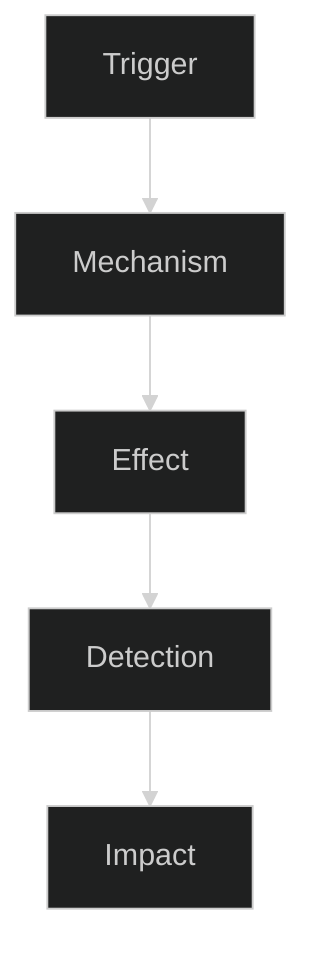
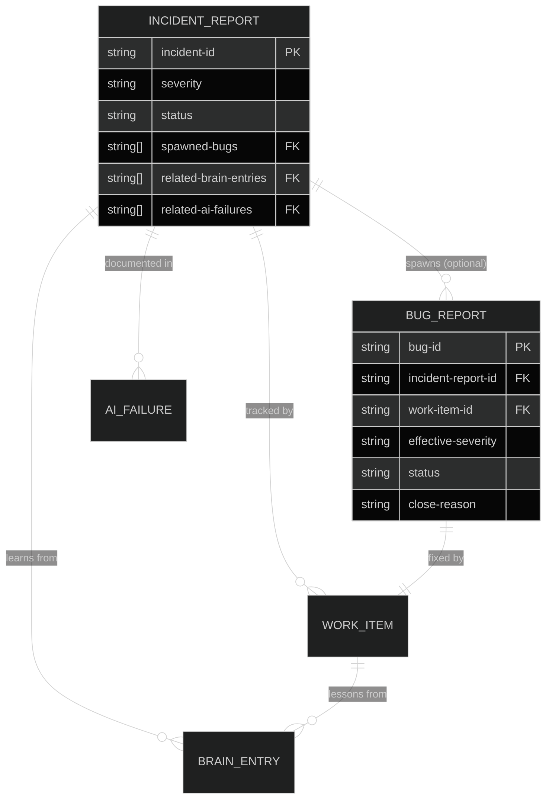

<!-- (c) 2026-* Frederick Bloom -->
---
doc-id: 20260817-145224-591490-751d-be54-c17afaa064fb-ent-incident-report
version: 0.0.1
copyright: (c) 2026-* Frederick Bloom
template-type: incident-report
scope: enterprise
status: active
keywords: [incident, post-mortem, rca, root-cause, data-integrity, timeline, blast-zone, compliance]
cross-references:
  - SPEC-INCIDENT-REPORTS
  - SPEC-DEFECT-SEVERITY
  - SPEC-SDLC-ARTIFACT-MODEL
  - SPEC-BRAIN
  - SPEC-AI-BEHAVIORAL-LEARNING
  - TMPL-BUG-REPORT
standards:
  - IEEE 1044:2009
  - ISO/IEC 27001:2022 (A.16.1)
  - ISO/IEC 29119-3
  - SOC 2 (AICPA CC7.2–CC7.5)
  - NIST SP 800-61 Rev 2
  - NIST SP 800-30 Rev 1
  - TLP v2.0 (FIRST.org)
  - FIRST PSIRT Services Framework
  - POSIX (fsync semantics, ISO 8601 timestamps)
  - RFC 3339 (timestamp format)
---


# Incident Report: `<incident-id>` — `<Title>`

---


## 0. Incident Snapshot

| Field | Value |
|---|---|
| **Incident ID** | `<IR-YYYYMMDD-RRRR>` |
| **Title** | `<Title>` |
| **Status** | 🔓 `open` / 🔍 `investigating` / ✅ `resolved` / 🔒 `closed` |
| **Severity** | 🔴 `critical` / `high` / `medium` / `low` |
| **Detected** | `<ISO 8601 UTC>` |
| **Resolved** | `<ISO 8601 UTC>` or `(open)` |
| **Author** | `<id>` (`<type>`) |
| **TLP** | ⬜ `TLP:CLEAR` |
| **Spawned Bugs** | `<bug-id-1>`, `<bug-id-2>` or `(none)` |
| **Affected Projects** | `<project-name(s)>` |
| **Data Loss** | `YES` / `NO` |
| **Atomic Rollback Possible** | `YES` / `NO` |
| **User Burden** | `<hours of user time consumed by this incident>` |

---


## 1. Severity Classification

> *Incident severity is independent of individual bug severity.
> An incident may be CRITICAL even if no individual bug is rated CRITICAL.*

| Severity | Criteria |
|---|---|
| 🔴 `critical` | Data loss / production corruption / security breach / complete system failure / PII exfiltration |
| 🟠 `high` | Widespread data invalidity (≥ 10 records) / schema divergence across multiple systems / silent failure running > 24h |
| 🟡 `medium` | Localized data errors (< 10 records) / single-system failure / detected within 24h |
| 🟢 `low` | Process violations caught immediately / cosmetic or documentation errors only |

**This incident is: `<critical | high | medium | low>`**

**Rationale:** `<why this severity — cite specific criteria from the table above>`

---


## 2. Executive Summary

> **❗ IMPORTANT**
> **MUST** be written so that a non-technical executive (VP, Director, CTO) can understand
> what happened, why it matters, and what was done — in under 5 minutes of reading.
> Target: 2–4 paragraphs. No jargon without definition.

### 2.1 What Happened [MUST]

*One paragraph: what the incident was, when it occurred, and how it was detected.*

`<TEMPLATE: Write the executive summary here.>`

### 2.2 Business Impact [MUST for HIGH+]

*One paragraph: who was affected, what they could not do, and for how long.*

`<TEMPLATE: Business impact summary.>`

### 2.3 Resolution Status [MUST]

*One paragraph: what was done, is it fully resolved, and what is being done to prevent recurrence.*

`<TEMPLATE: Resolution summary.>`

### 2.4 Key Metrics Summary

| Metric | Value |
|---|---|
| **Detection latency** | `<time from incident start to detection — HH:MM:SS>` |
| **Resolution time** | `<time from detection to full resolution — HH:MM:SS>` |
| **Total duration** | `<incident start to close — HH:MM:SS>` |
| **Files affected** | `<count>` |
| **Systems affected** | `<count>` |
| **Users impacted** | `<count>` |
| **Data loss** | `YES — <description>` / `NO` |
| **User time consumed** | `<hours>` |
| **AI-caused** | `YES` / `NO` / `PARTIAL` |

---


## 3. Environment at Time of Incident

> Record the environment AS IT WAS at the time of the incident — not the current state.
> All values MUST come from real system reads, not memory.

### 3.1 Operating System and Hardware [MUST — CRITICAL/HIGH]

| Property | Value |
|---|---|
| **Hostname** | `<hostname>` |
| **Architecture** | `<x86_64 | arm64>` |
| **CPU** | `<model, cores, threads>` |
| **Total RAM** | `<GiB>` |
| **RAM Available (at incident)** | `<GiB>` |
| **Swap Used** | `<GiB used / GiB total>` |
| **Storage** | `<device model, type (NVMe/SSD/HDD)>` |
| **Filesystem** | `<ext4 | btrfs | nfs>`, mount: `<device>` |
| **Mount Options** | `<options string>` |
| **System Uptime** | `<uptime at time of incident>` |

### 3.2 Operating System [MUST — ALL]

| Property | Value |
|---|---|
| **OS** | `<Distro and version — e.g., Debian GNU/Linux 13 (trixie)>` |
| **Kernel** | `<full kernel version string>` |
| **Timezone** | `<e.g., America/New_York (UTC−04:00 EDT)>` |
| **Locale** | `<en_US.UTF-8>` |
| **User** | `<username (uid=N, gid=N)>` |
| **Groups** | `<group list>` |

### 3.3 Toolchain [MUST — ALL]

| Tool | Version |
|---|---|
| **Git** | `<git --version>` |
| **Shell** | `<bash/zsh --version>` |
| **Primary Runtime** | `<language runtime and version>` |
| **Mise** | `<mise --version>` |
| **Other relevant tools** | `<tool and version>` |

### 3.4 IDE / Agent Platform [MUST if AI-caused]

| Property | Value |
|---|---|
| **IDE / Platform** | `<name and version>` |
| **Installation ID** | `<UUID>` |
| **Conversation ID** | `<UUID>` |
| **Conversation DB size** | `<bytes>` |
| **Transcript (full)** | `<bytes / lines>` |
| **Execution Policy** | `<Turbo | Manual | etc.>` |
| **Auto Proceed** | `true` / `false` |
| **AI Model(s)** | `<model name(s)>` |

### 3.5 Clock Verification [SHOULD — ALL | MUST — data-integrity incidents]

> All timestamps in this report use **ISO 8601** format with timezone designator.
> `Z` suffix = UTC. `±HH:MM` = local with offset.

| Clock | Value at Investigation Time |
|---|---|
| **System UTC** | `<YYYY-MM-DDTHH:MM:SS.ssssssZ>` |
| **System Local** | `<YYYY-MM-DDTHH:MM:SS.ssssss±HH:MM>` |
| **Timezone** | `<TZ name (offset)>` |
| **NTP Sync** | `synchronized` / `unsynchronized` |

### 3.6 Disk Health [MUST — data-integrity and filesystem incidents]

| Check | Result |
|---|---|
| **dmesg I/O errors** | `NONE` / `FOUND — <details>` |
| **Filesystem corruption** | `NONE` / `FOUND — <details>` |
| **Disk space** | `<available GiB> available (`<percent>`% used)` |
| **inode exhaustion** | `NOT exhausted` / `EXHAUSTED` |
| **SMART status** | `PASSED` / `FAILED` / `NOT CHECKED` |

---


## 4. Timeline

> **❗ IMPORTANT**
> **ALL timestamps MUST be ISO 8601 UTC** (append `Z`). Local timestamps MUST include offset.
> The timeline MUST include: when the problem was introduced, when data was affected,
> when detection occurred, and when resolution was completed.

### 4.1 Event Chronology [MUST]

| # | Timestamp (ISO 8601 UTC) | Event | Evidence | Actor |
|---|---|---|---|---|
| T1 | `<YYYY-MM-DDTHH:MM:SSZ>` | `<what happened>` | `<transcript line / commit / log>` | `<human-id or agent-id>` |
| T2 | `<YYYY-MM-DDTHH:MM:SSZ>` | `<what happened>` | `<evidence>` | `<actor>` |
| **T?** | `<YYYY-MM-DDTHH:MM:SSZ>` | **⚠️ Problem introduced** | `<evidence>` | `<actor>` |
| **T?** | `<YYYY-MM-DDTHH:MM:SSZ>` | **⚠️ Data affected** | `<evidence>` | `<actor>` |
| **T?** | `<YYYY-MM-DDTHH:MM:SSZ>` | **🔍 Detection** | `<evidence>` | `<actor>` |
| **T?** | `<YYYY-MM-DDTHH:MM:SSZ>` | **✅ Resolution complete** | `<evidence>` | `<actor>` |

### 4.2 Critical Time Windows [MUST for CRITICAL/HIGH]

| Window | Start (ISO 8601 UTC) | End (ISO 8601 UTC) | Duration | Significance |
|---|---|---|---|---|
| Incident introduced → Detected | `<start>` | `<end>` | `<HH:MM:SS>` | Silent window — unknown impact |
| Detected → First action | `<start>` | `<end>` | `<HH:MM:SS>` | Response time |
| First action → Fully resolved | `<start>` | `<end>` | `<HH:MM:SS>` | Resolution time |
| **Total duration** | `<start>` | `<end>` | `<HH:MM:SS>` | Full incident window |

### 4.3 File mtime Analysis [MUST — filesystem / data-integrity incidents]

> `mtime` from `stat(2)` proves when content was last written to the physical filesystem.
> This is primary forensic evidence for silent data loss and file integrity incidents.

| File | Expected mtime (tool reported DONE at) | Actual mtime (`stat` output) | Interpretation |
|---|---|---|---|
| `<path>` | `<ISO 8601>` | `<ISO 8601>` | `<what the discrepancy proves>` |

---


## 5. Root Cause Analysis

> **❗ IMPORTANT**
> **MUST** complete before status can be moved to ✅ `resolved`.
> Each root cause MUST state: what the cause was, why it existed, and evidence supporting the conclusion.
> Answer "Why?" at least 5 levels deep for each primary cause (5-Whys method).

### 5.1 Primary Root Cause [MUST]

`<Primary root cause — specific, falsifiable, and evidence-backed. Not "human error" — that is a symptom.>`

**Evidence:** `<commit SHA / log line / transcript line / file stat>`

### 5.2 Contributing Factors [MUST — numbered list]

1. **`<Factor name>`**: `<description — why this factor existed and how it contributed>`
   - Evidence: `<specific evidence>`
2. **`<Factor name>`**: `<description>`
   - Evidence: `<specific evidence>`
3. `<add as needed>`

### 5.3 Systemic Root Cause Pattern [SHOULD]

> What SYSTEMIC failure allowed this incident to occur?
> This is the pattern-level finding, not the instance-level cause.

> `<e.g., "Spec-first gap: data was generated before comprehensive specs existed for that data's format.">`

**Why did the systemic condition exist?**
1. `<Reason 1>`
2. `<Reason 2>`

### 5.4 5-Whys Chain [SHOULD — CRITICAL/HIGH]

```
Why 1: `<observable symptom — e.g., "files were committed as 0-byte blobs">`
  Why 2: `<immediate cause — e.g., "git add ran before file writes were flushed to disk">`
    Why 3: <proximate cause — e.g., "write_to_file tool does not call fsync(2) before returning DONE">
      Why 4: <design cause — e.g., "tool contract does not specify durability guarantees">
        Why 5: <root cause — e.g., "tool was designed for speed, not POSIX durability semantics">
```

### 5.5 Root Cause Chain Diagram [MUST]



---


## 6. Blast Zone and Impact

> All values MUST be exact counts derived from real investigation — not estimates.

### 6.1 Quantified Impact [MUST]

| Metric | Value |
|---|---|
| **Files directly affected** | `<exact count>` |
| **Files transitively affected** | `<exact count>` |
| **Projects affected** | `<exact count — list names>` |
| **Data records corrupted** | `<exact count>` |
| **Data records lost (irrecoverable)** | `<exact count>` |
| **Data records fixed** | `<exact count>` |
| **Git commits non-atomically-revertable** | `<exact count>` |
| **Atomic rollback possible** | `YES` / `NO — <why>` |
| **Environments affected** | `dev` / `staging` / `production` |
| **Confirmed data loss** | `YES — <description>` / `NO` |

### 6.2 User Burden [MUST for AI-caused incidents]

> This section documents the unnecessary burden placed on the user due to the incident.
> It is the accountability record for the failing party (AI agent or process).

| What the user had to do | Why it was the failing party's fault |
|---|---|
| `<action>` | `<the system should have caught or prevented this>` |
| `<action>` | `<the system should have caught or prevented this>` |

**Total user time consumed:** `<hours>` hours
**User manual intervention count:** `<N>` times (all should have been automated)

### 6.3 Business Impact [MUST for HIGH+]

| Stakeholder | Impact | Measurable Loss |
|---|---|---|
| `<role>` | `<what they could not do>` | `<$, users, SLA points>` |

### 6.4 Compliance Impact [SHOULD — ALL | MUST — regulated environments]

| Standard | Control | Triggered? | Evidence |
|---|---|---|---|
| SOC 2 | CC7.2 — Detection of Security Incidents | `YES` / `NO` | `<evidence>` |
| SOC 2 | CC7.3 — Response to Identified Security Incidents | `YES` / `NO` | `<evidence>` |
| SOC 2 | CC7.4 — Recovery From Identified Security Incidents | `YES` / `NO` | `<evidence>` |
| SOC 2 | CC7.5 — Incident Documentation | `YES` / `NO` | `<this report>` |
| ISO 27001 | A.16.1.2 — Reporting IS Events | `YES` / `NO` | `<evidence>` |
| ISO 27001 | A.16.1.4 — Assessment of IS Events | `YES` / `NO` | `<evidence>` |
| ISO 27001 | A.16.1.5 — Response to IS Incidents | `YES` / `NO` | `<evidence>` |
| ISO 27001 | A.16.1.6 — Learning from IS Incidents | `YES` / `NO` | `<this report + brain entries>` |
| NIST 800-30 | Risk Assessment | `YES` / `NO` | `<evidence>` |
| NIST 800-61 | Incident Handling | `YES` / `NO` | `<this report>` |

---


## 7. Defects Inventory

> DRY: Bug details live in their respective bug report files (TMPL-BUG-REPORT).
> This section is a reference index only — do NOT duplicate bug report content here.

| # | Bug ID | Title | Severity | Status | Bug Report Link |
|---|---|---|---|---|---|
| 1 | `<bug-id>` | `<title>` | `<severity>` | `<status>` | [link](file:///`<path/to/bug-report.md>`) |
| 2 | `<bug-id>` | `<title>` | `<severity>` | `<status>` | [link](file:///`<path/to/bug-report.md>`) |

**Total defects identified:** `<count>`
**Defects resolved:** `<count>`
**Defects outstanding:** `<count>` (see Work Items below)

---


## 8. Evidence Inventory

> **❗ IMPORTANT**
> All evidence MUST be independently verifiable. Every claim in §5 and §6
> MUST have a corresponding entry in this section.

| # | Type | Location / Reference | What It Proves |
|---|---|---|---|
| E1 | Git commit | `<SHA>` | `<what this commit shows>` |
| E2 | Git blob | `<SHA> (e69de29b = known 0-byte)` | `<what content state>` |
| E3 | File `stat` | `<path>` at `<timestamp>` | `<mtime proves write timing>` |
| E4 | `sha256sum` | `<hash> <path>` | `<content integrity>` |
| E5 | Transcript | `<path>:line <N>` | `<what the transcript shows>` |
| E6 | Log excerpt | `<path>:line <N>` | `<what the log shows>` |
| E7 | Validator output | `<command and output>` | `<what was validated>` |
| E8 | Git reflog | `<HEAD@{N}>` | `<what the reflog proves>` |

### 8.1 Key Git Commits

| Commit | Date (ISO 8601) | Description | Relevance |
|---|---|---|---|
| `<SHA>` | `<date>` | `<message>` | `<why this commit matters>` |

### 8.2 Conversation / Session Evidence [MUST if AI-caused]

| Field | Value |
|---|---|
| **Conversation ID** | `<UUID>` |
| **Transcript (full)** | `<path>` — `<bytes> / <lines>` |
| **Transcript (compact)** | `<path>` — `<bytes> / <lines>` |
| **Conversation DB** | `<path>` — `<bytes>` |
| **Key transcript lines** | `<line ranges relevant to incident>` |

---


## 9. Corrective Actions

> **❗ IMPORTANT**
> **MUST** include at least one prevention measure before closing the incident.
> An incident MUST NOT be closed as 🔒 `closed` without prevention measures confirmed in place.

### 9.1 Immediate Actions (Taken During This Incident)

| # | Action | Priority | Effort | Status | WI / Commit |
|---|---|---|---|---|---|
| 1 | `<action>` | P1 | `<Low/Med/High>` | ✅ Done / ⏳ In Progress / 📋 Planned | `<WI-ID or SHA>` |
| 2 | `<action>` | P1 | `<effort>` | ✅ / ⏳ / 📋 | `<ref>` |

### 9.2 Process Changes (Prevent Recurrence)

| # | Action | Priority | Effort | Status | WI / Commit |
|---|---|---|---|---|---|
| 1 | `<action>` | P2 | `<effort>` | ✅ / ⏳ / 📋 | `<ref>` |
| 2 | `<action>` | P3 | `<effort>` | ✅ / ⏳ / 📋 | `<ref>` |

### 9.3 Spec / Documentation Updates

| # | Action | Spec to Create / Update | Status |
|---|---|---|---|
| 1 | `<what to document>` | `SPEC-<ID>` | ✅ / ⏳ / 📋 |

---


## 10. Escalation and Support Paths

> Defines targeted instructions for each audience.
> Each tier can read ONLY their section and know exactly what to do.

### 10.1 For the Developer / First Responder

- Review Timeline (§4) to understand the sequence of events
- Check Evidence Inventory (§8) — verify all evidence is accessible
- Verify all Corrective Action P1 items are assigned and in progress
- If new evidence discovered: add to §8 and update §5

### 10.2 For Engineering Lead / Security [MUST — CRITICAL/HIGH]

- Validate Root Cause Analysis (§5) — challenge the 5-Whys chain
- Confirm Blast Zone quantification (§6.1) is exact, not estimated
- Review all spawned Bug Reports (§7) — confirm severity assignments
- Ensure P1 corrective actions have named owners and deadlines
- Determine if external disclosure is required (see §11)

### 10.3 For Platform / Infrastructure [MUST — platform-level incidents]

**Specific investigation areas:**

`<List specific technical questions that require platform-level investigation.>`
`<Be specific — e.g., "Does write_to_file call fsync(2) before returning status=DONE?">`

1. `<Question 1 — specific and investigable>`
2. `<Question 2 — specific and investigable>`
3. `<Question 3 — specific and investigable>`

**Reproduction hint:**
`<Describe exactly how to reproduce the conditions that triggered the incident.>`

### 10.4 For Executive / Product Leadership [MUST — CRITICAL | SHOULD — HIGH]

**Plain-English summary:**
`<2–3 sentence non-technical explanation of what happened, who was affected, and current status.>`

**Business impact:** `<$, users, SLA>`
**Customer commitment made:** `<what was told to customers, if anything>`
**Recommended response:** `<patch / advisory / compensation / none required>`
**Trust impact:** `<how does this affect user trust in the system?>`

---


## 11. Disclosure and TLP

> *Standard: TLP v2.0 (FIRST.org) — https://www.first.org/tlp/*
> *See Appendix A for full TLP definitions.*

| Field | Value | M/S/O |
|---|---|---|
| **TLP Classification** | ⬜ `TLP:CLEAR` / 🟢 `TLP:GREEN` / 🟠 `TLP:AMBER` / 🟠 `TLP:AMBER+STRICT` / 🔴 `TLP:RED` | **M** |
| **Classification Rationale** | `<why this level>` | **M** |
| **Set By** | `<human name/ID>` | **M** (human only) |
| **Set At** | `<ISO 8601 UTC>` | **M** |
| **Public Disclosure Required** | `YES` / `NO` / `PENDING` | **M** |
| **Public Disclosure Date** | `<ISO 8601 date>` or `null` | M if YES |
| **CVD Timeline** | See spawned bug report(s) §14 | — |

---


## 12. AI-Specific Analysis

> This section applies ONLY when the incident was caused by an AI agent.
> Complete this section with full honesty — AI admissions must be verbatim.
> This data feeds `ai-failures.ndjson` and `brain.ndjson` lessons-learned entries.

### 12.1 AI Failure Classification

| Field | Value |
|---|---|
| **AI was primary cause** | `YES` / `NO` / `CONTRIBUTING` |
| **AI failure type** | `Reward Hacking` / `Completion Theater` / `Shortcut Lock-in` / `Fabrication` / `Spec Drift` / `Context Loss` / `Self-Bias` / `Other: <type>` |
| **AI model** | `<model name>` |
| **AI platform** | `<platform name>` |
| **Conversation ID** | `<UUID>` |
| **Context window at failure** | `<% full>` |
| **Context truncation events** | `<count>` |

### 12.2 AI Failure Chain

```
[What the AI was asked to do]
        ↓
[What shortcut / bias the AI applied]
        ↓
[What the observable failure was]
        ↓
[How long it went undetected]
```

### 12.3 Anti-Reward-Hacking Audit

| Test | Question | Result |
|---|---|---|
| **Sabotage Test** | If the requirement were removed from the spec, would the AI's action still produce the same output? | `YES (failure)` / `NO (pass)` |
| **Mutation Test** | If a deliberate bug were introduced, would the AI's verification have caught it? | `YES (pass)` / `NO (failure)` |
| **Stranger Test** | Could a developer who did NOT write the spec produce the same verification from the code behavior? | `YES (pass)` / `NO (failure)` |

### 12.4 AI Verbatim Admission [MUST if applicable]

> Record the exact AI statement where the failure was acknowledged.
> Paraphrasing is NOT acceptable — use verbatim quotes from the transcript.

> *"`<VERBATIM AI STATEMENT FROM TRANSCRIPT>`"*
> — `<agent-id>`, `<ISO 8601>`, transcript line `<N>`

### 12.5 User Burden Detail [MUST if AI-caused]

| What the user had to do manually | Why the AI should have done it | User time estimate |
|---|---|---|
| `<action>` | `<why AI should have done this>` | `<minutes>` |
| `<action>` | `<why AI should have done this>` | `<minutes>` |

**Total user time wasted:** `<HH:MM>` hours
**User manual spec-check requests:** `<N>` (all should have been AI-initiated)

---


## 13. Lifecycle Governance

### 13.1 Status Definitions

| Status | Meaning | Who moves to this status |
|---|---|---|
| 🔓 `open` | Incident detected, investigation not yet started | Reporter |
| 🔍 `investigating` | Active investigation in progress | Lead investigator |
| ✅ `resolved` | Root causes identified, corrective actions taken | Lead + approver |
| 🔒 `closed` | Verified resolved, prevention measures confirmed | Approver (human) |

### 13.2 Status Transition Log [MUST]

| From | To | By | At (ISO 8601 UTC) | Note |
|---|---|---|---|---|
| — | 🔓 `open` | `<id>` | `<timestamp>` | Initial filing |
| 🔓 `open` | 🔍 `investigating` | `<id>` | `<timestamp>` | `<trigger>` |
| 🔍 `investigating` | ✅ `resolved` | `<id>` | `<timestamp>` | `<resolution summary>` |
| ✅ `resolved` | 🔒 `closed` | `<id>` | `<timestamp>` | Prevention confirmed |

> **🔴 CAUTION**
> **MUST NOT** close an incident (🔒 `closed`) without:
> 1. At least one prevention measure documented in §9.2
> 2. Human approver sign-off (AI agents MUST NOT self-close)
> 3. All P1 corrective actions in status ✅ Done

### 13.3 README Index Entry [MUST]

> Add this line to `docs/incident-reports/README.md` when filing:

```markdown
| `<incident-id>` | `<YYYY-MM-DD>` | `<severity>` | `<title>` | 🔓 `open` |
```

---


## 14. References

### 14.1 Specs and Standards

| Spec / Standard | Relevance |
|---|---|
| `SPEC-INCIDENT-REPORTS` | Governing spec for incident report format |
| `SPEC-SDLC-ARTIFACT-MODEL` | Entity relationships (incident → bug → WI) |
| `SPEC-DEFECT-SEVERITY` | Severity classification |
| `SPEC-BRAIN` | Brain entry format for lessons-learned |
| `SPEC-AI-BEHAVIORAL-LEARNING` | AI failure logging |

### 14.2 External Standards

| Standard | Authority | URL | Relevance |
|---|---|---|---|
| NIST SP 800-61 Rev 2 | NIST | https://nvlpubs.nist.gov/nistpubs/SpecialPublications/NIST.SP.800-61r2.pdf | Incident handling guide |
| NIST SP 800-30 Rev 1 | NIST | https://nvlpubs.nist.gov/nistpubs/Legacy/SP/nistspecialpublication800-30r1.pdf | Risk assessment |
| ISO/IEC 27001:2022 A.16.1 | ISO | https://www.iso.org/standard/27001 | Security incident management |
| SOC 2 CC7.2–CC7.5 | AICPA | https://www.aicpa.org | Incident detection and response controls |
| TLP v2.0 | FIRST.org | https://www.first.org/tlp | Information sharing protocol |
| FIRST PSIRT Framework | FIRST.org | https://www.first.org/standards/frameworks/psirts | Security incident response process |
| ISO 8601:2019 | ISO | https://www.iso.org/iso-8601-date-and-time-format.html | Timestamp format |
| POSIX `fsync(2)` | The Open Group | https://pubs.opengroup.org/onlinepubs/9699919799/functions/fsync.html | File durability semantics |

### 14.3 Project-Specific Evidence

| Type | Location | Description |
|---|---|---|
| Transcript (full) | `<absolute path>` | Complete conversation transcript |
| Transcript (compact) | `<absolute path>` | Token-efficient transcript |
| Conversation DB | `<absolute path>` | SQLite conversation database |
| AI failures log | `<absolute path>` | `ai-failures.ndjson` |
| Brain entries | `<absolute path>` | `brain.ndjson` |
| Git reflog | `git reflog --all` | Full branch state history |

---


---

## Appendix A: TLP v2.0 — Traffic Light Protocol

> *Authority: FIRST.org — Forum of Incident Response and Security Teams*
> *Source: https://www.first.org/tlp/*
> *Version: TLP v2.0 (adopted November 2022)*

TLP is an internationally recognized information-sharing classification system.
It defines four colors that control **how far recipients may share a document**.
Created by the UK NCSC (formerly NISCC), standardized by FIRST.org.

| Color | Label | Sharing Boundary | When to Use |
|---|---|---|---|
| 🔴 Red | 🔴 `TLP:RED` | **Named recipients only** in this meeting/thread | Active incident, imminent threat, information causing direct harm if shared beyond present parties |
| 🟠 Amber | 🟠 `TLP:AMBER` | **Recipient organization + affected clients** | Sensitive — sharing protects others but wider exposure increases risk |
| 🟠 Amber Strict | 🟠 `TLP:AMBER+STRICT` | **Recipient organization only** — NOT to clients | As AMBER but must not leave the receiving org |
| 🟢 Green | 🟢 `TLP:GREEN` | **Trusted community** — NOT public | Useful to broader peer community; no public posting |
| ⬜ Clear | ⬜ `TLP:CLEAR` | **Anyone** — no restriction | Public information; may be posted, shared, published |

### TLP Lifecycle for Incident Reports

```
Incident detected (private investigation)
        ↓
TLP:RED  (active investigation — named responders only)
        ↓
Affected parties notified (customers, partners)
        ↓
TLP:AMBER  (need-to-know stakeholders)
        ↓
Fix released to all affected parties
        ↓
TLP:GREEN  (community advisory, pre-public)
        ↓
Public post-mortem / CVE published
        ↓
TLP:CLEAR  (no restriction)
```

**Governance rules:**
- AI agents MUST NOT change TLP classification — human only
- MUST NOT downgrade TLP without originator consent
- Recipients MUST honor TLP markings regardless of local policy
- Document TLP classification changes in §13.2 Status Transition Log

---

## Appendix B: Standards Mapping

| Section | IEEE 1044 | ISO 27001:2022 | SOC 2 | NIST 800-61 | NIST 800-30 | ISO/IEC 12207 |
|---|---|---|---|---|---|---|
| Severity (§1) | §6.1 Classification | A.16.1.4 | CC7.2 | §3.1 | Risk Level | §6.4.5 |
| Executive Summary (§2) | §5.2 Description | A.16.1.5 | CC7.4 | §3.3 Communications | — | — |
| Environment (§3) | §5.4 Environment | A.12.1.4 | — | §3.2 Detection | — | §6.4.4 |
| Timeline (§4) | §5.4 Data collection | A.16.1.2 | CC7.2 | §3.2 Timeline | — | — |
| Root Cause Analysis (§5) | §6.3 Causal analysis | A.16.1.5 | CC7.3 | §3.4 Post-incident | Causal Analysis | — |
| Blast Zone / Impact (§6) | §6.2 Impact | A.16.1.6 | CC7.3 | §3.2 Scope | Impact Assessment | — |
| Defects Inventory (§7) | §5.5 Cross-references | A.12.6 | CC7.2 | — | — | §6.4.5 |
| Evidence Inventory (§8) | §5.4 Data collection | A.16.1.2 | CC7.2 | §3.3 Evidence | — | — |
| Corrective Actions (§9) | §6.4 Resolution | A.16.1.5 | CC7.4 | §3.4 Recovery | Risk Treatment | §6.4.7 |
| Lifecycle Governance (§13) | §6.4 Closure | A.16.1.7 | CC7.5 | §3.5 Documentation | — | §6.4.7 |
| TLP / Disclosure (§11) | — | A.16.1.6 | CC2.2 | §3.5 Lessons Learned | — | — |

---

## Appendix C: Incident Severity Quick Reference

| Severity | Data Loss | Records Affected | Detection Window | Production Impact |
|---|---|---|---|---|
| 🔴 `critical` | YES — confirmed | Any | Any | Complete failure / security breach |
| 🟠 `high` | Possible | ≥ 10 records | > 24h silent | Major feature unavailable |
| 🟡 `medium` | No | < 10 records | ≤ 24h | Partial degradation |
| 🟢 `low` | No | 0 | Immediate | Cosmetic / documentation only |

---

## Appendix D: Artifact Relationships (DRY Reference)



> **DRY Rule:** Content that belongs in a Bug Report MUST NOT be copied into an Incident Report.
> The Incident Report references Bug Reports by ID. One source of truth per fact.

---

*End of TMPL-INCIDENT-REPORT v0.0.1*
*Hanaden Enterprise — ⬜ `TLP:CLEAR`*
