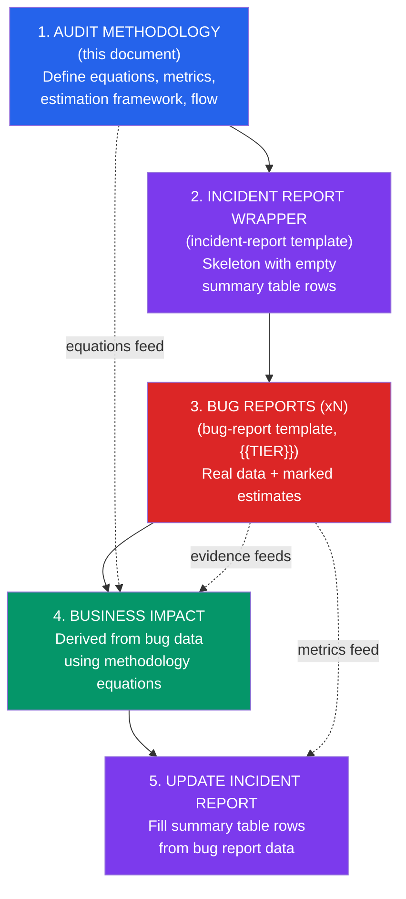

<!-- (c) 2026-* Frederick Bloom -->
---
doc-id:      20260904-034420-371732-7f9e-a1ce-6c79103e741f-AuditMethodology
version:     0.0.1
status:      ACTIVE
category:    TEMPLATE
node-types-covered: [AUDIT]
layer:       cross-cutting
scope:       generic -- any project, any platform, any audit domain
description: >
  Reusable audit methodology template with parameterized placeholders.
  Covers audit objective/scope, execution flow, data sources, raw and derived
  metrics, financial impact equations, estimation reliability framework,
  bug classification taxonomy, evidence handling, and glossary.
references:
  - 20260817-145224-590203-76c5-8764-5cf35c4a5227-ent-bug-report.tmpl-0.0.1.md
  - 20260817-145224-591490-751d-be54-c17afaa064fb-ent-incident-report.tmpl-0.0.1.md
copyright:   (c) 2026-* Frederick Bloom
---

> **Provenance:** Extracted and generalized from the Antigravity IDE cross-conversation
> contamination audit (conversation `a5d58453-2f4f-4421-8c58-ecdb2d6c8f62`, 2026-09-04).
> All instance-specific data replaced with `{{PLACEHOLDER}}` parameters.

# Audit Methodology Template

## Template Metadata

| Field | Value |
|---|---|
| **Template Name** | Audit Methodology |
| **Version** | 0.0.1 |
| **Domain** | Software Engineering / DevSecOps Auditing |
| **Purpose** | Structured framework for forensic analysis of software tools, platforms, or processes |
| **Companion Templates** | `ent-bug-report.tmpl`, `ent-incident-report.tmpl` |

### Usage Instructions

> [!NOTE]
> Replace all `{{PLACEHOLDER}}` values with instance-specific data.
> Delete this "Template Metadata" section in the completed instance document.
> Sections marked `[OPTIONAL]` may be removed if not applicable.

---

## AI Report Provenance

| Field | Value |
|---|---|
| **Compiling Agent** | `{{AGENT_NAME}}` `{{AGENT_VERSION}}` |
| **Compiling LLM Engine** | `{{LLM_ENGINE}}` |
| **Conversation ID** | `{{CONVERSATION_ID}}` |
| **Report Timestamp** | `{{TIMESTAMP_UTC}}` / `{{TIMESTAMP_LOCAL}}` |
| **Reporter Type** | `AI_AGENT` \| `HUMAN` \| `HYBRID` |
| **Verified By** | `PENDING` — not yet reviewed by user |
| **Prior Session(s)** | `{{PRIOR_SESSION_IDS}}` — origin session(s) |

---

## 1. Audit Objective

{{AUDIT_OBJECTIVE_DESCRIPTION}}

A concise statement of what this audit seeks to discover, classify, and quantify.

### 1.1 Scope

| Dimension | Value |
|---|---|
| **Audit period** | `{{START_DATE}}` → `{{END_DATE}}` (`{{DURATION}}`) |
| **Sessions/units analyzed** | `{{COUNT_AND_DESCRIPTION}}` |
| **Data sources** | `{{DATA_SOURCE_TYPES}}` |
| **System under audit** | `{{SYSTEM_NAME}}` `{{VERSION_RANGE}}` |
| **Projects affected** | `{{PROJECT_LIST}}` |
| **Bug report format** | `{{TEMPLATE_NAME}}` (`{{TEMPLATE_TIER}}`) |

### 1.2 Exclusions

- {{EXCLUSION_1}}
- {{EXCLUSION_2}}
- {{EXCLUSION_3}}

> [!IMPORTANT]
> Document exclusions explicitly. Unstated exclusions create ambiguity about audit completeness.

---

## 2. Audit Execution Flow



### 2.1 Step Dependencies

| Step | Inputs | Outputs | Depends On |
|---|---|---|---|
| 1. Methodology | Template standards, raw data | Equations, metric definitions | -- |
| 2. Incident Wrapper | Methodology, template | Skeleton with empty rows | Step 1 |
| 3. Bug Reports (xN) | Evidence, methodology | Completed {{TIER}}-tier reports | Steps 1, 2 |
| 4. Business Impact | Bug reports, methodology equations | Financial/time impact doc | Steps 1, 3 |
| 5. Incident Update | Bug reports, business impact | Completed incident report | Steps 2, 3, 4 |

---

## 3. Data Sources

### 3.1 Primary Sources

| Source | Location | Type | Records |
|---|---|---|---|
| **{{SOURCE_1_NAME}}** | `{{SOURCE_1_PATH}}` | `{{SOURCE_1_TYPE}}` | `{{SOURCE_1_COUNT}}` |
| **{{SOURCE_2_NAME}}** | `{{SOURCE_2_PATH}}` | `{{SOURCE_2_TYPE}}` | `{{SOURCE_2_COUNT}}` |
| **{{SOURCE_N_NAME}}** | `{{SOURCE_N_PATH}}` | `{{SOURCE_N_TYPE}}` | `{{SOURCE_N_COUNT}}` |

### 3.2 Derived Evidence Files

| File | Location (relative to audit root) | Contents |
|---|---|---|
| `{{EVIDENCE_1_FILE}}` | `{{EVIDENCE_1_DESCRIPTION}}` |
| `{{EVIDENCE_N_FILE}}` | `{{EVIDENCE_N_DESCRIPTION}}` |

### 3.3 Template Standards

| Template | Location | Lines | Standards |
|---|---|---|---|
| `{{TEMPLATE_1_NAME}}` | `{{PATH}}` | `{{LINES}}` | `{{STANDARDS_LIST}}` |

---

## 4. Metric Definitions

### 4.1 Raw Metrics (Directly Measured)

> [!TIP]
> Raw metrics are values obtained directly from data sources with no computation
> or estimation. Each must have a clear source and extraction method.

| Metric | Symbol | Unit | Source | Description |
|---|---|---|---|---|
| {{METRIC_NAME}} | `{{SYMBOL}}` | {{UNIT}} | {{SOURCE}} | {{DESCRIPTION}} |

### 4.2 Derived Metrics (Computed)

> [!TIP]
> Derived metrics are computed from raw metrics using defined equations.
> Each must document its formula, inputs, and estimation reliability.

#### 4.2.1 {{DERIVED_METRIC_1_NAME}}

**Purpose:** {{PURPOSE}}

**Algorithm:**

```
{{ALGORITHM_OR_EQUATION}}
```

**Result:**

| Quantity | Value | Reliability |
|---|---|---|
| {{QUANTITY}} | {{VALUE}} | `[{{H|M|L|S}}]` |

**Rationale:** {{WHY_THIS_ALGORITHM}}

#### 4.2.2 Waste Ratio [OPTIONAL]

```
W = {{WASTE_PERCENTAGE}} ({{WASTE_PERCENT}}%)

Basis: {{WASTE_BASIS_DESCRIPTION}}

T_wasted = T_engagement x W = {{T_ENGAGEMENT}} x {{W}} = {{T_WASTED}} hours
```

**Sensitivity analysis:**

| W | T_wasted | Work-days |
|---|---|---|
| {{W_LOW}}% | {{T_LOW}}h | {{D_LOW}} |
| **{{W_DEFAULT}}%** | **{{T_DEFAULT}}h** | **{{D_DEFAULT}}** |
| {{W_HIGH}}% | {{T_HIGH}}h | {{D_HIGH}} |

#### 4.2.3 Rework Time [OPTIONAL]

```
T_rework = N_incidents x F_avg x T_verify

Where:
  N_incidents = {{N}}       ({{N_DESCRIPTION}})
  F_avg = {{F}}             ({{F_DESCRIPTION}})
  T_verify = {{T}} hr       ({{T_DESCRIPTION}})

T_rework = {{CALCULATION}} = {{RESULT}} hours

Estimate reliability: {{H|M|L|S}}
  - {{RELIABILITY_NOTES}}
```

#### 4.2.4 Pre-Observation Extrapolation [OPTIONAL]

```
T_prelog = W_prelog x D_prelog x H_day

Where:
  W_prelog = {{WEEKS}}      ({{WEEKS_DESCRIPTION}})
  D_prelog = {{DAYS_PER_WEEK}} days/week
  H_day = {{HOURS_PER_DAY}} hr/day

T_prelog = {{CALCULATION}} = {{RESULT}} hours

Estimate reliability: {{H|M|L|S}}
  - {{RELIABILITY_NOTES}}
```

---

## 5. Financial Equations

### 5.1 Rate Tiers

| Tier | Symbol | Value | Basis |
|---|---|---|---|
| Minimum | `R_min` | ${{R_MIN}}/hr | {{R_MIN_BASIS}} |
| Midpoint | `R_mid` | ${{R_MID}}/hr | {{R_MID_BASIS}} |
| Maximum | `R_max` | ${{R_MAX}}/hr | {{R_MAX_BASIS}} |

> [!NOTE]
> Rate tiers should reflect loaded rates (salary + benefits + overhead + tooling).
> Use market data appropriate to the role and geography.

### 5.2 License/Subscription Cost [OPTIONAL]

```
C_license = C_monthly x (T_cal / 30)

Where:
  C_monthly = ${{MONTHLY_COST}}/month ({{PRODUCT_NAME}})
  T_cal = {{CALENDAR_DAYS}} days

C_license = ${{RESULT}}
```

### 5.3 Direct Labor Loss

```
L_direct = T_wasted x R

  L_direct_min = {{T_WASTED}} x ${{R_MIN}} = ${{RESULT_MIN}}
  L_direct_mid = {{T_WASTED}} x ${{R_MID}} = ${{RESULT_MID}}
  L_direct_max = {{T_WASTED}} x ${{R_MAX}} = ${{RESULT_MAX}}
```

### 5.4 Rework Labor Loss [OPTIONAL]

```
L_rework = T_rework x R

  L_rework_min = {{T_REWORK}} x ${{R_MIN}} = ${{RESULT_MIN}}
  L_rework_mid = {{T_REWORK}} x ${{R_MID}} = ${{RESULT_MID}}
  L_rework_max = {{T_REWORK}} x ${{R_MAX}} = ${{RESULT_MAX}}
```

### 5.5 Pre-Observation Labor Loss [OPTIONAL]

```
L_prelog = T_prelog x R

  L_prelog_min = {{T_PRELOG}} x ${{R_MIN}} = ${{RESULT_MIN}}
  L_prelog_mid = {{T_PRELOG}} x ${{R_MID}} = ${{RESULT_MID}}
  L_prelog_max = {{T_PRELOG}} x ${{R_MAX}} = ${{RESULT_MAX}}
```

### 5.6 Opportunity Cost [OPTIONAL]

```
L_opportunity = L_direct x M_opp

Where:
  M_opp = {{MULTIPLIER}} (opportunity cost multiplier)

Basis: {{MULTIPLIER_RATIONALE}}

  L_opp_min = ${{DIRECT_MIN}} x {{M_OPP}} = ${{RESULT_MIN}}
  L_opp_mid = ${{DIRECT_MID}} x {{M_OPP}} = ${{RESULT_MID}}
  L_opp_max = ${{DIRECT_MAX}} x {{M_OPP}} = ${{RESULT_MAX}}
```

### 5.7 Total Loss Equation

```
L_total = L_direct + C_license + L_rework + L_prelog + L_opportunity

        = R x (T_wasted x (1 + M_opp) + T_rework + T_prelog) + C_license
```

| Component | MIN (${{R_MIN}}/hr) | MID (${{R_MID}}/hr) | MAX (${{R_MAX}}/hr) |
|---|---|---|---|
| Direct labor ({{T_WASTED}}h) | ${{}} | ${{}} | ${{}} |
| License ({{MONTHS}} months) | ${{}} | ${{}} | ${{}} |
| Rework ({{T_REWORK}}h) | ${{}} | ${{}} | ${{}} |
| Pre-observation ({{T_PRELOG}}h) | ${{}} | ${{}} | ${{}} |
| Opportunity ({{M_OPP}}x) | ${{}} | ${{}} | ${{}} |
| **TOTAL** | **${{}}** | **${{}}** | **${{}}** |

### 5.8 Ongoing Monthly Tax [OPTIONAL]

```
L_monthly = (T_workaround x R) + C_monthly

Where:
  T_workaround = T_check x N_sessions_per_month
  T_check = {{HOURS}}/session (manual workaround time)
  N_sessions_per_month = {{COUNT}}

  T_workaround = {{CALCULATION}} hr/month

  L_monthly_min = ({{T_WA}} x ${{R_MIN}}) + ${{C_MONTHLY}} = ${{RESULT}}/month
  L_monthly_mid = ({{T_WA}} x ${{R_MID}}) + ${{C_MONTHLY}} = ${{RESULT}}/month
  L_monthly_max = ({{T_WA}} x ${{R_MAX}}) + ${{C_MONTHLY}} = ${{RESULT}}/month
```

---

## 6. Estimation Reliability Framework

When evidence is insufficient for direct measurement, estimates are used.
Each estimate is classified by reliability and documented with its basis.

### 6.1 Reliability Scale

| Level | Symbol | Definition | Confidence Interval |
|---|---|---|---|
| **HIGH** | `[H]` | Directly measured from raw data | >= 90% |
| **MEDIUM** | `[M]` | Measured from partial data; extrapolated from representative sample | 60-89% |
| **LOW** | `[L]` | Estimated from indirect evidence or reasonable assumption | 30-59% |
| **SPECULATIVE** | `[S]` | No direct evidence; based on domain expertise or analogy | < 30% |

### 6.2 Reliability Calculation

```
For each estimated value V:

  Reliability(V) = min(
    Data_Coverage(V),      # % of actual data points vs estimated
    Source_Quality(V),      # % based on source type (raw log=100%, inference=50%)
    Cross_Validation(V)     # % based on independent confirmation
  )

  If Reliability(V) < 30%: mark as [SPECULATIVE]
  If Reliability(V) < 60%: mark as [LOW]
  If Reliability(V) < 90%: mark as [MEDIUM]
  Else: mark as [HIGH]
```

### 6.3 Applied Reliability Ratings

| Metric | Value | Rating | Basis |
|---|---|---|---|
| {{METRIC_1}} | {{VALUE}} | `[{{RATING}}]` | {{BASIS}} |
| {{METRIC_N}} | {{VALUE}} | `[{{RATING}}]` | {{BASIS}} |

> [!WARNING]
> Every estimated value MUST have an explicit reliability rating.
> Unrated estimates create false confidence in the final numbers.

---

## 7. Bug Classification Taxonomy

### 7.1 Bug Categories

> [!TIP]
> Define categories specific to the system under audit. The examples below
> are common for developer tools; adjust for your domain.

| Category | Description | Examples |
|---|---|---|
| `ISOLATION_DEFECT` | Agent/system crosses intended boundaries | Cross-environment access, wrong-target writes |
| `CONTEXT_CONTAMINATION` | Wrong context injected into operation | Stale data, cross-session bleed |
| `GUARDRAIL_WEAKNESS` | Missing or insufficient safety mechanism | No confirmation prompts, no boundary checks |
| `CONCURRENCY_DEFECT` | Race condition or shared-state collision | Overlapping operations, lock failures |
| `INFORMATION_LEAK` | Unintended exposure across boundaries | Data from environment A visible in environment B |
| `TRUST_VIOLATION` | System action undermines user trust | Misleading status, silent failures |
| `{{CUSTOM_CATEGORY}}` | {{DESCRIPTION}} | {{EXAMPLES}} |

### 7.2 Severity Derivation

Per the bug report template:

```
effective_severity = max(security_severity, business_severity)
```

Where:
- `security_severity` is derived from CVSS 4.0 Base Score thresholds
- `business_severity` is derived from impact criteria (users, data integrity, SLA)

### 7.3 Common CVSS 4.0 Base Vector [OPTIONAL]

If most bugs share a common attack profile, document it here:

```
AV:{{AV}}  -- {{AV_DESCRIPTION}}
AC:{{AC}}  -- {{AC_DESCRIPTION}}
AT:{{AT}}  -- {{AT_DESCRIPTION}}
PR:{{PR}}  -- {{PR_DESCRIPTION}}
UI:{{UI}}  -- {{UI_DESCRIPTION}}
```

Impact metrics (VC, VI, VA, SC, SI, SA) vary per bug.

---

## 8. Evidence Handling

### 8.1 Evidence Packaging

Each bug report directory contains a `{{EVIDENCE_DIR}}/` subdirectory with copies
of relevant source files. These are the raw, unmodified records.

> [!CAUTION]
> Evidence files must be immutable copies, not symlinks or references.
> The original source may change after the audit; the evidence must not.

### 8.2 Chain of Custody

| Action | Date | Actor | Description |
|---|---|---|---|
| {{ACTION_1}} | {{DATE}} | {{ACTOR}} | {{DESCRIPTION}} |
| {{ACTION_N}} | {{DATE}} | {{ACTOR}} | {{DESCRIPTION}} |

### 8.3 Integrity Verification

{{DESCRIBE_HOW_EVIDENCE_INTEGRITY_IS_VERIFIED}}

Examples:
- Timestamps are system-generated and immutable
- Files are checksummed at collection time
- Git commit hashes provide tamper evidence

---

## 9. Assumptions and Limitations

### 9.1 Assumptions

1. {{ASSUMPTION_1}}
2. {{ASSUMPTION_2}}
3. {{ASSUMPTION_N}}

### 9.2 Limitations

1. **{{LIMITATION_1_TITLE}}** -- {{LIMITATION_1_DESCRIPTION}}
2. **{{LIMITATION_2_TITLE}}** -- {{LIMITATION_2_DESCRIPTION}}
3. **{{LIMITATION_N_TITLE}}** -- {{LIMITATION_N_DESCRIPTION}}

---

## 10. Glossary

| Term | Definition |
|---|---|
| **{{TERM_1}}** | {{DEFINITION_1}} |
| **{{TERM_N}}** | {{DEFINITION_N}} |

---

## 11. Version History

| Version | Date | Author | Changes |
|---|---|---|---|
| 0.0.1 | 2026-09-04 | AI-assisted extraction | Initial template extracted from Antigravity IDE audit methodology |
