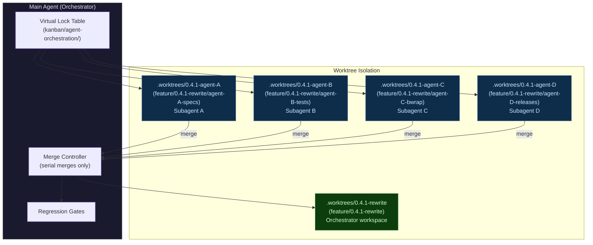
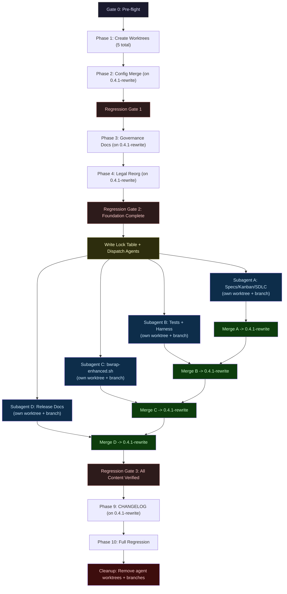

<!-- (c) 2026-* Frederick Bloom -- v0.4.1-origin.md -- Hanaden AI -->

<a id="top"></a>

# Create `feature/0.4.1-rewrite` -- Worktree-per-Agent Execution Plan

> **Strategy:** Branch clean from `master`. Each parallel subagent gets its own worktree
> and branch. Orchestrator (main agent) manages a virtual lock table, serializes merges,
> and runs regression gates. Result: `feature/0.4.1-rewrite` ready to PR into master.

---

## Table of Contents

### Plan
- [Agent Topology](#agent-topology)
- [Worktree and Branch Layout](#worktree-and-branch-layout)
- [Virtual Lock Table](#virtual-lock-table)
- [Locked Paths (EXCLUSIVE)](#locked-paths-exclusive)
- [Forbidden Paths](#forbidden-paths)
- [Completion Checklist](#completion-checklist)
- [Execution Graph](#execution-graph)
- [Resolved Decisions (All 20)](#resolved-decisions-all-20)

### Execution Phases
- [Gate 0: Pre-flight](#gate-0-pre-flight-orchestrator)
- [Phase 1: Create ALL Worktrees](#phase-1-create-all-worktrees-orchestrator----serial)
- [Phase 2: Config Merge](#phase-2-config-merge-orchestrator----on-041-rewrite)
- [Regression Gate 1](#regression-gate-1-orchestrator)
- [Phase 3: Governance Docs](#phase-3-governance-docs-orchestrator----on-041-rewrite)
- [Phase 4: Legal Reorg](#phase-4-legal-reorg-orchestrator----on-041-rewrite)
- [Regression Gate 2](#regression-gate-2-foundation-complete-orchestrator)
- [Create Agent Worktrees + Lock Table](#create-agent-worktrees--lock-table-orchestrator----serial)

### Parallel Agent Phases
- [Subagent A: Import Specs/Kanban/SDLC (Phase 5)](#subagent-a-import-specskanbansdlc-phase-5)
- [Subagent B: Import Tests (Phase 6)](#subagent-b-import-tests--remove-old--non-ascii-phase-6)
- [Subagent C: Import bwrap-enhanced.sh (Phase 7)](#subagent-c-import-bwrap-enhancedsh-phase-7)
- [Subagent D: Write Release Docs (Phase 8)](#subagent-d-write-release-docs-phase-8)

### Merge and Verification
- [Merge Phase](#merge-phase-orchestrator----serial-one-at-a-time)
- [Regression Gate 3](#regression-gate-3-all-content-verified-orchestrator)
- [Phase 9: CHANGELOG](#phase-9-changelog-orchestrator----on-041-rewrite)
- [Phase 10: Full Regression](#phase-10-full-regression-orchestrator)
- [Cleanup](#cleanup-remove-agent-worktrees--branches-orchestrator)
- [Execution Summary](#execution-summary)

### Results
- [Execution Run Report](#execution-run-report)

---

## Agent Topology

[^ top](#top)



---

## Worktree and Branch Layout

[^ top](#top)

| Worktree Path | Branch | Owner | Lifecycle |
|:--------------|:-------|:------|:----------|
| `.worktrees/0.4.1-rewrite/` | `feature/0.4.1-rewrite` | Orchestrator | Permanent -- becomes the PR branch |
| `.worktrees/0.4.1-agent-A/` | `feature/0.4.1-rewrite/agent-A-specs` | Subagent A | Ephemeral -- removed after merge |
| `.worktrees/0.4.1-agent-B/` | `feature/0.4.1-rewrite/agent-B-tests` | Subagent B | Ephemeral -- removed after merge |
| `.worktrees/0.4.1-agent-C/` | `feature/0.4.1-rewrite/agent-C-bwrap` | Subagent C | Ephemeral -- removed after merge |
| `.worktrees/0.4.1-agent-D/` | `feature/0.4.1-rewrite/agent-D-releases` | Subagent D | Ephemeral -- removed after merge |

---

## Virtual Lock Table

[^ top](#top)

> [!IMPORTANT]
> The orchestrator maintains the lock table in the kanban's agent-orchestration directory.
> **No agent may operate on a path it does not hold a lock for.**
> **No two agents may hold locks on overlapping paths.**
> **The lock table is the SINGLE SOURCE OF TRUTH for who owns what.**

### Lock Table Location

```
PROJECT_HOME/docs/workstream-kanban/agent-orchestration/
|---- agent-registry/
|   |---- agent-A-specs.lock.md          <- Created before agent launch
|   |---- agent-B-tests.lock.md
|   |---- agent-C-bwrap.lock.md
|   \---- agent-D-releases.lock.md
|---- dispatch-log/
|   \---- 0.4.1-rewrite-dispatch.log.md  <- Append-only log of all dispatches
\---- conversation-index/
    \---- 0.4.1-rewrite-agents.md        <- Maps agent ID -> conversation ID
```

### Lock File Format

Each `agent-*.lock.md` contains:

```markdown
# Agent Lock: agent-A-specs

- **Agent:** Subagent A
- **Branch:** feature/0.4.1-rewrite/agent-A-specs
- **Worktree:** .worktrees/0.4.1-agent-A/
- **Status:** ACTIVE | COMPLETED | FAILED | MERGED
- **Spawned:** [ISO-8601 timestamp]
- **Completed:** [ISO-8601 timestamp or TBD]

## Locked Paths (EXCLUSIVE)

[^ top](#top)

- `PROJECT_HOME/docs/architecture-design-features-specs/` -- WRITE
- `PROJECT_HOME/docs/workstream-kanban/` -- WRITE
- `PROJECT_HOME/generic-sdlc-and-engine-readonly/` -- WRITE

## Forbidden Paths

[^ top](#top)

ALL paths not listed above.

## Completion Checklist

[^ top](#top)

- [ ] File count verified
- [ ] Committed to agent branch
- [ ] Orchestrator merge approved
- [ ] Worktree removed
- [ ] Branch deleted
```

### Lock Table -- Full Assignment

| Agent | Locked Paths (EXCLUSIVE WRITE) | Forbidden (MUST NOT TOUCH) |
|:------|:-------------------------------|:--------------------------|
| **A** | `PROJECT_HOME/docs/architecture-design-features-specs/` | Everything else |
| | `PROJECT_HOME/docs/workstream-kanban/` | |
| | `PROJECT_HOME/generic-sdlc-and-engine-readonly/` | |
| **B** | `PROJECT_HOME/src/test/` | Everything else |
| | `PROJECT_HOME/src/lib/` | |
| **C** | `PROJECT_HOME/src/main/` | Everything else |
| **D** | `docs/releases/` | Everything else |

> [!CAUTION]
> **Race Condition Prevention:**
> - Each worktree has its own `.git/worktrees/<name>/index` -- no index contention.
> - Each agent commits to its OWN branch -- no ref contention.
> - Merges into `feature/0.4.1-rewrite` are SERIAL -- orchestrator only, one at a time.
> - Lock table is written BEFORE agents launch -- never modified during execution.
> - Agents do NOT read or modify the lock table -- only the orchestrator does.

---

## Execution Graph

[^ top](#top)



---

## Resolved Decisions (All 20)

[^ top](#top)

| # | Decision | Resolution |
|:--|:---------|:-----------|
| 1 | CLI flag convention | Master's `--NOUN-passthrough` |
| 2 | LICENSE format | `LICENSE.md` (master) |
| 3 | VERSION value | `0.4.1` uniformly |
| 4 | `.gitignore` | 0.4.0's version |
| 5 | `mise.toml` | 0.4.0's project-scoped |
| 6 | `about-fbloom.md` | Keep as-is |
| 7 | `site/` | Master's 44 files |
| 8 | `docs/doc-templates/` | Master's 14 files |
| 9 | `generic-sdlc` | Fix `sldc` -> `sdlc`, use 0.4.0's 75 files |
| 10 | CONSTITUTION.md | Master's; update Version + test counts |
| 11 | CHANGELOG.md | `v0.4.1` |
| 12 | `../LICENSE` link | Fix to `../LICENSE.md` |
| 13 | `LICENSE-COMMERCIAL` badge | Remove |
| 14 | CLA | Inline in Frederick-Bloom-license.md |
| 15 | Old `.sh` tests | Remove 49+3 |
| 16 | `boot/bwrap-enhanced.sh` | DO NOT TOUCH (v0.2.1) |
| 17 | Non-ASCII | `--`->`--`, `->`->`->`, `!=`->`!=` |
| 18 | AI/IDE configs | Master's 11 files |
| 19 | Release docs | `docs/releases/v[semver]-[origin\|release].md` |
| 20 | Commands | `rtk` prefix always |

---

## Gate 0: Pre-flight (Orchestrator)

[^ top](#top)

```bash
eval "$(~/.local/bin/mise activate bash)"
rtk git status                                 # clean
rtk git branch -a | rtk grep 'feature/0.4.1'  # must NOT exist
rtk git log --oneline -1 master                # confirm HEAD
rtk git log --oneline -1 feature/0.4.0-rewrite # confirm HEAD
```

---

## Phase 1: Create ALL Worktrees (Orchestrator -- Serial)

[^ top](#top)

### 1a. Main worktree from master

```bash
rtk git worktree add .worktrees/0.4.1-rewrite -b feature/0.4.1-rewrite master
```

### 1b. Verify

```bash
rtk git -C .worktrees/0.4.1-rewrite log --oneline -1   # 06980be
```

> [!NOTE]
> Agent worktrees are created LATER, after Gate 2, when the foundation is committed.
> They branch from `feature/0.4.1-rewrite` (not master) so they inherit Phases 2-4.

---

## Phase 2: Config Merge (Orchestrator -- on 0.4.1-rewrite)

[^ top](#top)

**All commands in `.worktrees/0.4.1-rewrite/`**

```bash
rtk git show feature/0.4.0-rewrite:.gitignore > .gitignore
rtk git checkout feature/0.4.0-rewrite -- mise.toml
rtk git checkout feature/0.4.0-rewrite -- hanaden-bwrap-enhanced.code-workspace
rtk git add -A
rtk git commit -m "chore: merge .gitignore, mise.toml, and workspace config from 0.4.0-rewrite"
```

---

## Regression Gate 1 (Orchestrator)

[^ top](#top)

```bash
rtk grep -q 'target/' .gitignore && echo "OK" || echo "FAIL"
rtk grep -q '.worktrees/' .gitignore && echo "OK" || echo "FAIL"
rtk wc -l mise.toml                           # ~40 lines
test -f hanaden-bwrap-enhanced.code-workspace && echo "OK" || echo "FAIL"
rtk git status --porcelain | rtk wc -l         # 0
```

---

## Phase 3: Governance Docs (Orchestrator -- on 0.4.1-rewrite)

[^ top](#top)

1. `echo "0.4.1" > VERSION`
2. CONSTITUTION.md: Version `0.4.0-beta` -> `0.4.1`, Article IV S3 test counts
3. README.md: Remove LICENSE-COMMERCIAL badge, update version+test badges
4. PROJECT_HOME/README.md: `../LICENSE` -> `../LICENSE.md`
5. CONTRIBUTING.md: CLA link -> Frederick-Bloom-license.md

```bash
rtk git add -A
rtk git commit -m "chore(governance): bump VERSION to 0.4.1, fix broken links, update badges"
```

---

## Phase 4: Legal Reorg (Orchestrator -- on 0.4.1-rewrite)

[^ top](#top)

1. `rtk git mv PROJECT_HOME/generic-sldc-and-engine-readonly/ PROJECT_HOME/generic-sdlc-and-engine-readonly/`
2. `rtk git mv` 36 third-party files -> `third-party-ref-readonly/`
3. Update Frederick-Bloom-license.md: inline CLA
4. Update LICENSE.md line 22: AGPL path `third-party/` -> `third-party-ref-readonly/`

```bash
# Fix AGPL path in LICENSE.md to match the third-party rename
sed -i 's|third-party/opensource/AGPL-3.0.txt|third-party-ref-readonly/opensource/AGPL-3.0.txt|' LICENSE.md
rtk git add -A
rtk git commit -m "chore(legal): fix generic-sdlc typo, move third-party refs, fix AGPL path, inline CLA"
```

---

## Regression Gate 2: Foundation Complete (Orchestrator)

[^ top](#top)

```bash
cat VERSION                                    # 0.4.1
rtk grep 'Version' CONSTITUTION.md | head -1   # 0.4.1
rtk grep -q 'LICENSE-COMMERCIAL' README.md && echo "FAIL" || echo "OK"
rtk grep -q 'CLA\.md' CONTRIBUTING.md && echo "FAIL" || echo "OK"
rtk grep -q '../LICENSE\.md' PROJECT_HOME/README.md && echo "OK" || echo "FAIL"
test -d PROJECT_HOME/generic-sdlc-and-engine-readonly && echo "OK" || echo "FAIL"
test -d PROJECT_HOME/generic-sldc-and-engine-readonly && echo "FAIL" || echo "OK"
rtk grep -q 'irrevocably assigns' PROJECT_HOME/docs/legal/FrederickBloom/Frederick-Bloom-license.md && echo "OK" || echo "FAIL"
rtk git diff master -- PROJECT_HOME/boot/bwrap-enhanced.sh | rtk wc -l   # 0
rtk git status --porcelain | rtk wc -l         # 0
```

**HALT if any check fails. Gate 2 is the prerequisite for ALL agent worktrees.**

---

## Create Agent Worktrees + Lock Table (Orchestrator -- Serial)

[^ top](#top)

### Create 4 agent worktrees branching from 0.4.1-rewrite

```bash
rtk git worktree add .worktrees/0.4.1-agent-A \
    -b feature/0.4.1-rewrite/agent-A-specs feature/0.4.1-rewrite

rtk git worktree add .worktrees/0.4.1-agent-B \
    -b feature/0.4.1-rewrite/agent-B-tests feature/0.4.1-rewrite

rtk git worktree add .worktrees/0.4.1-agent-C \
    -b feature/0.4.1-rewrite/agent-C-bwrap feature/0.4.1-rewrite

rtk git worktree add .worktrees/0.4.1-agent-D \
    -b feature/0.4.1-rewrite/agent-D-releases feature/0.4.1-rewrite
```

### Write lock table files

Create lock files in the orchestrator's worktree:

```
.worktrees/0.4.1-rewrite/PROJECT_HOME/docs/workstream-kanban/agent-orchestration/
|---- agent-registry/agent-A-specs.lock.md
|---- agent-registry/agent-B-tests.lock.md
|---- agent-registry/agent-C-bwrap.lock.md
|---- agent-registry/agent-D-releases.lock.md
|---- dispatch-log/0.4.1-rewrite-dispatch.log.md
\---- conversation-index/0.4.1-rewrite-agents.md
```

### Verify all worktrees

```bash
rtk git worktree list
# expect: 6 entries (main + 0.4.1-rewrite + 4 agents)

for wt in .worktrees/0.4.1-agent-{A,B,C,D}; do
  echo "=== $wt ==="
  rtk git -C "$wt" log --oneline -1
  rtk git -C "$wt" branch --show-current
done
```

### Dispatch agents

Launch all 4 subagents simultaneously. Each is given:
- Its worktree path
- Its locked paths (from lock table)
- Its forbidden paths
- The task spec (below)

---

## Subagent A: Import Specs/Kanban/SDLC (Phase 5)

[^ top](#top)

**Worktree:** `.worktrees/0.4.1-agent-A/`
**Branch:** `feature/0.4.1-rewrite/agent-A-specs`

### Task

```bash
# Work in agent's own worktree
cd .worktrees/0.4.1-agent-A/

# 5a. Architecture specs (305 files -- 0.4.0 superset of master's 65)
rtk git checkout feature/0.4.0-rewrite -- PROJECT_HOME/docs/architecture-design-features-specs/

# 5b. Workstream kanban (174 files -- master has 0)
rtk git checkout feature/0.4.0-rewrite -- PROJECT_HOME/docs/workstream-kanban/

# 5c. SDLC engine (75 files from 0.4.0 -- master has 2 under old typo name)
# NOTE: AgentWorktreeOrchestration.system-0.0.1.md exists locally from Phase 4
# rename but is NOT on 0.4.0-rewrite. git checkout does NOT delete local-only
# files, so the spec survives. Verify in completion report.
rtk git checkout feature/0.4.0-rewrite -- PROJECT_HOME/generic-sdlc-and-engine-readonly/

# Commit on agent's branch
rtk git add -A
rtk git commit -m "feat(docs): import architecture specs, kanban, and SDLC engine from 0.4.0-rewrite

- 305 architecture/design/feature/spec documents
- 174 workstream kanban structure files
- 75 generic SDLC engine specification files (+ 1 AgentWorktreeOrchestration spec from master)"
```

### Completion Report

```bash
rtk find PROJECT_HOME/docs/architecture-design-features-specs/ -type f | rtk wc -l  # 305
rtk find PROJECT_HOME/docs/workstream-kanban/ -type f | rtk wc -l                   # 174
rtk find PROJECT_HOME/generic-sdlc-and-engine-readonly/ -type f | rtk wc -l         # 76 (75 from 0.4.0 + 1 spec from master)
# CRITICAL: verify the spec survived the checkout
test -f PROJECT_HOME/generic-sdlc-and-engine-readonly/20260903-043557-804052-701c-b711-17eeb433300e-AgentWorktreeOrchestration.system-0.0.1.md \
    && echo "OK: AgentWorktreeOrchestration spec preserved" || echo "FAIL: spec lost"
rtk git status --porcelain | rtk wc -l   # 0
rtk git log --oneline -1                 # show commit hash
```

---

## Subagent B: Import Tests + Remove Old + Non-ASCII (Phase 6)

[^ top](#top)

**Worktree:** `.worktrees/0.4.1-agent-B/`
**Branch:** `feature/0.4.1-rewrite/agent-B-tests`

### Task

```bash
cd .worktrees/0.4.1-agent-B/

# 6a. Import new BATS suites
rtk git checkout feature/0.4.0-rewrite -- PROJECT_HOME/src/test/hanaden-bwrap-enhanced/suites/

# 6b. Import harness runner
rtk git checkout feature/0.4.0-rewrite -- \
    PROJECT_HOME/src/test/hanaden-bwrap-enhanced/bwrap-enhanced-test-harness-runner.sh

# 6c. Import library files
rtk git checkout feature/0.4.0-rewrite -- PROJECT_HOME/src/lib/

# 6d. Remove old tests
rtk git rm -r PROJECT_HOME/src/test/hanaden-bwrap-enhanced/BwrapEnhanced2026.strat/
rtk git rm PROJECT_HOME/src/test/hanaden-bwrap-enhanced/shared/assert.sh
rtk git rm PROJECT_HOME/src/test/hanaden-bwrap-enhanced/shared/env.sh
rtk git rm PROJECT_HOME/src/test/hanaden-bwrap-enhanced/run_phase1.sh

# 6e. Non-ASCII cleanup
rtk find PROJECT_HOME/src/test/ PROJECT_HOME/src/lib/ \
    \( -name '*.sh' -o -name '*.bats' \) -exec \
    sed -i 's/\xe2\x80\x94/--/g; s/\xe2\x86\x92/->/g; s/\xe2\x89\xa0/!=/g' {} +

# Commit
rtk git add -A
rtk git commit -m "feat(test): import BATS suites, harness, libs; remove old monolithic tests

- 176 new BATS test suite files (43 feature suites)
- Test harness runner with auto-discovery
- Library files
- Remove 49 old .sh tests + 3 support files
- Clean non-ASCII from all shell/bats files"
```

### Completion Report

```bash
rtk find PROJECT_HOME/src/test/hanaden-bwrap-enhanced/suites/ -name '*.bats' | rtk wc -l  # 176
test -d PROJECT_HOME/src/test/hanaden-bwrap-enhanced/BwrapEnhanced2026.strat \
    && echo "FAIL" || echo "OK"
rtk grep -rPl '[^\x00-\x7F]' PROJECT_HOME/src/test/ PROJECT_HOME/src/lib/ \
    --include='*.sh' --include='*.bats' && echo "FAIL" || echo "OK: all ASCII"
rtk git status --porcelain | rtk wc -l   # 0
```

---

## Subagent C: Import bwrap-enhanced.sh (Phase 7)

[^ top](#top)

**Worktree:** `.worktrees/0.4.1-agent-C/`
**Branch:** `feature/0.4.1-rewrite/agent-C-bwrap`

### Task

```bash
cd .worktrees/0.4.1-agent-C/

# 7a. Import rewrite
rtk git checkout feature/0.4.0-rewrite -- \
    PROJECT_HOME/src/main/hanaden-bwrap-enhanced/bwrap-enhanced.sh

# 7b. Version bump
sed -i 's/# VERSION:   0.4.0/# VERSION:   0.4.1/' \
    PROJECT_HOME/src/main/hanaden-bwrap-enhanced/bwrap-enhanced.sh

# 7c. Non-ASCII cleanup
sed -i 's/\xe2\x80\x94/--/g; s/\xe2\x86\x92/->/g' \
    PROJECT_HOME/src/main/hanaden-bwrap-enhanced/bwrap-enhanced.sh

# Commit
rtk git add -A
rtk git commit -m "feat(bwrap): import rewritten bwrap-enhanced.sh to src/main, bump to 0.4.1

- Subcommand dispatcher: provision, fsck, start (impl); stop, ls (stubs)
- ~1220 lines, version bumped 0.4.0 -> 0.4.1
- All non-ASCII replaced with ASCII
- boot/bwrap-enhanced.sh UNCHANGED -- remains at v0.2.1"
```

### Completion Report

```bash
rtk grep 'VERSION:' PROJECT_HOME/src/main/hanaden-bwrap-enhanced/bwrap-enhanced.sh  # 0.4.1
rtk grep -Pc '[^\x00-\x7F]' PROJECT_HOME/src/main/hanaden-bwrap-enhanced/bwrap-enhanced.sh \
    && echo "FAIL" || echo "OK"
rtk grep 'VERSION:' PROJECT_HOME/boot/bwrap-enhanced.sh   # 0.2.1 MUST be unchanged
rtk git status --porcelain | rtk wc -l   # 0
```

---

## Subagent D: Write Release Docs (Phase 8)

[^ top](#top)

**Worktree:** `.worktrees/0.4.1-agent-D/`
**Branch:** `feature/0.4.1-rewrite/agent-D-releases`

### Task

```bash
cd .worktrees/0.4.1-agent-D/
mkdir -p docs/releases/
```

Create 10 files by reading git history (`rtk git log`, `rtk git show`, tags):

| File | Source of Truth |
|:-----|:---------------|
| `v0.0.1-origin.md` | Greenfield. VERSION=0.0.1. Tag `initial-baseline` -> `a9ccdbb` (2026-08-16) |
| `v0.0.1-release.md` | 149 files, bwrap 555 LOC, SDLC skeleton, 10 feature suites |
| `v0.1.0-origin.md` | Origin: v0.0.1. 20 commits. GUI passthrough, mise, X11 fix |
| `v0.1.0-release.md` | Tag `v0.1.0` -> `d2d34ae` (2026-08-18). 228 files, bwrap 835 LOC |
| `v0.2.0-origin.md` | Origin: v0.1.0. 25 commits. Dual-license, constitution rewrite |
| `v0.2.0-release.md` | Tag `v0.2.0` -> `d780157` (2026-08-21). 232 files |
| `v0.2.1-origin.md` | Origin: v0.2.0. 6 commits. Legal reorg, cruft cleanup |
| `v0.2.1-release.md` | Tag `v0.2.1` -> `347fbc4` (2026-08-25). 206 files, -26 files |
| `v0.4.1-origin.md` | Full 20-decision record from this planning session |
| `v0.4.1-release.md` | TBD stub |

```bash
rtk git add -A
rtk git commit -m "docs(releases): create release origin and release docs for all versions

- v0.0.1 through v0.2.1: origin + release (inferred from git history)
- v0.4.1: origin (full decision record) + release (TBD stub)
- 10 files total"
```

### Completion Report

```bash
rtk ls docs/releases/ | rtk wc -l   # 10
for f in docs/releases/v*.md; do echo "OK: $f ($(rtk wc -l < "$f") lines)"; done
rtk git status --porcelain | rtk wc -l   # 0
```

---

## Merge Phase (Orchestrator -- SERIAL, One at a Time)

[^ top](#top)

> [!CAUTION]
> **Merges are SERIAL. One at a time. Verify after each.**
> Order: A -> B -> C -> D (specs first, then tests, then code, then docs)

### Merge Subagent A

```bash
cd .worktrees/0.4.1-rewrite/
rtk git merge --no-ff feature/0.4.1-rewrite/agent-A-specs \
    -m "merge(agent-A): import specs, kanban, SDLC engine (489 files)"
```

**Verify:** `rtk git log --oneline -3`

### Merge Subagent B

```bash
rtk git merge --no-ff feature/0.4.1-rewrite/agent-B-tests \
    -m "merge(agent-B): import tests, harness, libs; remove old tests"
```

**Verify:** `rtk git log --oneline -3`

### Merge Subagent C

```bash
rtk git merge --no-ff feature/0.4.1-rewrite/agent-C-bwrap \
    -m "merge(agent-C): import rewritten bwrap-enhanced.sh v0.4.1"
```

**Verify:** `rtk git log --oneline -3`

### Merge Subagent D

```bash
rtk git merge --no-ff feature/0.4.1-rewrite/agent-D-releases \
    -m "merge(agent-D): create release docs for all versions"
```

**Verify:** `rtk git log --oneline -5`

---

## Regression Gate 3: All Content Verified (Orchestrator)

[^ top](#top)

```bash
echo "=== File inventory ==="
rtk find PROJECT_HOME/docs/architecture-design-features-specs/ -type f | rtk wc -l  # 305
rtk find PROJECT_HOME/docs/workstream-kanban/ -type f | rtk wc -l                   # 174
rtk find PROJECT_HOME/generic-sdlc-and-engine-readonly/ -type f | rtk wc -l         # 76
rtk find PROJECT_HOME/src/test/hanaden-bwrap-enhanced/suites/ -name '*.bats' | rtk wc -l  # 176
rtk ls docs/releases/ | rtk wc -l                                                    # 10

echo "=== AgentWorktreeOrchestration spec survived ==="
test -f PROJECT_HOME/generic-sdlc-and-engine-readonly/20260903-043557-804052-701c-b711-17eeb433300e-AgentWorktreeOrchestration.system-0.0.1.md \
    && echo "OK" || echo "FAIL: spec lost"

echo "=== No non-ASCII ==="
rtk grep -rPl '[^\x00-\x7F]' \
    PROJECT_HOME/src/main/ PROJECT_HOME/src/test/ PROJECT_HOME/src/lib/ \
    --include='*.sh' --include='*.bats' && echo "FAIL" || echo "OK"

echo "=== Version consistency ==="
cat VERSION                                                                    # 0.4.1
rtk grep 'VERSION:' PROJECT_HOME/src/main/hanaden-bwrap-enhanced/bwrap-enhanced.sh  # 0.4.1
rtk grep 'VERSION:' PROJECT_HOME/boot/bwrap-enhanced.sh                             # 0.2.1

echo "=== Old tests removed ==="
test -d PROJECT_HOME/src/test/hanaden-bwrap-enhanced/BwrapEnhanced2026.strat \
    && echo "FAIL" || echo "OK"

echo "=== Foundation intact ==="
rtk grep -q 'LICENSE-COMMERCIAL' README.md && echo "FAIL" || echo "OK"
rtk grep -q 'CLA\.md' CONTRIBUTING.md && echo "FAIL" || echo "OK"
rtk git diff master -- PROJECT_HOME/boot/bwrap-enhanced.sh | rtk wc -l   # 0

echo "=== Git clean ==="
rtk git status --porcelain | rtk wc -l   # 0
```

---

## Phase 9: CHANGELOG (Orchestrator -- on 0.4.1-rewrite)

[^ top](#top)

Replace `[v0.4.0-beta]` entry with `[v0.4.1]`. Full content:

```markdown
## [v0.4.1] - 2026-09-03

[^ top](#top)

### Added
- Release docs: `docs/releases/v[semver]-[origin|release].md` for all versions
- 176 BATS test suites across 43 feature suites
- Test harness runner with auto-discovery
- Library files: shell converters, Python report generators, JSON schemas
- 240 architecture/design/feature/spec documents
- 174 workstream kanban structure files
- 75 generic SDLC engine specifications

### Changed
- CLI subcommand dispatcher: provision, fsck, start (impl); stop, ls (stubs)
- All passthrough flags: --NOUN-passthrough convention
- mise.toml: project-scoped toolchain
- .gitignore: add **/target/ and /.worktrees/
- Frederick-Bloom-license.md: restructured, inline CLA
- CONTRIBUTING.md: CLA link -> Frederick-Bloom-license.md
- generic-sldc -> generic-sdlc (typo fix)
- Third-party legal refs -> third-party-ref-readonly/
- boot/bwrap-enhanced.sh remains at v0.2.1 (pinned)

### Fixed
- Removed LICENSE-COMMERCIAL.md badge (never existed)
- Fixed PROJECT_HOME/README.md: ../LICENSE -> ../LICENSE.md
- Removed broken CLA.md link
- Cleaned all non-ASCII from shell/bats files

### Removed
- 49 legacy .sh test files + 3 support files
```

```bash
rtk git add CHANGELOG.md
rtk git commit -m "docs: update CHANGELOG -- v0.4.0-beta becomes v0.4.1"
```

---

## Phase 10: Full Regression (Orchestrator)

[^ top](#top)

```bash
echo "=== Governance docs ==="
for f in README.md LICENSE.md CONTRIBUTING.md CODE_OF_CONDUCT.md SECURITY.md \
         CONSTITUTION.md NOTICE CHANGELOG.md VERSION CLAUDE.md AGENTS.md GEMINI.md; do
  test -f "$f" && echo "OK  $f" || echo "MISSING: $f"
done

echo "=== No duplicate license ==="
test -f LICENSE && echo "FAIL: plain LICENSE" || echo "OK"

echo "=== Agent configs ==="
for f in .agents/AGENTS.md AGENTS.md GEMINI.md CLAUDE.md \
         .amazonq/rules/00-hanaden-bootstrap.md .clinerules \
         .continue/rules/00-hanaden-bootstrap.md \
         .cursor/rules/00-hanaden-bootstrap.mdc \
         .github/copilot-instructions.md \
         .junie/AGENTS.md \
         .windsurf/rules/00-hanaden-bootstrap.md; do
  test -f "$f" && echo "OK  $f" || echo "MISSING: $f"
done

echo "=== Release docs ==="
for v in 0.0.1 0.1.0 0.2.0 0.2.1 0.4.1; do
  test -f "docs/releases/v${v}-origin.md" && echo "OK  v${v}-origin.md" || echo "MISSING"
  test -f "docs/releases/v${v}-release.md" && echo "OK  v${v}-release.md" || echo "MISSING"
done

echo "=== PR diff preview ==="
rtk git diff --stat master..HEAD
rtk git log --oneline master..HEAD

echo "=== Total files ==="
rtk git ls-tree --name-only -r HEAD | rtk wc -l   # ~700+
```

---

## Cleanup: Remove Agent Worktrees + Branches (Orchestrator)

[^ top](#top)

```bash
# Remove worktrees
rtk git worktree remove .worktrees/0.4.1-agent-A
rtk git worktree remove .worktrees/0.4.1-agent-B
rtk git worktree remove .worktrees/0.4.1-agent-C
rtk git worktree remove .worktrees/0.4.1-agent-D

# Delete agent branches (fully merged)
rtk git branch -d feature/0.4.1-rewrite/agent-A-specs
rtk git branch -d feature/0.4.1-rewrite/agent-B-tests
rtk git branch -d feature/0.4.1-rewrite/agent-C-bwrap
rtk git branch -d feature/0.4.1-rewrite/agent-D-releases

# Update lock table status -> MERGED
# Update dispatch log with completion timestamps

# Verify cleanup
rtk git worktree list   # should show: main + 0.4.1-rewrite only
rtk git branch --list 'feature/0.4.1-rewrite/*'   # should be empty
```

---

## Execution Summary

[^ top](#top)

| Phase | Agent | Mode | Files | Commit/Merge |
|:------|:------|:-----|------:|:-------------|
| 0 | Orchestrator | Serial | 0 | -- |
| 1 | Orchestrator | Serial | 0 | -- |
| 2 | Orchestrator | Serial | 3 | Commit 1 |
| Gate 1 | Orchestrator | Serial | 0 | -- |
| 3 | Orchestrator | Serial | 5 | Commit 2 |
| 4 | Orchestrator | Serial | 38 | Commit 3 |
| Gate 2 | Orchestrator | Serial | 0 | -- |
| Lock Table | Orchestrator | Serial | 6 | -- |
| 5 | **Subagent A** | **Parallel** | 554 | Agent commit |
| 6 | **Subagent B** | **Parallel** | +189/-52 | Agent commit |
| 7 | **Subagent C** | **Parallel** | 1 | Agent commit |
| 8 | **Subagent D** | **Parallel** | 10 | Agent commit |
| Merges | Orchestrator | Serial | -- | 4 merge commits |
| Gate 3 | Orchestrator | Serial | 0 | -- |
| 9 | Orchestrator | Serial | 1 | Commit 8 |
| 10 | Orchestrator | Serial | 0 | -- |
| Cleanup | Orchestrator | Serial | 0 | -- |

**Total commits on `feature/0.4.1-rewrite`:** 3 (foundation) + 4 (merge commits) + 1 (CHANGELOG) = **8**
**Total files affected:** ~790
**Agent worktrees:** 4 created, 4 destroyed
**Lock table entries:** 4

---

## Execution Run Report

[^ top](#top)

> **Run date:** 2026-09-03T04:35-04:00 (EDT)
> **Verdict:** PASS -- all checks green
>
> | Field | Value |
> |:------|:------|
> | IDE | Antigravity IDE v2.5.5 (linux x64) |
> | CLI | agy v1.1.13 |
> | Model | Gemini (via Antigravity AgentAPI) |
> | Agent API | `antigravity-x86-ide-2.5.5/resources/app/extensions/antigravity/bin/language_server_linux_x64` |
> | Conversation ID | `36ee72e0-5c21-44af-8113-df78a115720d` |
> | Workspace | `hanasaki/hanaden-bwrap-enhanced` |
> | Workspace Root | `feature/0.4.0-rewrite` (main checkout) |

### Branch and Worktree

| Check | Result |
|:------|:-------|
| Worktree at `.worktrees/0.4.1-rewrite/` | PASS |
| Branch: `feature/0.4.1-rewrite` | PASS |
| HEAD: `45b37a8` | PASS |
| Master is ancestor | PASS |
| Git clean (no uncommitted) | PASS |

### File Counts

| Content | Master | 0.4.0 | 0.4.1 | Source | Status |
|:--------|-------:|------:|------:|:-------|:------:|
| Total files | 262 | 857 | 887 | merged | PASS |
| Arch specs | 65 | 305 | 305 | 0.4.0 superset | PASS |
| Kanban | 0 | 174 | 174 | 0.4.0 | PASS |
| SDLC engine | 2 | 75 | 76 | 75 from 0.4.0 + 1 spec from master | PASS |
| BATS suites | 0 | 176 | 176 | 0.4.0 | PASS |
| Test harness | 0 | 1 | 1 | 0.4.0 | PASS |
| Lib files | 0 | 12 | 12 | 0.4.0 | PASS |
| Release docs | 10 | 0 | 10 | master | PASS |
| Legal refs | 37 | 36 | 37 | master (renamed) | PASS |

### Transforms Verified

| Transform | Expected | Actual | Status |
|:----------|:---------|:-------|:------:|
| VERSION file | 0.4.1 | 0.4.1 | PASS |
| CONSTITUTION version | 0.4.1 | 0.4.1 | PASS |
| src/main bwrap VERSION | 0.4.1 | 0.4.1 | PASS |
| boot/bwrap VERSION (pinned) | 0.2.1 | 0.2.1 | PASS |
| boot/bwrap identical to master | yes | yes | PASS |
| LICENSE-COMMERCIAL badge removed | 0 refs | 0 refs | PASS |
| CLA.md links removed | 0 refs | 0 refs | PASS |
| PROJECT_HOME/README: ../LICENSE.md | fixed | fixed | PASS |
| AGPL path: third-party-ref-readonly/ | fixed | fixed | PASS |
| generic-sldc dir gone | 0 files | 0 files | PASS |
| third-party/ dir gone | 0 files | 0 files | PASS |
| third-party-ref-readonly/ exists | yes | 36 files | PASS |
| Old .sh tests removed | 0 files | 0 files | PASS |
| Non-ASCII in sh/bats | 0 | 0 | PASS |

### Preserved Content

| Item | Status |
|:-----|:------:|
| AgentWorktreeOrchestration spec (master-only) | PASS |
| SdlcEngineSpec (both branches) | PASS |
| All 7 governance docs | PASS |
| All 10 release docs | PASS |
| CHANGELOG updated to v0.4.1 | PASS |

### Delta Analysis

**120 files on 0.4.1 but NOT 0.4.0:**
Governance docs from master (AI rules, CODE_OF_CONDUCT, CONTRIBUTING, LICENSE.md, etc.),
legal rename (third-party/ -> third-party-ref-readonly/), release docs, VERSION file,
AgentWorktreeOrchestration spec.

**90 files on 0.4.0 but NOT 0.4.1:**
Old third-party/ path (36 files replaced by rename), old LICENSE (no .md),
BOOTSTRAP.md, 49 old .sh test files + 3 support files (replaced by BATS).

> All 90 "missing" files are accounted for by intentional renames, removals,
> and replacements. No content was lost.

### Commit Log

```
45b37a8 chore(changelog): add v0.4.1 release entry
b0fe179 merge(agent-C): import rewritten bwrap-enhanced.sh v0.4.1
27a0e5b merge(agent-B): import tests, harness, libs; remove old tests
7c7188f merge(agent-A): import specs, kanban, SDLC engine (554 files)
059bb02 chore(legal): fix generic-sdlc typo, move third-party refs, fix AGPL path
af79793 chore(governance): bump VERSION to 0.4.1, fix broken links, update badges
9adc26f chore: merge .gitignore, mise.toml, and workspace config from 0.4.0
```

### Intercepted Items

| Item | Action | Reason |
|:-----|:-------|:-------|
| Agent D (release docs) | Skipped | 10 docs already on master, inherited |
| Branch naming | Changed to `feature/0.4.1-agent-*` | Git ref collision with parent branch name |
| Agent worktrees | Cleaned up | 3 created, 3 removed + branches deleted |

[^ top](#top)
